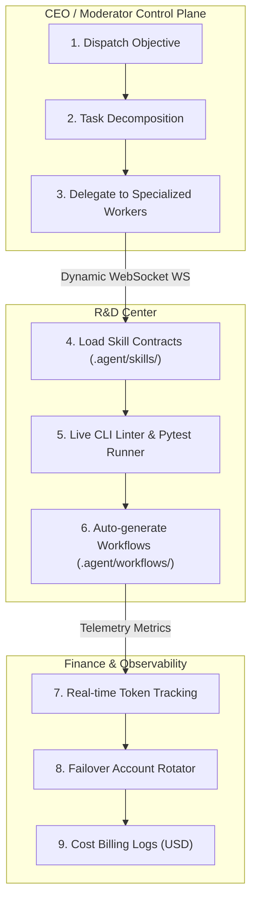
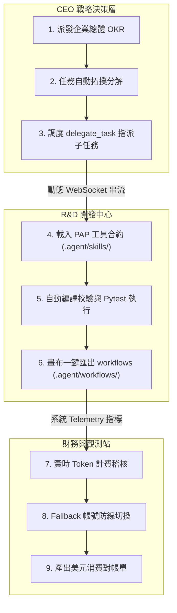

# 🌌 FindAi Studio — LLM Agent System (LAS)

<div align="center">


### [English](#-english) | [繁體中文](#-繁體中文)

</div>

---

## 🌐 English

> ### 🧠 **The First AI-Maintainable Agent Framework**
> Stop fighting rigid framework abstractions. FindAi Studio uses a **Contract-First design** (`.agent/` PAP + `INSTRUCTIONS_FOR_AI.md`) that lets cutting-edge LLMs safely understand, refactor, and extend your Agent workflows autonomously. **It's not just an AI Agent — it's an AI that builds your AI.**
>
> *Natively supports Gemini, Claude 3.5 Sonnet, GPT-4o, and Ollama with zero vendor lock-in.*

LAS is an extremely readable, maintainable, observable, and portable local Agent Runtime with a visual multi-dashboard control-plane. It is built upon four pillars:

* 🗺️ **Topological Workspace** — A node-based visual control-plane that transforms complex multi-agent sessions into an infinite canvas of interconnected task blocks.
* 🔏 **Contract-First Handoff** — PAP-compatible `.agent/` workspace contracts that allow humans and AI to safely inspect, verify, and extend the codebase.
* 🏢 **Agent Corporate Swarm** — Runs role-specialized agents concurrently (CEO, Developer, Auditor) operating collectively like an agile software company.
* 🧠 **Self-Healing Swarm** — Features automated runtime error self-healing, dynamic multi-account swapping, and dynamic runtime skill discovery.


---

### 🗺️ Live Topological Dagre View

```text
 ┌────────────────────────────────────────────────────────┐
 │            Moderator View: CEO Strategy Room           │
 └───────────────────────────┬────────────────────────────┘
                             │
                             │ (Handoff Edge: glowing gold)
                             ▼
 ┌────────────────────────────────────────────────────────┐
 │            R&D Center: Developer Workspace             │
 └───────────────────────────┬────────────────────────────┘
                             ├─────────────────────────────┐
                             │                             │ (Tool/API Edge: glowing blue)
                             ▼                             ▼
 ┌───────────────────────────────────────┐     ┌───────────────────────────────────────┐
 │       Auditor: Telemetry & Billing    │     │       HITL Gate: Human Approval       │
 │   (Real-time Token & cost charts)     │     │      (goldPulse amber border)         │
 └───────────────────────────────────────┘     └───────────────────────────────────────┘
```

---

### 🏢 Corporate Swarm Architecture



---

### ⚡ Quick Start (Three-Minute Setup)

#### 1. Setup Environment & Validate
```powershell
git clone <repo-url>
cd LLM-Agent-System
python -m venv .venv
.\.venv\Scripts\Activate.ps1
pip install -r requirements.txt
.\scripts\verify.cmd -SkipViewer
```

#### 2. Start the API Server
```powershell
uvicorn agent_workspace.api:app --host 0.0.0.0 --port 8000
```

#### 3. Launch Visual Dashboards
* **Option A (Zero-Build Vanilla HTML5 Panel):**
  ```powershell
  python -m http.server 8000
  # Open http://localhost:8000/workspace/viewer.html
  ```
* **Option B (Full Vite + React Flow Tauri Desktop App):**
  ```powershell
  cd viewer
  npm install
  npm run dev
  ```
  *(To compile a standalone high-performance desktop `.exe` app, execute `npm run tauri build`)*

---

### 🔌 Developer Operations CLI

LAS features a unified operations toolbelt (`agent_workspace/cli.py`):

```powershell
# List all registered local & global skills
python agent_workspace/cli.py --list-skills

# Run static schema checks on all PAP contracts
python agent_workspace/cli.py --validate

# Execute a declarative DAG workflow script
python agent_workspace/cli.py --run-workflow my_workflow

# Run interactive closed-loop session with live HITL approvals
python agent_workspace/cli.py --chat
```

---

### 🛡️ SOC2 Audit Ledger & Container Sandboxing

LAS includes enterprise-grade security auditing and containerized sandboxing:
* **Immutable Cryptographic Audit Trail**: Automatically intercepts and logs critical events (system calls, WebSocket packets, and consensus votes) to an SQLite ledger database. Each log entry is cryptographically chained using SHA-256 signatures (`previous_hash` + `current_hash` validation), allowing instant detection of tampered or corrupted log entries.
* **Restricted Docker Sandbox**: Dynamically executes generated Python script files inside a constrained, zero-network `python:3.11-slim` container (disabled networking, 128MB maximum memory limit).
* **Graceful AST Fallbacks**: In case the Docker SDK or local Docker daemon is offline, execution automatically falls back gracefully to a restricted AST-sanitized sandboxing layer with security notifications.

---

## 🌐 繁體中文

> ### 🧠 **首個讓 AI 幫你客製化與重構 AI 的框架**
> 拒絕僵硬死板的框架抽象。FindAi Studio 採用 **合約優先 (Contract-First) 設計** (`.agent/` PAP + `INSTRUCTIONS_FOR_AI.md`)，讓最尖端的大模型在**不污染、不破壞核心架構**的前提下，安全地自主理解、重構、編譯並擴充你的工作流。**它不僅是一個智慧體 —— 它是一個幫你生產智慧體的自動化工廠。**
>
> *原生無縫支援 Gemini, Claude 3.5 Sonnet, GPT-4o 與 Ollama，零供應商鎖定。*

---

### 🗺️ 實時拓撲 Dagre 觀測圖

```text
 ┌────────────────────────────────────────────────────────┐
 │             Moderator View: CEO 戰略指揮官視角          │
 └───────────────────────────┬────────────────────────────┘
                             │
                             │ (Handoff 邊線：琥珀金粒子流)
                             ▼
 ┌────────────────────────────────────────────────────────┐
 │              R&D Center: 開發工程師畫布編輯器           │
 └───────────────────────────┬────────────────────────────┘
                             ├─────────────────────────────┐
                             │                             │ (Tool/API 邊線：流動藍光)
                             ▼                             ▼
 ┌───────────────────────────────────────┐     ┌───────────────────────────────────────┐
 │         Auditor: 財務計費與統計儀表板  │     │        HITL Gate: 人機審批閘口         │
 │     (實時 Token 統計與延遲折線圖)       │     │       (金黃脈動 goldPulse 邊框)        │
 └───────────────────────────────────────┘     └───────────────────────────────────────┘
```

---

### 🏢 公司化協同架構 (Mermaid)



---

### ⚡ 快速啟動 (三分鐘環境搭建)

#### 1. 建立虛擬環境與校驗
```powershell
git clone <repo-url>
cd LLM-Agent-System
python -m venv .venv
.\.venv\Scripts\Activate.ps1
pip install -r requirements.txt
.\scripts\verify.cmd -SkipViewer
```

#### 2. 啟動 FastAPI 服務適配器
```powershell
uvicorn agent_workspace.api:app --host 0.0.0.0 --port 8000
```

#### 3. 啟動視覺化多重視角控制台
* **方案 A (零編譯 Vanilla HTML5 輕量面板):**
  ```powershell
  python -m http.server 8000
  # 開啟 http://localhost:8000/workspace/viewer.html
  ```
* **方案 B (Vite + React Flow Tauri 專業桌面端):**
  ```powershell
  cd viewer
  npm install
  npm run dev
  ```
  *(若要編譯為免安裝單一執行檔 `.exe`，請執行 `npm run tauri build`)*

---

### 🚥 本地開發者工具 CLI 

LAS 提供一站式開發者工具箱 (`agent_workspace/cli.py`)：

```powershell
# 列出所有註冊的本地與全域工具 (Skills)
python agent_workspace/cli.py --list-skills

# 執行零依賴的 PAP 工作區合約靜態校驗
python agent_workspace/cli.py --validate

# 執行定義於 .agent/workflows/ 的宣告式工作流腳本
python agent_workspace/cli.py --run-workflow my_workflow

# 啟動具有實時 HITL 人機審批的互動式對話
python agent_workspace/cli.py --chat
```

---

### 🛡️ SOC2 密碼學審計日誌與容器沙箱

LAS 內建企業級安全防護與可溯源的容器沙箱執行環境：
* **不可篡改密碼學審計軌跡 (SOC2)**: 自動攔截並記錄關鍵操作（系統呼叫、WebSocket 通訊封包與共識投票登記）至 SQLite 審計資料庫。每一筆日誌皆透過 SHA-256 進行前後鏈式簽章追蹤，能自動偵測並精準回報手動篡改或損毀的日誌 ID。
* **限制型 Docker 沙箱環境**: 在完全停用網路連線 (`network="none"`) 且具備記憶體配額配給（最大 128MB）的隔離 `python:3.11-slim` 容器中執行生成的 Python 腳本。
* **自動退回安全 AST 沙箱**: 若本地主機未啟動 Docker Daemon 或缺少 SDK 套件，沙箱執行引擎會自動且優雅地降級回退至具備 AST 靜態語法白名單的本地沙箱，並同步拋出安全性警報日誌。

---

### ⚖️ License

LAS is distributed under the **Elastic License 2.0 (ELv2)**. Free to use, modify, and distribute internally, but hosting the software as a managed service is prohibited. See `LICENSE` for details.
