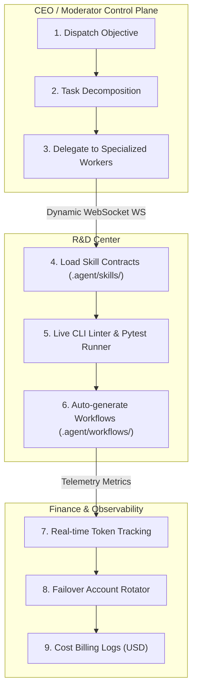
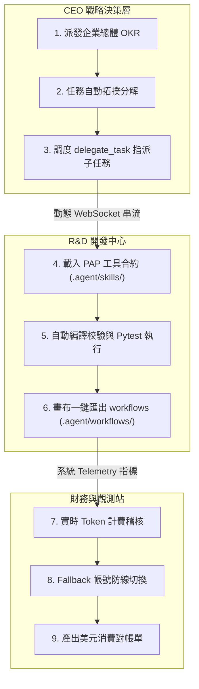

# 🌌 FindAi Studio — LLM Agent System (LAS)

<div align="center">


### [English](#-english) | [繁體中文](#-繁體中文)

</div>

---

## 🌐 English

> ### 🧠 **The First AI-Maintainable Agent Framework**
> Stop fighting rigid framework abstractions. FindAi Studio uses a **Contract-First design** (`.agent/` PAP + `INSTRUCTIONS_FOR_AI.md`) that lets cutting-edge LLMs safely understand, refactor, and extend your Agent workflows autonomously. **It's not just an AI Agent — it's an AI that builds your AI.**
>
> *Natively supports Gemini, Claude 3.5 Sonnet, GPT-4o, and Ollama with zero vendor lock-in.*

LAS is an extremely readable, maintainable, observable, and portable local Agent Runtime with a visual multi-dashboard control-plane. It is built upon four pillars:

* 🗺️ **Topological Workspace** — A node-based visual control-plane that transforms complex multi-agent sessions into an infinite canvas of interconnected task blocks.
* 🔏 **Contract-First Handoff** — PAP-compatible `.agent/` workspace contracts that allow humans and AI to safely inspect, verify, and extend the codebase.
* 🏢 **Agent Corporate Swarm** — Runs role-specialized agents concurrently (CEO, Developer, Auditor) operating collectively like an agile software company.
* 🧠 **Self-Healing Swarm** — Features automated runtime error self-healing, dynamic multi-account swapping, and dynamic runtime skill discovery.


---

### Conductor Telemetry

LAS now includes a Fugu-inspired `ConductorPlan` telemetry surface. Before the router executes a task, it can describe the intended execution mode (`fast`, `pro`, or `ultra`), role topology, selected model/account, tool allowlist, memory scope, verification strategy, budget, and fallback policy without changing the existing provider selection behavior.

`DiscussionRoom` also emits Thinker/Worker/Verifier role contracts and a durable verifier verdict for each debate run. The deterministic smoke eval can be run with `python scripts/eval_agents.py` to report completion, cost, latency, tool use, verifier outcome, and unresolved risk from local golden fixtures.

Router runs now persist compact `routing_outcome` records into long-term memory, including success/failure, task type, execution mode, selected model, token total, latency, and human intervention count. New `ConductorPlan` instances attach recent same-task-type outcomes as bounded `routing_memory_hints` for auditability; routing still remains behavior-compatible until outcome scoring is explicitly enabled. The deterministic eval suite now contains 24 golden tasks across code review, debugging, repo navigation, security review, long-context research, and UI smoke categories.

The React topology dashboard now renders a Conductor Trace panel for streamed sessions. The panel surfaces the published task breakdown, selected model rationale, routing memory hits, verification strategy, current cost, and execution latency from the same topology and telemetry channels used by the rest of the control plane.

`UnifiedPolicyGate` now centralizes high-impact runtime action decisions. Ultra mode, browser-use, computer-use, and external API actions require a valid ProofOfConsensus certificate or registered consensus hash before the gate allows them; safety scans remain audit-only but still pass through the same workspace/session/tenant scope guard. Every allow/deny decision is recorded as a `policy_gate_decision` event in `AuditLedger`, with metadata values excluded from the audit payload to avoid leaking secrets.

Workflow governance is now split into short, stage-specific documents under `docs/workflow/`. `SOURCE_OF_TRUTH.md`, `RISK_POLICY.md`, `REVIEW_PROTOCOL.md`, and `HANDOFF_SCHEMA.md` define how agents resolve conflicting instructions, classify risk, review changes, and hand off work without loading a single oversized workflow prompt.

The opt-in `codex-development` workflow manifest under `.agent/workflows/` models repo audit, PRD, SDD, spec, task inventory, atomic task, review, security gate, and handoff stages. `agent_workspace/workflow_lint.py` validates the manifest and checkpoint records in read-only mode, including dependency integrity and workspace path containment.

Evidence memory packing is available through `agent_workspace/memory_pack.py`. It explicitly copies selected raw output into `.agent/memory/refs/`, writes traceable L1 atoms, L2 scenarios, optional L3 persona notes, and Mermaid canvases, while keeping every summary tied to a `result_ref` and source hash.

`ConductorPlan` can now carry optional workflow audit metadata: `workflow_stage_id`, `workflow_checkpoint_ref`, `evidence_refs`, `code_graph_refs`, and `impact_summary`. These fields are emitted through router telemetry and streamed topology payloads when present, including workflow-stage node support and structural code-evidence counts, but they remain audit-only and do not affect provider selection, tool resolution, or routing behavior.

Structured review and security-gate reports are validated by `agent_workspace/review_findings_validate.py` against `spec/review-findings.schema.json`. Findings require entrypoint, sink, evidence, impact, remediation, and validation status; high-risk paths must declare security triggers and stay inside the workspace. High or critical findings also require code graph evidence for the entrypoint symbol, propagation path, sink symbol, impacted symbols, and linked tests.

The Conductor Trace panel now includes a Workflow Gate surface for workflow stage, checkpoint reference, evidence-ref count, and review-gate status. It consumes the same `workflow_stage_id`, `workflow_checkpoint_ref`, and `evidence_refs` metadata already emitted in topology conductor traces.

Codebase structural memory starts with a command-driven read-only indexer in `agent_workspace/codebase_index.py`. It scans source and config files into `.agent/codebase-memory/code_graph.sqlite`, recording files, modules, classes, functions, imports, calls, routes, config keys, and tests without installing external MCP binaries or saving config values.

The code graph is exposed through PAP-declared read-only tools: `code_index_repo`, `code_search_symbol`, `code_trace_call_path`, `code_detect_change_impact`, `code_get_architecture`, and `code_get_snippet`. Each tool keeps output bounded and relies on the runtime allowlist enforced by `AgentEngine.execute_tool()`.

---

### 🗺️ Live Topological Dagre View

```text
 ┌────────────────────────────────────────────────────────┐
 │            Moderator View: CEO Strategy Room           │
 └───────────────────────────┬────────────────────────────┘
                             │
                             │ (Handoff Edge: status-aware)
                             ▼
 ┌────────────────────────────────────────────────────────┐
 │            R&D Center: Developer Workspace             │
 └───────────────────────────┬────────────────────────────┘
                             ├─────────────────────────────┐
                             │                             │ (Tool/API Edge: typed route)
                             ▼                             ▼
 ┌───────────────────────────────────────┐     ┌───────────────────────────────────────┐
 │       Auditor: Telemetry & Billing    │     │       HITL Gate: Human Approval       │
 │   (Real-time Token & cost charts)     │     │      (approval state badge)           │
 └───────────────────────────────────────┘     └───────────────────────────────────────┘
```

---

### 🏢 Corporate Swarm Architecture



---

### ⚡ Quick Start (Three-Minute Setup)

#### 1. Setup Environment & Validate
```powershell
git clone <repo-url>
cd LLM-Agent-System
python -m venv .venv
.\.venv\Scripts\Activate.ps1
pip install -r requirements.txt
.\scripts\verify.cmd -SkipViewer
```

`-SkipViewer` still runs Python compile, `pytest --no-cov -q`, PAP validation, and the runtime tool manifest checks. After installing viewer dependencies, run `.\scripts\verify.cmd` from the repo root for the full Python + viewer build and UI smoke verification gate.

#### 2. Start the API Server
```powershell
uvicorn agent_workspace.api:app --host 0.0.0.0 --port 8000
```

#### 3. Launch Visual Dashboards
* **Option A (Zero-Build Vanilla HTML5 Panel):**
  ```powershell
  python -m http.server 8000
  # Open http://localhost:8000/workspace/viewer.html
  ```
* **Option B (Full Vite + React Flow Tauri Desktop App):**
  ```powershell
  cd viewer
  npm install
  npm run dev
  ```
  *(To download the pre-compiled standalone application directly, check the [releases/](releases/) directory. To compile it yourself, execute `npm run tauri build` inside the `viewer` directory.)*

#### 4. Verify the React Control Plane
```powershell
cd viewer
npm run build
npm run verify:ui
npm run test:swarm-ui
```

The React/Tauri viewer is the product-grade visual control plane for the local Agent Runtime. It uses route-level code splitting, shared UI primitives, low-saturation design tokens, and repeatable bundle verification. The Task Flow workspace, Activity Log, Admin Console, Rules, MODs, and Settings surfaces now share the same restrained status language, localized operational copy, and tokenized interaction states. The Admin Console also includes typed Swarm node monitor, session failover, P2P mesh, billing policy, topological replay, governance ballot, PromptComposer diff, anomaly timeline, and Merkle/ZK proof inspector panels backed by the `/v1/swarm/*` and `/v1/audit/*` operator APIs. `npm run verify:ui` checks the production bundle and enforces a sub-500 kB JavaScript chunk budget. `npm run test:swarm-ui` verifies the Swarm governance panels, API endpoint bindings, and offline mock-service render markers inside the production Admin chunk. `npm run verify:ui:screenshots` also attempts Edge headless screenshots into `viewer/output/ui-regression/`; set `UI_VERIFY_STRICT_SCREENSHOTS=1` when screenshot capture must be treated as a hard failure.

---

### 🔌 Developer Operations CLI

LAS features a unified operations toolbelt (`agent_workspace/cli.py`):

```powershell
# List all registered local & global skills
python agent_workspace/cli.py --list-skills

# Run static schema checks on all PAP contracts
python agent_workspace/cli.py --validate

# Execute a declarative DAG workflow script
python agent_workspace/cli.py --run-workflow my_workflow

# Run interactive closed-loop session with live HITL approvals
python agent_workspace/cli.py --chat

# Sync PAP contracts, agent.md, and skills.md from live registry
python agent_workspace/tool_manifest.py sync

# Validate tool contracts parity and scan secrets
python agent_workspace/tool_manifest.py validate

# Build the local structural code graph index
python agent_workspace/codebase_index.py --root .

# Audit package dependencies licenses for compliance
python agent_workspace/tool_manifest.py audit-licenses [--deny-copyleft]
```

#### Git Safety Hooks

`.\scripts\verify.cmd` does not modify `.git/hooks` by default. To opt in to local guardrails, run:

```powershell
.\scripts\verify.cmd -SkipTests -SkipViewer -InstallGitHooks
```

The generated `pre-push` hook runs `scripts/git_guard.py`. It prefers the repo `.venv` Python interpreter before falling back to `python` on `PATH`. It blocks force-push flags, `git reset --hard`, destructive `git clean` flags, remote ref deletion, and non-fast-forward pre-push records. For an intentional human override, set `BYPASS_GIT_GUARD=1` for that command.

中文：產生的 `pre-push` hook 會執行 `scripts/git_guard.py`，並優先使用 repo `.venv` 內的 Python interpreter，再退回 `PATH` 上的 `python`。它會阻擋 force-push flags、`git reset --hard`、破壞性的 `git clean` flags、刪除 remote ref，以及 non-fast-forward pre-push records。若是刻意的人為覆寫，可在該命令設定 `BYPASS_GIT_GUARD=1`。

---

### 🛡️ SOC2 Audit Ledger & Container Sandboxing

LAS includes enterprise-grade security auditing and containerized sandboxing:
* **Immutable Cryptographic Audit Trail**: Automatically intercepts and logs critical events (system calls, WebSocket packets, and consensus votes) to an SQLite ledger database. Each log entry is cryptographically chained using SHA-256 signatures (`previous_hash` + `current_hash` validation), allowing instant detection of tampered or corrupted log entries.
* **Restricted Docker Sandbox**: Dynamically executes generated Python script files inside a constrained, zero-network `python:3.11-slim` container (disabled networking, 128MB maximum memory limit).
* **Graceful AST Fallbacks**: In case the Docker SDK or local Docker daemon is offline, execution automatically falls back gracefully to a restricted AST-sanitized sandboxing layer with security notifications.

---

### 🔑 SaaS Multi-Tenancy & Channel Webhook Adapters

LAS features built-in multi-tenant isolation, secure webhooks, and automated usage sync:
* **JWT & API Key Authentication**: Secures builder, sandbox, audit, and billing APIs with role-based tenant routing. Row-level tenant isolation is enforced at the SQLite layer for `AuditLedger` and `FinancialLedger`.
* **Slack & LINE Production Webhook Adapters**: Direct POST webhook routes with cryptographic signature checking (HMAC-SHA256 of `x-slack-signature` and `x-line-signature` / base64 hashing), protecting workspaces against replay attacks.
* **WebSocket Room Isolation**: Automatically verifies authentication tokens and api keys on collaboration WebSocket handshakes, restricting broadcasts strictly to users within the same tenant.
* **Stripe Metered Billing & SLA Audited Failovers**: Periodically aggregates token usage from `FinancialLedger` and pushes increments to Stripe's Usage Record API via an asynchronous background scheduler, verifies incoming Stripe webhooks timing-safe, and automatically routes model provider failovers to fallback accounts under a custom 1.8x markup registered in `AuditLedger`.
* **Stripe Subscription Lifecycle & Access Control Gating**: Updates subscription status (`active`, `frozen`, `canceled`) inside SQLite from Stripe webhook events. Secures REST/WebSocket endpoints with custom close code `4003` for inactive accounts and `4029` for token rate-limit violations (capped at 5,000 tokens/minute), bypassing the failover mechanism for rate-limit blocks.

---

### 📡 Distributed Redis Broker & Swarm Microservices
LAS supports highly scalable, distributed execution of agent swarms:
* **Pluggable Redis Message Broker**: Replaces local in-memory queues with a `RedisSwarmBroker` using Redis Pub/Sub channels (`swarm:debate:{role}` and `swarm:role:{role}`) for consensus debates and task dispatches. Includes silent dynamic fallback to `InMemorySwarmBroker` if Redis is offline.
* **Microservices & Orchestration**: Packages individual agent roles (CEO, Dev, QA, CFO) into separate system processes/nodes managed by `docker-compose.microservices.yml`. Dynamically joins workspace sessions via a Redis-based peer discovery ping-pong protocol and periodic heartbeats.
* **Prometheus Telemetry**: Exposes `/metrics` and `/v1/metrics` endpoints tracking tenant token metrics (`las_tenant_tokens_total`), sandbox execution statistics (`las_sandbox_executions_total`), and HTTP request latencies (`las_api_response_latency_seconds`).
* **Real-time Resource Monitoring**: Dynamically collects Docker sandbox memory (MB) and CPU usage percentage from container stats, logging the execution overhead real-time to the immutable `AuditLedger`.
* **Cryptographic Consensus Auditing**: Batch audits event logs and builds a deterministic Merkle Tree (`core/merkle.py`) to verify block-state consistency across nodes. Exposes `/v1/audit/status` and `/v1/audit/sync` endpoints.
* **Self-Healing & Replication Sync**: An asynchronous consensus daemon (`AuditConsensusDaemon` in `core/audit_ledger.py`) broadcasts roots and event counts over Redis. Lagging nodes automatically request missing logs, verify signatures, and self-heal.
* **Tamper & Fork Detection**: Detects unresolvable forks and invalid logs, automatically generating alerts and logging `SOC2_VIOLATION` records.

---

### 🗳️ Swarm Consensus Governance & Dynamic Prompt Calibration
LAS features a decentralized peer-voting governance protocol to self-recalibrate system directives:
* **Decentralized Swarm Voting**: Triggers prompt policy calibration proposals automatically when the audit ledger detects latency overruns or safety exceptions. Swarm members (CEO, CTO, Dev, QA, CFO) cast cryptographically signed approve/reject votes.
* **Proof-of-Consensus Certification**: Requires a strict majority (> 50% active members, i.e., 3 out of 5 roles) to sign and certify proposal hashes, generating consensus certificates registered in `consensus_registry.json`.
* **Dynamic Prompt Policy Injection**: Automatically injects active calibration rules into future role system prompts under a dedicated section in `PromptComposer`.

---

### 🔏 Portable Agent Protocol (PAP) v0.2.0 Alignment
LAS is fully aligned with the latest PAP v0.2.0 reference specification:
* **Strict JSON Schema Validation**: Natively validates `.agent/agent.md` manifest frontmatter against `spec/agent-schema.json` using the `jsonschema` library, catching layout mismatches and missing keys.
* **Bootstrapping Onboarding State Machine**: Enforces a strict onboarding guard that blocks tool executions until the agent has read `agent.md`, `skills.md`, `agent_tasks.md`, and `handoff_guide.md` in order.
* **Turn & Context Limit Exceeded Handoffs**: Automatically exports session handoffs and raises `HandoffRequired` (Exit Code `42`) to gracefully trigger host-level execution restarts.
* **Automated Registry Sync**: Supports `cli.py --sync-pap` to validate local workspaces and synchronize standard skill definitions or templates automatically.
* **Runtime & Security Interface Specs**: Adds `spec/runtime-interface.md` and `spec/security.md` as PAP-facing contracts for manifest loading, skill calls, memory access, workflow execution, standard errors, permission gates, and handoff integrity.
* **PAP Handoff Packet Compatibility**: Handoff exports now include `pending_steps` and checksum metadata compatible with `spec/memory.schema.json`, while imports continue to accept legacy LAS packets when their legacy checksum verifies.

---

## 🌐 繁體中文

> ### 🧠 **首個讓 AI 幫你客製化與重構 AI 的框架**
> 拒絕僵硬死板的框架抽象。FindAi Studio 採用 **合約優先 (Contract-First) 設計** (`.agent/` PAP + `INSTRUCTIONS_FOR_AI.md`)，讓最尖端的大模型在**不污染、不破壞核心架構**的前提下，安全地自主理解、重構、編譯並擴充你的工作流。**它不僅是一個智慧體 —— 它是一個幫你生產智慧體的自動化工廠。**
>
> *原生無縫支援 Gemini, Claude 3.5 Sonnet, GPT-4o 與 Ollama，零供應商鎖定。*

---

### Conductor Telemetry / 指揮層遙測

LAS 現在加入受 Fugu 啟發的 `ConductorPlan` 遙測層。Router 在執行任務前，可以描述預計使用的 execution mode (`fast`, `pro`, `ultra`)、角色拓撲、模型與帳號選擇、工具允許清單、記憶範圍、驗證策略、預算與 fallback 政策；這一層目前只做可審計記錄，不改變既有 provider selection 行為。

`DiscussionRoom` 也會在每次 debate run 輸出 Thinker/Worker/Verifier 角色契約與 durable verifier verdict。可用 `python scripts/eval_agents.py` 執行 deterministic smoke eval，從本地 golden fixtures 回報 completion、cost、latency、tool use、verifier outcome 與 unresolved risk。

Router 現在會把精簡的 `routing_outcome` 記錄寫入 long-term memory，內容包含成功/失敗、任務類型、execution mode、已選模型、token 總量、latency 與人工介入次數。新的 `ConductorPlan` 會把近期同任務類型 outcome 作為 bounded `routing_memory_hints` 附上，供審計使用；在 outcome scoring 明確啟用前，routing 行為仍維持相容。Deterministic eval suite 現在包含 24 個 golden tasks，涵蓋 code review、debugging、repo navigation、security review、long-context research 與 UI smoke 類別。

React topology dashboard 現在會為 streamed session 顯示 Conductor Trace panel。該 panel 會從既有 topology 與 telemetry channels 呈現 task breakdown、已選模型 rationale、routing memory hits、verification strategy、目前 cost 與 execution latency。

`UnifiedPolicyGate` 現在集中處理高影響 runtime action 決策。Ultra mode、browser-use、computer-use 與 external API actions 必須具備有效的 ProofOfConsensus certificate，或已登錄的 consensus hash，gate 才會放行；safety scan 維持 audit-only，但同樣會經過 workspace/session/tenant scope guard。每次允許或拒絕都會以 `policy_gate_decision` event 寫入 `AuditLedger`，且 audit payload 只記錄 metadata key，不記錄 value，以降低秘密外洩風險。

Workflow governance 現在拆成 `docs/workflow/` 底下的短文件：`SOURCE_OF_TRUTH.md`、`RISK_POLICY.md`、`REVIEW_PROTOCOL.md` 與 `HANDOFF_SCHEMA.md`。這些文件定義 agent 如何處理衝突指令、風險分級、review gate 與 handoff，而不需要每輪載入一整份過長 workflow prompt。

`.agent/workflows/` 內的 opt-in `codex-development` workflow manifest 會描述 repo audit、PRD、SDD、spec、task inventory、atomic task、review、security gate 與 handoff stages。`agent_workspace/workflow_lint.py` 以唯讀模式驗證 manifest 與 checkpoint records，包含 dependency 完整性與 workspace path containment。

Evidence memory packing 現在可透過 `agent_workspace/memory_pack.py` 明確執行。它會把指定 raw output 複製到 `.agent/memory/refs/`，寫入可追溯的 L1 atoms、L2 scenarios、可選 L3 persona notes 與 Mermaid canvases，並讓每個 summary 保留 `result_ref` 與 source hash。

`ConductorPlan` 現在可以攜帶可選的 workflow audit metadata：`workflow_stage_id`、`workflow_checkpoint_ref`、`evidence_refs`、`code_graph_refs` 與 `impact_summary`。這些欄位在存在時會進入 router telemetry 與 streamed topology payload，並支援 workflow-stage node 與 structural code-evidence counts；但它們仍只作為審計資訊，不影響 provider selection、tool resolution 或 routing 行為。

Structured review 與 security-gate 報告現在由 `agent_workspace/review_findings_validate.py` 依照 `spec/review-findings.schema.json` 驗證。Finding 必須包含 entrypoint、sink、evidence、impact、remediation 與 validation status；高風險路徑必須宣告 security triggers，且證據路徑必須留在 workspace 內。High 或 critical finding 也必須附上 code graph evidence，包含 entrypoint symbol、propagation path、sink symbol、impacted symbols 與 linked tests。

Conductor Trace 面板現在新增 Workflow Gate surface，可顯示 workflow stage、checkpoint reference、evidence-ref 數量與 review-gate status。它直接消費 topology conductor trace 已發出的 `workflow_stage_id`、`workflow_checkpoint_ref` 與 `evidence_refs` metadata。

Codebase structural memory 從命令驅動的 read-only indexer 開始，實作位於 `agent_workspace/codebase_index.py`。它會把 source 與 config files 掃入 `.agent/codebase-memory/code_graph.sqlite`，記錄 files、modules、classes、functions、imports、calls、routes、config keys 與 tests，不安裝外部 MCP binary，也不保存 config values。

Code graph 現在也透過 PAP-declared read-only tools 暴露：`code_index_repo`、`code_search_symbol`、`code_trace_call_path`、`code_detect_change_impact`、`code_get_architecture` 與 `code_get_snippet`。每個 tool 都限制輸出大小，並依賴 `AgentEngine.execute_tool()` 的 runtime allowlist enforcement。

---

### 🗺️ 實時拓撲 Dagre 觀測圖

```text
 ┌────────────────────────────────────────────────────────┐
 │             Moderator View: CEO 戰略指揮官視角          │
 └───────────────────────────┬────────────────────────────┘
                             │
                             │ (Handoff 邊線：狀態化路徑)
                             ▼
 ┌────────────────────────────────────────────────────────┐
 │              R&D Center: 開發工程師畫布編輯器           │
 └───────────────────────────┬────────────────────────────┘
                             ├─────────────────────────────┐
                             │                             │ (Tool/API 邊線：類型化路由)
                             ▼                             ▼
 ┌───────────────────────────────────────┐     ┌───────────────────────────────────────┐
 │         Auditor: 財務計費與統計儀表板  │     │        HITL Gate: 人機審批閘口         │
 │     (實時 Token 統計與延遲折線圖)       │     │       (審批狀態標籤)                  │
 └───────────────────────────────────────┘     └───────────────────────────────────────┘
```

---

### 🏢 公司化協同架構 (Mermaid)



---

### ⚡ 快速啟動 (三分鐘環境搭建)

#### 1. 建立虛擬環境與校驗
```powershell
git clone <repo-url>
cd LLM-Agent-System
python -m venv .venv
.\.venv\Scripts\Activate.ps1
pip install -r requirements.txt
.\scripts\verify.cmd -SkipViewer
```

`-SkipViewer` 仍會執行 Python compile、`pytest --no-cov -q`、PAP validation 與 runtime tool manifest checks。安裝 viewer dependencies 後，可在 repo root 執行 `.\scripts\verify.cmd` 跑完整 Python + viewer build 與 UI smoke verification gate。

#### 2. 啟動 FastAPI 服務適配器
```powershell
uvicorn agent_workspace.api:app --host 0.0.0.0 --port 8000
```

#### 3. 啟動視覺化多重視角控制台
* **方案 A (零編譯 Vanilla HTML5 輕量面板):**
  ```powershell
  python -m http.server 8000
  # 開啟 http://localhost:8000/workspace/viewer.html
  ```
* **方案 B (Vite + React Flow Tauri 專業桌面端):**
  ```powershell
  cd viewer
  npm install
  npm run dev
  ```
  *(若您希望直接下載預先編譯好的免安裝執行檔，請前往 [releases/](releases/) 目錄取得。若要自行編譯，請在 `viewer` 目錄下執行 `npm run tauri build`)*

#### 4. 校驗 React 視覺控制平面
```powershell
cd viewer
npm run build
npm run verify:ui
npm run test:swarm-ui
```

React/Tauri viewer 是本地 Agent Runtime 的產品級 visual control plane。它已使用 route-level code splitting、共用 UI primitives、低飽和設計 token 與可重複的 bundle gate。Task Flow 工作區、Activity Log、Admin Console、Rules、MODs 與 Settings surface 現在共用同一套克制的狀態語言、本地化操作文案與 tokenized interaction states。Admin Console 也已整合 typed Swarm node monitor、session failover、P2P mesh、billing policy、topological replay、governance ballot、PromptComposer diff、anomaly timeline，以及由 `/v1/swarm/*` 與 `/v1/audit/*` operator APIs 支援的 Merkle/ZK proof inspector panels。`npm run verify:ui` 會檢查 production bundle，並要求最大 JavaScript chunk 小於 500 kB。`npm run test:swarm-ui` 會驗證 Swarm governance panels、API endpoint bindings，以及 production Admin chunk 內的 offline mock-service render markers。`npm run verify:ui:screenshots` 會額外嘗試使用 Edge headless 產出截圖至 `viewer/output/ui-regression/`；若截圖必須作為硬性 gate，可設定 `UI_VERIFY_STRICT_SCREENSHOTS=1`。

---

### 🚥 本地開發者工具 CLI

LAS 提供一站式開發者工具箱 (`agent_workspace/cli.py`)：

```powershell
# 列出所有註冊的本地與全域工具 (Skills)
python agent_workspace/cli.py --list-skills

# 執行零依賴的 PAP 工作區合約靜態校驗
python agent_workspace/cli.py --validate

# 執行定義於 .agent/workflows/ 的宣告式工作流腳本
python agent_workspace/cli.py --run-workflow my_workflow

# 啟動具有實時 HITL 人機審批的互動式對話
python agent_workspace/cli.py --chat

# 從運行時註冊表同步 PAP 合約、agent.md 與 skills.md
python agent_workspace/tool_manifest.py sync

# 校驗合約一致性與掃描敏感金鑰
python agent_workspace/tool_manifest.py validate

# 建立本地 structural code graph index
python agent_workspace/codebase_index.py --root .

# 審計專案套件依賴授權合規性
python agent_workspace/tool_manifest.py audit-licenses [--deny-copyleft]
```

---

### 🛡️ SOC2 密碼學審計日誌與容器沙箱

LAS 內建企業級安全防護與可溯源的容器沙箱執行環境：
* **不可篡改密碼學審計軌跡 (SOC2)**: 自動攔截並記錄關鍵操作（系統呼叫、WebSocket 通訊封包與共識投票登記）至 SQLite 審計資料庫。每一筆日誌皆透過 SHA-256 進行前後鏈式簽章追蹤，能自動偵測並精準回報手動篡改或損毀的日誌 ID。
* **限制型 Docker 沙箱環境**: 在完全停用網路連線 (`network="none"`) 且具備記憶體配額配給（最大 128MB）的隔離 `python:3.11-slim` 容器中執行生成的 Python 腳本。
* **自動退回安全 AST 沙箱**: 若本地主機未啟動 Docker Daemon 或缺少 SDK 套件，沙箱執行引擎會自動且優雅地降級回退至具備 AST 靜態語法白名單的本地沙箱，並同步拋出安全性警報日誌。

---

### 🔑 SaaS 多租戶隔離與生產級管道轉接器

LAS 提供原生多租戶 SaaS 架構與安全的通訊管道轉接器：
* **JWT 與 API 金鑰雙重認證**: 安全防護智慧體構建器 (Builder)、安全沙箱 (Sandbox)、審計軌跡 (Audit) 與財務帳單 API。在資料庫底層對 `AuditLedger` 與 `FinancialLedger` 強制執行列級多租戶查詢隔離。
* **Slack 與 LINE 生產級 Webhook 轉接器**: 提供專屬 POST Webhook 路由，內建 HMAC-SHA256 簽章校驗機制（比對 `x-slack-signature` 與 `x-line-signature`），防範重放攻擊 (Replay Attacks)。
* **WebSocket 租戶房間隔離**: 在 `/v1/collaboration/{session_id}` 握手時自動校驗 JWT 與金鑰，限制廣播訊息僅在相同租戶 ID 的成員之間流通，防止跨租戶資料外洩。
* **Stripe 計量計費與 SLA 智能避障**: 透過背景工作排程器定期彙整 `FinancialLedger` 中的 Token 消耗，並以增量方式呼叫 Stripe 的 Usage Record API。Webhook 接收端點具備時間安全的 HMAC 簽章驗證，防護重放攻擊。當主模型供應商發生故障時，自動路由避障至備用帳戶，並自動套用 1.8 倍加成費率且寫入 SOC2 審計軌跡 `AuditLedger`。
* **Stripe 訂閱生命週期與訪問控制門禁**: 基於 Stripe Webhook 事件實時更新 SQLite 中的訂閱狀態（`active`、`frozen`、`canceled`）。透過 REST 攔截與 WebSocket 自定義關閉代碼（停權/取消為 `4003`，超出 Token 速率限制為 `4029`）進行訪問阻斷，Token 消耗限制為每分鐘 5,000 tokens，且此速率限制阻斷會直接繞過 SLA 故障轉移機制。

---

### 📡 分散式 Redis 訊息代理與 Swarm 微服務
LAS 支援高可擴充性的分散式智慧體群體執行架構：
* **可插拔式 Redis 訊息代理**: 透過 `RedisSwarmBroker` 以 Redis 發佈/訂閱頻道（`swarm:debate:{role}` 與 `swarm:role:{role}`）進行群體共識辯論與任務指派。若 Redis 離線，系統會自動且無感地回退至 `InMemorySwarmBroker` 本地佇列。
* **微服務與容器編排**: 將各智慧體角色（CEO、Dev、QA、CFO）打包為獨立的系統程序/節點，由 `docker-compose.microservices.yml` 統一編排。透過 Redis 進行對等點發現（Peer Discovery） ping-pong 協議與定期心跳，動態加入活躍的工作區會議。
* **Prometheus 指標觀測**: 曝露 `/metrics` 與 `/v1/metrics` 端點，以匯出租戶 Token 統計 (`las_tenant_tokens_total`)、沙箱執行次數 (`las_sandbox_executions_total`) 與 API 響應延遲時間 (`las_api_response_latency_seconds`) 等指標。
* **實時沙箱資源監控**: 動態擷取 Docker 安全沙箱容器 stats 中的 CPU 百分比與記憶體（MB）開銷，並將實時運行開銷登載至不可篡改的 `AuditLedger` 審計軌跡中。
* **密碼學共識審計**: 批次審計事件日誌並構建確定性 Merkle Tree (`core/merkle.py`)，驗證跨節點的區塊狀態一致性，並提供 `/v1/audit/status` 與 `/v1/audit/sync` API 端點。
* **自癒與複製同步**: 透過非同步共識守護程序 (`AuditConsensusDaemon` 於 `core/audit_ledger.py`) 在 Redis 上定期廣播 Merkle Root 與計數。落後節點會自動請求缺失日誌、驗證簽章並進行自癒。
* **篡改與分叉檢測**: 自動偵測無法解決的分叉和無效日誌，同步拋出安全性警報並寫入 `SOC2_VIOLATION` 審計記錄。

---

### 🗳️ Swarm 共識治理與動態提示詞策略校準
LAS 具備去中心化的節點投票治理協定，實現提示詞指令的自適應校準與防禦：
* **去中心化群體投票**：當 `AuditLedger` 偵測到超時或安全異常時，自動觸發提示詞策略校準提案。Swarm 成員（CEO、CTO、Dev、QA、CFO）針對提案投下經密碼學簽章的讚成或反對票。
* **共識證明 (Proof-of-Consensus) 認證**：要求嚴格多數決（超過 50% 的活躍節點，即 5 個角色中至少 3 個讚成）對提案雜湊進行協同簽章，並產出共識憑證登記於 `consensus_registry.json` 中。
* **動態提示詞注入**：`PromptComposer` 自動在系統提示詞中動態載入並注入已通過共識決的校準規則，實現系統自我優化與安全補強。

---

### 🔏 Portable Agent Protocol (PAP) v0.2.0 協議對齊
LAS 完整對齊了最新版的 PAP v0.2.0 參考實作：
* **嚴格的 JSON Schema 靜態校驗**：利用 `jsonschema` 庫對 `.agent/agent.md` 屬性宣告進行 Schema 格式驗證，確保屬性宣告沒有拼寫錯誤。
* **引導順序防禦狀態機**：強制要求智慧體在執行工具前，必須依序讀取 `agent.md` -> `skills.md` -> `agent_tasks.md` -> `handoff_guide.md` 才能解鎖工具。
* **超限自動 Handoff 重啟**：當對話輪次或 context 字數超限時，自動導出 Handoff 封包並拋出 `HandoffRequired` 異常以 Exit Code `42` 退出，通知宿主重啟執行執行緒。
* **自動化協定同步 CLI**：支援 `cli.py --sync-pap` 一鍵校驗本地工作區合約並自動對齊與引進標準 Skill 合約範本。
* **Runtime 與安全接口規格**：新增 `spec/runtime-interface.md` 與 `spec/security.md`，作為 manifest 載入、skill 呼叫、memory 存取、workflow 執行、標準錯誤、權限閘門與 handoff 完整性的 PAP-facing 合約。
* **PAP Handoff 封包相容性**：Handoff 匯出現在包含 `pending_steps` 與 checksum metadata，可通過 `spec/memory.schema.json`；匯入端仍會在 legacy checksum 驗證通過時接受舊版 LAS 封包。

---

### ⚖️ License

LAS is distributed under the **Elastic License 2.0 (ELv2)**. Free to use, modify, and distribute internally, but hosting the software as a managed service is prohibited. See `LICENSE` for details.
