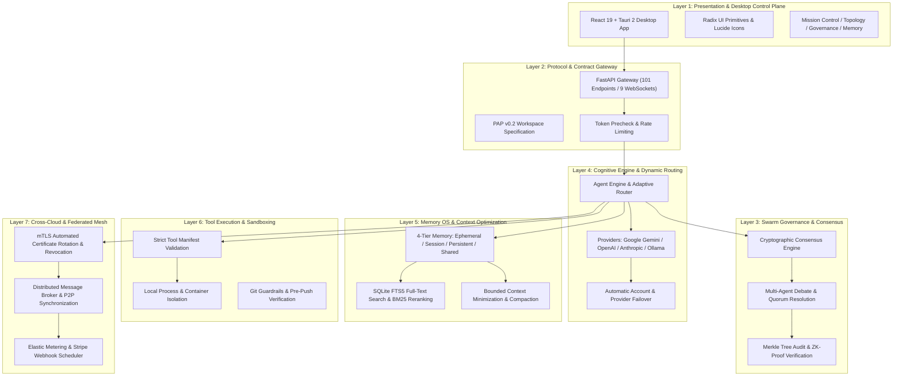

# FindAi Studio — LLM Agent System (LAS)

LAS is an enterprise-grade, contract-first multi-agent runtime and topology control plane featuring a FastAPI backend, Portable Agent Protocol (PAP v0.2) contracts, a resilient 7-layer architecture, durable cross-agent memory, and a modern React 19 / Tauri 2 desktop control plane.

```
+-------------------------------------------------------------------------------+
|  Presentation: React 19 + Tauri 2 Control Plane (Radix UI / Lucide Icons)     |
+-------------------------------------------------------------------------------+
|  Protocol & Gateway: PAP v0.2, 101 REST Endpoints, 9 WebSockets, OpenAPI     |
+-------------------------------------------------------------------------------+
|  Governance & Consensus: Cryptographic Merkle Trees, ZK Proofs, Role Voting   |
+-------------------------------------------------------------------------------+
|  Cognitive Engine: Swarm Debate, Dynamic Routing, Provider Failover           |
+-------------------------------------------------------------------------------+
|  Memory OS: 4-Tier Memory (Ephemeral, Session, Persistent, Shared FTS5)       |
+-------------------------------------------------------------------------------+
|  Tool & Sandbox: Strict Manifest, Container Sandboxing, Security Guardrails  |
+-------------------------------------------------------------------------------+
|  Cross-Cloud Mesh: Mutual TLS (mTLS), Distributed Broker, Multi-Region Sync   |
+-------------------------------------------------------------------------------+
```

## 7-Layer Topological Architecture


```mermaid
flowchart TD
    subgraph L1["Layer 1: Presentation & Desktop Control Plane"]
        UI["React 19 + Tauri 2 Desktop App"]
        Radix["Radix UI Primitives & Lucide Icons"]
        Views["Mission Control / Topology / Governance / Memory"]
    end

    subgraph L2["Layer 2: Protocol & Contract Gateway"]
        PAP["PAP v0.2 Workspace Specification"]
        API["FastAPI Gateway (101 Endpoints / 9 WebSockets)"]
        Guard["Token Precheck & Rate Limiting"]
    end

    subgraph L3["Layer 3: Swarm Governance & Consensus"]
        Audit["Cryptographic Consensus Engine"]
        Merkle["Merkle Tree Audit & ZK-Proof Verification"]
        Vote["Multi-Agent Debate & Quorum Resolution"]
    end

    subgraph L4["Layer 4: Cognitive Engine & Dynamic Routing"]
        Engine["Agent Engine & Adaptive Router"]
        Providers["Providers: Google Gemini / OpenAI / Anthropic / Ollama"]
        Failover["Automatic Account & Provider Failover"]
    end

    subgraph L5["Layer 5: Memory OS & Context Optimization"]
        MemoryTiers["4-Tier Memory: Ephemeral / Session / Persistent / Shared"]
        FTS5["SQLite FTS5 Full-Text Search & BM25 Reranking"]
        Compaction["Bounded Context Minimization & Compaction"]
    end

    subgraph L6["Layer 6: Tool Execution & Sandboxing"]
        Manifest["Strict Tool Manifest Validation"]
        Sandbox["Local Process & Container Isolation"]
        GitGuard["Git Guardrails & Pre-Push Verification"]
    end

    subgraph L7["Layer 7: Cross-Cloud & Federated Mesh"]
        mTLS["mTLS Automated Certificate Rotation & Revocation"]
        Broker["Distributed Message Broker & P2P Synchronization"]
        Billing["Elastic Metering & Stripe Webhook Scheduler"]
    end

    UI --> API
    API --> Guard
    Guard --> Engine
    Engine --> Audit
    Audit --> Vote
    Vote --> Merkle
    Engine --> MemoryTiers
    MemoryTiers --> FTS5
    MemoryTiers --> Compaction
    Engine --> Providers
    Providers --> Failover
    Engine --> Manifest
    Manifest --> Sandbox
    Engine --> mTLS
    mTLS --> Broker
    Broker --> Billing
```

## System Metrics & Quality Highlights

- **Scale**: 516+ tracked files, 96,000+ lines of code across Python, TypeScript, and Rust.
- **Contract & API Surface**: 101 REST endpoints, 9 real-time WebSocket channels, 100% PAP v0.2 compliance.
- **Testing & Verification**: 118 test suites covering routing, consensus, memory, tools, and routes.
- **Frontend Quality**: Built with Rolldown / Vite in ~400ms. React Doctor verified with **0 errors**, **0 array index keys**, and **0 performance warnings**.
- **Knowledge & Memory OS**: 85 project knowledge base documents (`.agent/knowledge_base/`) and 131 Obsidian vault notes with 0 linting findings.

## What is Included

- **Python Runtime (`agent_workspace/core`)**: Routing, multi-tier memory, cryptographic consensus, sandboxing, provider abstraction, and multi-agent coordination.
- **Contract & Knowledge System (`.agent`)**: PAP contracts, workflows, role definitions, and durable cross-agent project knowledge.
- **React 19 + Tauri 2 Desktop App (`viewer`)**: Dark glassmorphism interface, Radix UI primitives, Lucide icons, Rolldown code-splitting, real-time topology stream.
- **Multi-Provider Support**: Pluggable adapters for Google Gemini, Anthropic Claude, OpenAI, and local Ollama.

## Requirements

- Windows 10 or 11 (x64)
- Python 3.11+
- Node.js 22 LTS+
- Rust stable and Tauri 2 Windows prerequisites (C++ Build Tools, WebView2)

## Quick Start

```powershell
# 1. Clone repository
git clone https://github.com/OPluke11-abula/LLM-Agent-System.git
cd LLM-Agent-System

# 2. Setup Python virtual environment
python -m venv .venv
.\.venv\Scripts\python.exe -m pip install -r requirements.txt

# 3. Optional: install hosted provider SDKs
.\.venv\Scripts\python.exe -m pip install -r requirements-providers.txt

# 4. Run authoritative verification ladder
.\scripts
erify.cmd -SkipViewer
```

Configure credentials via environment variables (`GOOGLE_API_KEY`, `OPENAI_API_KEY`, `ANTHROPIC_API_KEY`). Local Ollama requires no API key. Never commit credentials or local `.env` files.

## Running the Services

### 1. Start the API Gateway

```powershell
.\.venv\Scripts\python.exe -m uvicorn agent_workspace.api:app --host 127.0.0.1 --port 8000
```

### 2. Start the Web Viewer (Development)

```powershell
npm.cmd --prefix viewer install
npm.cmd --prefix viewer run dev
```

### 3. Start the Desktop Control Plane

```powershell
$env:AGENT_WORKSPACE_DIR="$PWD\workspace"
npm.cmd --prefix viewer run tauri -- dev
```

## Runtime Configuration

The local profile runs loopback-only, single-tenant, and leaves SaaS or distributed workers disabled by default. Boolean values accept `true`, `1`, `yes`, `on`, `false`, `0`, `no`, or `off` (case-insensitive).

| Variable | Purpose and accepted value/type | Secure default | Example | Security or operational consequence |
| --- | --- | --- | --- | --- |
| `LAS_BIND_HOST` | API bind hostname or IP string | `127.0.0.1` | `LAS_BIND_HOST=127.0.0.1` | External binding requires configured secure authentication. |
| `LAS_JWT_SECRET` | JWT signing secret; non-empty string of at least 32 characters | unset; fail closed | `LAS_JWT_SECRET=<secret-manager-value>` | Required for authenticated external binding; never commit or log it. |
| `LAS_ENABLE_STRIPE` | Enable Stripe billing scheduler; boolean | `false` | `LAS_ENABLE_STRIPE=false` | SaaS billing is opt-in and otherwise creates no scheduler. |
| `LAS_ENABLE_REDIS_SWARM` | Enable Redis swarm listener; boolean | `false` | `LAS_ENABLE_REDIS_SWARM=false` | No Redis connection or retry loop is started when disabled. |
| `LAS_ENABLE_MULTI_WORKER` | Enable multi-worker coordination; boolean | `false` | `LAS_ENABLE_MULTI_WORKER=false` | Distributed workers remain off unless explicitly enabled with Redis. |
| `LAS_ENABLE_AUDIT_CONSENSUS` | Enable the audit/consensus daemon; boolean | `false` | `LAS_ENABLE_AUDIT_CONSENSUS=false` | Consensus background work is not started by the local profile. |
| `LAS_TASK_MAX_CONCURRENCY` | Maximum in-flight task count; integer | `8` | `LAS_TASK_MAX_CONCURRENCY=8` | The limit is process-local unless durable/distributed coordination is provided. |
| `LAS_TASK_TIMEOUT_SECONDS` | Per-task execution timeout in seconds; number | `300` | `LAS_TASK_TIMEOUT_SECONDS=300` | Long-running tasks are terminated after the limit. |
| `LAS_TASK_RECORD_TTL_SECONDS` | Retention for terminal task records in seconds; number | `3600` | `LAS_TASK_RECORD_TTL_SECONDS=3600` | Expired in-memory records are removed; this is not durable storage. |
| `LAS_POC_CONSENSUS_SECRET` | Consensus signing secret; non-empty secret string | unset; fail closed | `LAS_POC_CONSENSUS_SECRET=<secret-manager-value>` | Missing or test-only values prevent production consensus signing. |
| `LAS_POC_SECRET_<ROLE>` | Per-role consensus secret; non-empty secret string | unset; fail closed | `LAS_POC_SECRET_CEO=<secret-manager-value>` | Missing role secrets fail closed; never place real values in source or docs. |
| `LAS_ZK_SECRET_KEY` | Audit proof secret; non-empty secret string | unset; fail closed | `LAS_ZK_SECRET_KEY=<secret-manager-value>` | Missing values prevent proof verification instead of using a fallback. |
| `LAS_TEST_MODE` | Explicit non-production secret marker mode; `1`, `true`, or `yes` | unset/off | `LAS_TEST_MODE=1` | Test-only markers are permitted; never enable this in production. |

## Hardened Runtime Profile

The hardened runtime profile protects authentication, secret handling, egress control, filesystem boundaries, and task lifecycle limits:

| Control | Default | Description |
| --- | ---: | --- |
| Debate provider calls | 64 | Maximum round-trip LLM invocations per debate |
| Debate retries | 12 | Maximum retry attempts for transient provider failures |
| Debate healing calls | 8 | Maximum automatic self-healing turns |
| Debate nested depth | 1 | Maximum recursive delegation depth |
| Debate provider concurrency | 3 | Concurrent model completion limit |
| Memory results | 100 | Top-K limit for semantic memory retrieval |
| Memory backend fetch | 300 | Maximum raw items retrieved before reranking |

## The 8-Step Golden Verification Ladder

The authoritative repository gate is:

```powershell
.\scripts
erify.cmd
```

This single command executes the complete 8-step verification pipeline:

1. **[1/8] Python Compile Check**: Strict byte-compilation of all runtime files.
2. **[2/8] Python Test Suite**: Full pytest test matrix (118 test files) with isolated scratch sandboxes.
3. **[3/8] PAP Workspace & Workflow Schema**: Validates workspace contracts against JSON Schema specifications.
4. **[4/8] Tool Manifest & Skills Matrix**: Validates tool definitions, argument schemas, and role permissions.
5. **[5/8] Knowledge Base & Obsidian Vault Integrity**: Lints 85 knowledge base notes and 131 Obsidian vault notes for broken links, syntax, and credential leaks.
6. **[6/8] Viewer Production Build**: Rolldown / Vite optimized bundle generation (all chunks under 100 kB).
7. **[7/8] Viewer UI Smoke & Swarm Governance**: Validates UI rendering, state synchronization, and mock service contracts.
8. **[8/8] React Doctor Quality Gate**: Verifies React 19 best practices, hook dependencies, and component performance (0 errors).

Developer flags available: `-SkipViewer`, `-SkipTests`, `-SkipLint`, `-SkipDoctor`, `-InstallGitHooks`.

## Desktop Release Artifacts

The repository ships with a verified Windows x64 NSIS standalone installer:

| Property | Value |
| --- | --- |
| Artifact | `releases/aai-agent-topology-viewer_0.1.1_x64-setup.exe` |
| Size | 2,459,111 bytes (~2.34 MB) |
| Architecture | Windows x64 (Tauri 2 + WebView2) |
| Signature | Unsigned (community distribution) |
| SHA-256 | `1D4A47DA57E60D641EFE729E7F347DBABCAE84033D1AF0EF45220CE0B6C49B47` |

Verify checksum before installation:

```powershell
Get-FileHash .
eleasesai-agent-topology-viewer_0.1.1_x64-setup.exe -Algorithm SHA256
```

See [`releases/README.md`](releases/README.md) for full release evidence, build instructions, and security details.

## Repository Layout

| Path | Purpose |
| --- | --- |
| `agent_workspace/core` | Core runtime logic (Engine, Router, Memory, Consensus, Precheck) |
| `agent_workspace/routes` | FastAPI route endpoints (101 routes, 9 WebSockets) |
| `agent_workspace/skills` | Built-in tool implementations and execution handlers |
| `agent_workspace/tests` | Comprehensive pytest test matrix (118 suites) |
| `.agent` | PAP v0.2 contracts, workflows, and knowledge base wiki |
| `viewer` | React 19 + Tauri 2 desktop control plane |
| `scripts` | Verification ladder, bootstrap, and Git guardrails |
| `releases` | Tracked desktop executable installer and SHA-256 evidence |

## License & Security

- Runtime codebase: **Elastic License 2.0** (`LICENSE`).
- Standalone viewer package: **MIT License** (`viewer/LICENSE`).
- Security policy: see [`SECURITY.md`](SECURITY.md) for vulnerability reporting procedures.
