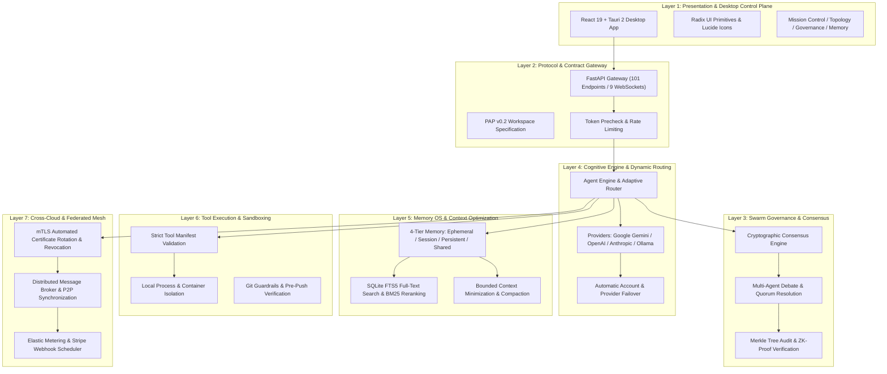

# <a id="english"></a>FindAi Studio — LLM Agent System (LAS)

[English](#english) | [繁體中文](#繁體中文)

LAS is an enterprise-grade, contract-first multi-agent runtime and topology control plane featuring a FastAPI backend, Portable Agent Protocol (PAP v0.2) contracts, a resilient 7-layer architecture, durable cross-agent memory, and a modern React 19 / Tauri 2 desktop control plane.

```
+-------------------------------------------------------------------------------+
|  Presentation: React 19 + Tauri 2 Control Plane (Radix UI / Lucide Icons)     |
+-------------------------------------------------------------------------------+
|  Protocol & Gateway: PAP v0.2, 101 REST Endpoints, 9 WebSockets, OpenAPI     |
+-------------------------------------------------------------------------------+
|  Governance & Consensus: Cryptographic Merkle Trees, ZK Proofs, Role Voting   |
+-------------------------------------------------------------------------------+
|  Cognitive Engine: Swarm Debate, Dynamic Routing, Provider Failover           |
+-------------------------------------------------------------------------------+
|  Memory OS: 4-Tier Memory (Ephemeral, Session, Persistent, Shared FTS5)       |
+-------------------------------------------------------------------------------+
|  Tool & Sandbox: Strict Manifest, Container Sandboxing, Security Guardrails  |
+-------------------------------------------------------------------------------+
|  Cross-Cloud Mesh: Mutual TLS (mTLS), Distributed Broker, Multi-Region Sync   |
+-------------------------------------------------------------------------------+
```

## 7-Layer Topological Architecture


```mermaid
flowchart TD
    subgraph L1["Layer 1: Presentation & Desktop Control Plane"]
        UI["React 19 + Tauri 2 Desktop App"]
        Radix["Radix UI Primitives & Lucide Icons"]
        Views["Mission Control / Topology / Governance / Memory"]
    end

    subgraph L2["Layer 2: Protocol & Contract Gateway"]
        PAP["PAP v0.2 Workspace Specification"]
        API["FastAPI Gateway (101 Endpoints / 9 WebSockets)"]
        Guard["Token Precheck & Rate Limiting"]
    end

    subgraph L3["Layer 3: Swarm Governance & Consensus"]
        Audit["Cryptographic Consensus Engine"]
        Merkle["Merkle Tree Audit & ZK-Proof Verification"]
        Vote["Multi-Agent Debate & Quorum Resolution"]
    end

    subgraph L4["Layer 4: Cognitive Engine & Dynamic Routing"]
        Engine["Agent Engine & Adaptive Router"]
        Providers["Providers: Google Gemini / OpenAI / Anthropic / Ollama"]
        Failover["Automatic Account & Provider Failover"]
    end

    subgraph L5["Layer 5: Memory OS & Context Optimization"]
        MemoryTiers["4-Tier Memory: Ephemeral / Session / Persistent / Shared"]
        FTS5["SQLite FTS5 Full-Text Search & BM25 Reranking"]
        Compaction["Bounded Context Minimization & Compaction"]
    end

    subgraph L6["Layer 6: Tool Execution & Sandboxing"]
        Manifest["Strict Tool Manifest Validation"]
        Sandbox["Local Process & Container Isolation"]
        GitGuard["Git Guardrails & Pre-Push Verification"]
    end

    subgraph L7["Layer 7: Cross-Cloud & Federated Mesh"]
        mTLS["mTLS Automated Certificate Rotation & Revocation"]
        Broker["Distributed Message Broker & P2P Synchronization"]
        Billing["Elastic Metering & Stripe Webhook Scheduler"]
    end

    UI --> API
    API --> Guard
    Guard --> Engine
    Engine --> Audit
    Audit --> Vote
    Vote --> Merkle
    Engine --> MemoryTiers
    MemoryTiers --> FTS5
    MemoryTiers --> Compaction
    Engine --> Providers
    Providers --> Failover
    Engine --> Manifest
    Manifest --> Sandbox
    Engine --> mTLS
    mTLS --> Broker
    Broker --> Billing
```

## System Metrics & Quality Highlights

- **Scale**: 516+ tracked files, 96,000+ lines of code across Python, TypeScript, and Rust.
- **Contract & API Surface**: 101 REST endpoints, 9 real-time WebSocket channels, 100% PAP v0.2 compliance.
- **Testing & Verification**: 118 test suites covering routing, consensus, memory, tools, and routes.
- **Frontend Quality**: Built with Rolldown / Vite in ~400ms. React Doctor verified with **0 errors**, **0 array index keys**, and **0 performance warnings**.
- **Knowledge & Memory OS**: 85 project knowledge base documents (`.agent/knowledge_base/`) and 131 Obsidian vault notes with 0 linting findings.

## What is Included

- **Python Runtime (`agent_workspace/core`, `agent_workspace/routes`)**: Routing, multi-tier memory, cryptographic consensus, sandboxing, provider abstraction, in-session protocol self-healing (`ProtocolRepairManager`), structured Advisor delegation (`DelegationPacket`), OpenAI-compatible Responses API streaming gateway (`POST /v1/responses`), Quota-Aware routing with 429 exponential backoff (`QuotaAwareRouter`), multi-agent concurrent worktree mutation sandboxes, and federated vector pattern distillation.
- **Multimodal Swarm Mesh (Phase 107)**: Heterogeneous P2P mesh cluster with `PeerCapability.MULTIMODAL_PERCEPTION`, capability-aware workload dispatching for visual/diagram verification, dynamic X.509 mTLS attestation, and 16-node chaos stress fault resilience (320 transactions, 0% error rate).
- **Edge SLM & Local Code Optimization (Phase 110)**: Integrated `EdgeSLMEngine` for zero-cloud-token AST static defect inspection, automated test stub synthesis, and complexity-based model routing ($CC \le 10$).
- **Cross-Organization Encrypted P2P Mesh (Phase 111)**: Zero-trust NAT hole punching (`MeshNATBridge` STUN / DERP relay fallback), zero-knowledge task state verifier (`ZeroKnowledgeTaskVerifier`) with air-gap code protection, and WAN multi-cluster Raft disaster recovery.
- **Cloud-Native Kubernetes & Argo Rollouts Canary (Phase 112)**: Production Helm v2 Chart (`deploy/helm/llm-agent-system/`), non-root container security context (UID 1001), 4-stage progressive canary delivery (10% -> 25% -> 50% -> 100%), Prometheus SLO gates, and GHCR OCI automated publishing pipeline (`.github/workflows/helm-publish.yml`).
- **Multi-Platform Desktop Packaging & Release Matrix (Phase 113)**: Native cross-platform distribution matrix across Windows (WiX `.msi` / NSIS `.exe`), macOS (`.dmg` / `.app` bundle with macOS 10.13+ compatibility), and Linux (Debian `.deb` with WebKitGTK 4.1 runtime / universal `.AppImage`), automated via multi-runner GitHub Actions CI/CD (`.github/workflows/release.yml`).
- **Container & Release Pipeline**: Production rootless container image, GHCR automated multi-arch publishing (`.github/workflows/docker-publish.yml`), and dual-track release pipeline packaging container and multi-OS desktop artifacts (`.github/workflows/release.yml`).
- **Contract & Knowledge System (`.agent`)**: PAP contracts, workflows, role definitions, and durable cross-agent project knowledge.
- **Developer Agent Control Plane**: Canonical mission and autonomous coding pipeline contracts ([`docs/product/developer-agent-control-plane.md`](docs/product/developer-agent-control-plane.md)).
- **React 19 + Tauri 2 Desktop App (`viewer`)**: Dark glassmorphism interface, Radix UI primitives, Lucide icons, Rolldown code-splitting, real-time topology stream, and ambient floating companion (`AmbientCompanion`) with 1-click HITL approval, context file drag-and-drop, workstation peripheral battery telemetry via zero-dependency HaloBattery bridge (`CompanionPeripheralBadge`), fullscreen focus & quiet mode detection (`WindowsFocusDetector`), and dynamic Tauri 2 system tray status synchronization.
- **Multi-Provider Support**: Pluggable adapters for Google Gemini, Anthropic Claude, OpenAI, and local Ollama.


## Requirements

- Windows 10 or 11 (x64)
- Python 3.11+
- Node.js 22 LTS+
- Rust stable and Tauri 2 Windows prerequisites (C++ Build Tools, WebView2)

## Quick Start

```powershell
# 1. Clone repository
git clone https://github.com/OPluke11-abula/LLM-Agent-System.git
cd LLM-Agent-System

# 2. Setup Python virtual environment
python -m venv .venv
.\.venv\Scripts\python.exe -m pip install -r requirements.txt

# 3. Optional: install hosted provider SDKs
.\.venv\Scripts\python.exe -m pip install -r requirements-providers.txt

# 4. Run authoritative verification ladder
.\scripts
erify.cmd -SkipViewer
```

Configure credentials via environment variables (`GOOGLE_API_KEY`, `OPENAI_API_KEY`, `ANTHROPIC_API_KEY`). Local Ollama requires no API key. Never commit credentials or local `.env` files.

## Running the Services

### 1. Start the API Gateway

```powershell
.\.venv\Scripts\python.exe -m uvicorn agent_workspace.api:app --host 127.0.0.1 --port 8000
```

### 2. Start the Web Viewer (Development)

```powershell
npm.cmd --prefix viewer install
npm.cmd --prefix viewer run dev
```

### 3. Start the Desktop Control Plane

```powershell
$env:AGENT_WORKSPACE_DIR="$PWD\workspace"
npm.cmd --prefix viewer run tauri -- dev
```

## Runtime Configuration

The local profile runs loopback-only, single-tenant, and leaves SaaS or distributed workers disabled by default. Boolean values accept `true`, `1`, `yes`, `on`, `false`, `0`, `no`, or `off` (case-insensitive).

| Variable | Purpose and accepted value/type | Secure default | Example | Security or operational consequence |
| --- | --- | --- | --- | --- |
| `LAS_BIND_HOST` | API bind hostname or IP string | `127.0.0.1` | `LAS_BIND_HOST=127.0.0.1` | External binding requires configured secure authentication. |
| `LAS_JWT_SECRET` | JWT signing secret; non-empty string of at least 32 characters | unset; fail closed | `LAS_JWT_SECRET=<secret-manager-value>` | Required for authenticated external binding; never commit or log it. |
| `LAS_ENABLE_STRIPE` | Enable Stripe billing scheduler; boolean | `false` | `LAS_ENABLE_STRIPE=false` | SaaS billing is opt-in and otherwise creates no scheduler. |
| `LAS_ENABLE_REDIS_SWARM` | Enable Redis swarm listener; boolean | `false` | `LAS_ENABLE_REDIS_SWARM=false` | No Redis connection or retry loop is started when disabled. |
| `LAS_ENABLE_MULTI_WORKER` | Enable multi-worker coordination; boolean | `false` | `LAS_ENABLE_MULTI_WORKER=false` | Distributed workers remain off unless explicitly enabled with Redis. |
| `LAS_ENABLE_AUDIT_CONSENSUS` | Enable the audit/consensus daemon; boolean | `false` | `LAS_ENABLE_AUDIT_CONSENSUS=false` | Consensus background work is not started by the local profile. |
| `LAS_TASK_MAX_CONCURRENCY` | Maximum in-flight task count; integer | `8` | `LAS_TASK_MAX_CONCURRENCY=8` | The limit is process-local unless durable/distributed coordination is provided. |
| `LAS_TASK_TIMEOUT_SECONDS` | Per-task execution timeout in seconds; number | `300` | `LAS_TASK_TIMEOUT_SECONDS=300` | Long-running tasks are terminated after the limit. |
| `LAS_TASK_RECORD_TTL_SECONDS` | Retention for terminal task records in seconds; number | `3600` | `LAS_TASK_RECORD_TTL_SECONDS=3600` | Expired in-memory records are removed; this is not durable storage. |
| `LAS_POC_CONSENSUS_SECRET` | Consensus signing secret; non-empty secret string | unset; fail closed | `LAS_POC_CONSENSUS_SECRET=<secret-manager-value>` | Missing or test-only values prevent production consensus signing. |
| `LAS_POC_SECRET_<ROLE>` | Per-role consensus secret; non-empty secret string | unset; fail closed | `LAS_POC_SECRET_CEO=<secret-manager-value>` | Missing role secrets fail closed; never place real values in source or docs. |
| `LAS_ZK_SECRET_KEY` | Audit proof secret; non-empty secret string | unset; fail closed | `LAS_ZK_SECRET_KEY=<secret-manager-value>` | Missing values prevent proof verification instead of using a fallback. |
| `LAS_TEST_MODE` | Explicit non-production secret marker mode; `1`, `true`, or `yes` | unset/off | `LAS_TEST_MODE=1` | Test-only markers are permitted; never enable this in production. |

## Hardened Runtime Profile

The hardened runtime profile protects authentication, secret handling, egress control, filesystem boundaries, and task lifecycle limits:

| Control | Default | Description |
| --- | ---: | --- |
| Debate provider calls | 64 | Maximum round-trip LLM invocations per debate |
| Debate retries | 12 | Maximum retry attempts for transient provider failures |
| Debate healing calls | 8 | Maximum automatic self-healing turns |
| Debate nested depth | 1 | Maximum recursive delegation depth |
| Debate provider concurrency | 3 | Concurrent model completion limit |
| Memory results | 100 | Top-K limit for semantic memory retrieval |
| Memory backend fetch | 300 | Maximum raw items retrieved before reranking |

## The 8-Step Golden Verification Ladder

The authoritative repository gate is:

```powershell
.\scripts
erify.cmd
```

This single command executes the complete 8-step verification pipeline:

1. **[1/8] Python Compile Check**: Strict byte-compilation of all runtime files.
2. **[2/8] Python Test Suite**: Full pytest test matrix (118 test files) with isolated scratch sandboxes.
3. **[3/8] PAP Workspace & Workflow Schema**: Validates workspace contracts against JSON Schema specifications.
4. **[4/8] Tool Manifest & Skills Matrix**: Validates tool definitions, argument schemas, and role permissions.
5. **[5/8] Knowledge Base & Obsidian Vault Integrity**: Lints 85 knowledge base notes and 131 Obsidian vault notes for broken links, syntax, and credential leaks.
6. **[6/8] Viewer Production Build**: Rolldown / Vite optimized bundle generation (all chunks under 100 kB).
7. **[7/8] Viewer UI Smoke & Swarm Governance**: Validates UI rendering, state synchronization, and mock service contracts.
8. **[8/8] React Doctor Quality Gate**: Verifies React 19 best practices, hook dependencies, and component performance (0 errors).

Developer flags available: `-SkipViewer`, `-SkipTests`, `-SkipLint`, `-SkipDoctor`, `-InstallGitHooks`.

## Desktop Release Artifacts

The repository ships with a verified Windows x64 NSIS standalone installer:

| Property | Value |
| --- | --- |
| Artifact | `releases/aai-agent-topology-viewer_0.1.1_x64-setup.exe` |
| Size | 2,459,111 bytes (~2.34 MB) |
| Architecture | Windows x64 (Tauri 2 + WebView2) |
| Signature | Unsigned (community distribution) |
| SHA-256 | `1D4A47DA57E60D641EFE729E7F347DBABCAE84033D1AF0EF45220CE0B6C49B47` |

Verify checksum before installation:

```powershell
Get-FileHash .
eleasesai-agent-topology-viewer_0.1.1_x64-setup.exe -Algorithm SHA256
```

See [`releases/README.md`](releases/README.md) for full release evidence, build instructions, and security details.

## Repository Layout

| Path | Purpose |
| --- | --- |
| `agent_workspace/core` | Core runtime logic (Engine, Router, Memory, Consensus, Precheck) |
| `agent_workspace/routes` | FastAPI route endpoints (101 routes, 9 WebSockets) |
| `agent_workspace/skills` | Built-in tool implementations and execution handlers |
| `agent_workspace/tests` | Comprehensive pytest test matrix (118 suites) |
| `.agent` | PAP v0.2 contracts, workflows, and knowledge base wiki |
| `viewer` | React 19 + Tauri 2 desktop control plane |
| `scripts` | Verification ladder, bootstrap, and Git guardrails |
| `releases` | Tracked desktop executable installer and SHA-256 evidence |

## License & Security

- Runtime codebase: **Elastic License 2.0** (`LICENSE`).
- Standalone viewer package: **MIT License** (`viewer/LICENSE`).
- Security policy: see [`SECURITY.md`](SECURITY.md) for vulnerability reporting procedures.

---

## <a id="繁體中文"></a>繁體中文說明

[English](#english) | [返回頂部](#english)

### 專案概述 (FindAi Studio — LLM Agent System)

LAS (FindAi Studio) 是一套企業級、合約優先 (Contract-First) 的多智能體運行時與拓撲控制系統。具備 FastAPI 後端、Portable Agent Protocol (PAP v0.2) 規格、強固的七層拓撲架構、持久化跨智能體記憶系統，以及基於 React 19 / Tauri 2 的現代化桌面控制介面。

### 核心特性

1. **七層拓撲架構 (7-Layer Topological Architecture)**：
   * **展示層 (Layer 1)**：React 19 + Tauri 2 桌面應用程式，採用暗色毛玻璃風格、Radix UI、Lucide 圖標與 Rolldown 程式碼分割。
   * **協定與閘道層 (Layer 2)**：PAP v0.2 工作區規格、101 個 REST 端點、9 組即時 WebSocket 管道、OpenAPI 整合。
   * **治理與共識層 (Layer 3)**：加密 Merkle Tree、零知識證明 (ZK-Proof) 驗證、多智能體審批辯論機制。
   * **認知引擎與動態路由 (Layer 4)**：智慧路由、多模型調度 (Gemini, Claude, GPT, Ollama) 與自動帳號容錯。
   * **記憶體作業系統 (Layer 5)**：四階記憶體 (臨時、會話、持久、共享 SQLite FTS5) 與上下文壓縮。
   * **工具執行與沙箱層 (Layer 6)**：嚴格工具清單驗證、進程與容器隔離、Git 破壞性指令攔截防護。
   * **跨雲與分散式網格 (Layer 7)**：自動 mTLS 憑證輪換、分散式訊息代理、多區域同步。

2. **Phase 105 工具協議自癒修復輪次 (Protocol Repair Loop)**：
   * **確定性語法修復**：自動清理 Markdown 代碼塊 (` ```json `)、自訂 XML 標籤、修復尾隨逗號與單引號 JSON。
   * **參數別名自動映射**：自動將 `path`/`target_file` 映射為 `file_path`，`cmd` 映射為 `command`，`text` 映射為 `content`。
   * **型別安全轉換**：安全轉換字串數值與布林值 (`"10"` ➔ `10`, `"true"` ➔ `True`)。
   * **會話內有界反思修復**：當參數完全不合規時，發動有界 LLM 反思輪次，嚴格限制上限 `max_turns=2`，防範循環死鎖與提示注入。

3. **Phase 105 Executor vs. Advisor 結構化委派封包 (Delegation Packet)**：
   * **思考與執行解耦**：本地執行環境專注快速 Shell/檔案改動；高階架構規劃與審查則封裝為脫敏且嚴格小於 2000 tokens 之 `DelegationPacket`。
   * **Zero-Risk 零外部風險手動模式**：支援一鍵渲染 Markdown 剪貼簿封包供離線手動諮詢，杜絕自動外部雲端數據外洩。
   * **自動化 MCP 委派與優雅降級**：外部 Advisor 逾時或異常時，自動降級至本地內部模型，保障任務不中斷。

4. **Phase 105 OpenAI Responses API 閘道與配額感知路由 (Quota-Aware Routing)**：
   * **OpenAI 相容串流閘道**：暴露 `POST /v1/responses` 端點，支援 SSE 串流事件（`response.created`, `output_item.added`, `content_part.added`, `output_item.done`, `response.completed`）與非串流輸出。
   * **動態配額與 429 指數退避**：內建 `QuotaAwareRouter`，實現 429 冷卻維護池（$5 \times 2^{n-1}$ 秒上限 120 秒）、60 秒滑動視窗 RPM/TPM 即時監控，並於冷卻時自動平滑切換至健康備援帳號。
   * **客戶端斷線與型別化錯誤防護**：優雅釋放中斷串流資源，當所有可用帳號皆耗盡或冷卻時拋出型別化 `QuotaExhaustedError`（HTTP 429）。

5. **Phase 106 桌面伴侶互動閉環、並行 Worktrees 與自癒模式萃取**：
   * **桌面伴侶解耦**：將 `AmbientCompanion.tsx` 解構為 4 大單一職責子組件與 9 階 Stepper 同步，具備拖曳上下文檔案任務發起與 0 React Doctor 告警。
   * **多代理 Worktrees 並行沙箱**：支援 `BACKEND_INFRA_AGENT` 與 `UI_UX_AGENT` 並行工作樹修改，透過 `UnifiedPolicyGate` 自動審查與衝突仲裁。
   * **經驗模式向量沉澱**：`FederatedVectorMemory` 自動將自癒修復經驗轉化為向量 Merkle 存儲，版本正式晉升為 `v0.6.0`。

6. **Phase 107 高階多模態協作與 16 節點分散式 P2P Mesh 壓力演練**：
   * **多模態感知能力 (Multimodal Perception)**：擴充 `PeerCapability.MULTIMODAL_PERCEPTION`，工廠調度器自動將視覺 UI 與圖表檢驗導向多模態節點。
   * **Merkle 雜湊拓樸鏈接**：視覺二進制酬載計算 SHA-256 雜湊並生成 `MultimodalVerificationReceipt` 綁定 Raft 共識狀態機。
   * **16 節點異質叢集壓力測試**：執行 `run_p2p_mesh_stress_benchmark.py` 完成 16 節點、320 筆操作、0 錯誤、100% 證明合格與網路分區混沌自癒。

7. **Phase 108 Docker Buildx 與 GHCR 自動容器映像檔發布**：
   * **GHCR 映像檔發布管線**：整合 `.github/workflows/docker-publish.yml`，支援 Docker Buildx、QEMU 多架構與 GitHub Actions 快取，自動建置並推送映像檔至 GitHub Packages Container Registry。
   * **生產配置加固**：加固非 root 使用者 `lasuser` (UID 1001 / GID 1001)，提供包含資料夾隔離與金鑰安全的 `.env.production.example` 模板。

8. **Phase 109 雙軌正式發布工作流與 Tauri 桌面端打包 (Dual-Track Release & Packaging)**：
   * **雙軌發布工作流**：整合 `.github/workflows/release.yml`，在推送到 `v*.*.*` 標籤時自動同時發布 GHCR 容器映像檔與 Tauri Windows 桌面端安裝檔 (`.msi` / `.exe`)。
   * **發布預檢閘門**：實作 `scripts/verify_release_readiness.py`，嚴格校驗 Python (`pyproject.toml`)、前端 (`viewer/package.json`) 與桌面端 (`tauri.conf.json` / `Cargo.toml`) 版本號 100% 同步一致與部署資產完整性。

9. **Phase 110 端側 SLM 本地優化 (Edge SLM & Local Coding Model Optimization)**：
   * **零雲端代幣靜態分析**：實作 `OfflineASTAnalyzer`，本地端即時審計 bare except 並動態合成 pytest 測試 stub。
   * **複雜度感知智慧分流**：實作 `SmartModelDispatcher`，依據圈複雜度 ($CC \le 10$) 自動分流至本地端 Ollama/vLLM 引擎，顯著降低雲端 Token 消耗。

10. **Phase 111 跨組織加密 P2P 網格與 NAT 穿透 (Cross-Org P2P Mesh & NAT Traversal)**：
    * **STUN 打洞與 DERP 中繼降級**：實作 `MeshNATBridge`，6.06ms 直連握手，對稱型 NAT 自動降級至 DERP 加密通道，管理 `10.244.0.0/16` 覆蓋網路。
    * **零知識任務狀態驗證**：實作 `ZeroKnowledgeTaskVerifier`，以 AST 結構特徵與 Merkle 根證明取代原始碼傳輸，徹底防禦程式碼洩漏。
    * **多區域聯邦 Raft 容災**：跨 US/EU/AP 廣域網 Quorum 選主與分區自動容災轉移。

11. **Phase 112 雲原生 Kubernetes Helm 與 Argo Rollouts Canary 發布**：
    * **企業級 Helm Chart**：提供 `deploy/helm/llm-agent-system/`，配置 3 副本高可用、非 root 安全上下文 (UID 1001)、HPA 自動擴縮與 PVC 持久儲存。
    * **Argo Rollouts 漸進式金絲雀**：定義 4 階段金絲雀階梯 (10% -> 25% -> 50% -> 100%)，整合 Prometheus SLO 熔斷門檻 (成功率 $\ge 99.9\%$、P99 $<500\text{ms}$、錯誤率 $<0.1\%$)。
    * **GHCR OCI 自動發布管線**：整合 `.github/workflows/helm-publish.yml`，自動 lint、渲染測試並推播至 `oci://ghcr.io/opluke11-abula/charts`。

12. **Phase 113 跨平台桌面原生打包與矩陣發布 (Multi-Platform Desktop Packaging)**：
    * **三大作業系統原生支援**：擴充 `viewer/src-tauri/tauri.conf.json`，支援 Windows (WiX `.msi` 與 NSIS `.exe`)、macOS (`.dmg` 映象檔與 `.app` bundle，支援 10.13+)、Linux (`.deb` 自動相依 WebKitGTK 4.1 與通用 `.AppImage`)。
    * **多平台併行 CI 發布**：整合 `.github/workflows/release.yml` 多 OS 矩陣 (`windows-latest`, `macos-latest`, `ubuntu-22.04`)，自動編譯並發布多平台資產至 GitHub Releases。

13. **黃金八階驗證階梯 (8-Step Golden Verification Ladder)**：
    * 執行 `.\scripts\verify.cmd` 進行 Python 編譯、Pytest 矩陣測試、PAP 規格驗證、工具清單檢核、Obsidian 筆記健康檢查、Viewer 生產建置、UI 冒煙測試與 React Doctor 品質審查。

14. **Phase 1 環境智慧與工作站情境感知 (Ambient Intelligence & Workstation Context Mesh)**：
    * **周邊設備電量遙測 (`CompanionPeripheralBadge`)**：透過非侵入式松耦合 HaloBattery 橋接（`status.json`），0 額外驅動依賴監控滑鼠、耳機、鍵盤、控制器電量，並於低電量時發出微型柔和警示。
    * **全螢幕勿擾焦點感知 (`WindowsFocusDetector`)**：純標準庫 `ctypes` 調用 Windows 原生 Shell 通知 API（`SHQueryUserNotificationState`）與前台全螢幕判定，自動抑制沉浸工作或簡報時的 HITL 強行奪取焦點。
    * **Tauri 2.0 動態系統托盤 (`TrayIconBuilder`)**：支援左鍵切換常駐伴侶、右鍵工作台快捷選單、以及依據 Agent 思考/審批狀態即時同步托盤狀態提示。


### 快速開始

```powershell
# 1. 複製儲存庫
git clone https://github.com/OPluke11-abula/LLM-Agent-System.git
cd LLM-Agent-System

# 2. 設定 Python 虛擬環境
python -m venv .venv
.\.venv\Scripts\python.exe -m pip install -r requirements.txt

# 3. 執行權威驗證階梯
.\scripts\verify.cmd -SkipViewer
```

### 授權與安全

- 核心運行時代碼採用 **Elastic License 2.0** (`LICENSE`)。
- 桌面 Viewer 採用 **MIT License** (`viewer/LICENSE`)。
- 安全性漏洞通報指引請參閱 [`SECURITY.md`](SECURITY.md)。
