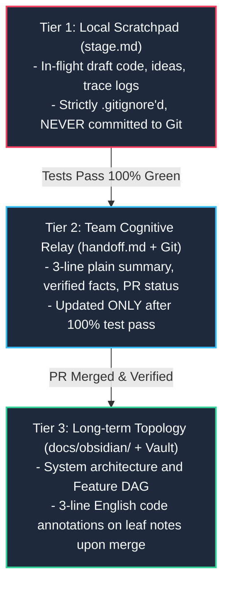

# LAS Multi-Agent Development Workflow Guide

> **Protocol Version**: 3.8.0 (`Universal_Coding_Agent_Development_Protocol.md`)
> **Target Audience**: All AI Agents and Developers contributing to LAS (LLM-Agent-System)
> **Domain Owner & Final Sign-off**: Luke (PO / Domain Owner)
> **Last Updated**: 2026-09-10

---

## 1. Team Model Evolution: Feature-Based Ownership

LAS adopts **Feature-Based Vertical Slicing (一人一功能垂直切片全棧負責制)**:
- Outdated, siloed role divisions (e.g., rigid "frontend vs backend vs database") are deprecated.
- Each human owner and collaborating AI Agent operates within designated feature boundaries from database to UI.
- **Module Responsibility Matrix** (Defined in `.agent/ownership.md`):
  - **Luke (PO / Domain Owner)**: Domain logic, core architecture, consensus rules, merge integration, and final acceptance.
  - **Joe**: Control plane UI/UX (`viewer/`), presentation components, and desktop interface.
  - **Ethan**: Backend runtime (`agent_workspace/core/`), database persistence, IPC pipes, and API endpoints.
  - **Eason**: Application workflow, async state machines, and concurrency orchestration.
  - **Jimmy**: QA automation, CI verification, and evidence receipt collection.

> **Hard Invariant**: Never modify files outside your assigned mutable boundary without explicit PO approval.

---

## 2. Three-Tier Cognitive Relay (三層認知接力棒架構)

To prevent context exhaustion, hallucination cascades, and session disconnects, all development follows the Three-Tier Cognitive Relay:



1. **Tier 1: `stage.md` (Local Working Memory)**
   - Draftpad for active sessions. Excluded via `.gitignore`.
2. **Tier 2: `handoff.md` + Git (Cross-Session Team Relay)**
   - The team Source of Truth. Contains: (1) 3-line plain summary, (2) verified facts and receipts, (3) active PRs/branches.
   - **Strict Rule**: Only update `handoff.md` when automated tests pass 100% (`PASS`).
3. **Tier 3: `docs/obsidian/` + Local Vault (Architecture Knowledge Topology)**
   - Deep knowledge notes and module DAG.
   - Upon PR merge, append 3 concise lines of English code annotations to the relevant leaf notes.

---

## 3. Standard Six-Stage Development Execution Cycle

Every feature or bug fix must advance through these six stages:

1. **Stage 1 (Requirements Alignment & Preflight)**:
   - Run knowledge preflight if wiki context is needed.
   - **Anti-Summary Invariant**: Inspect concrete primary source files (code, schemas) and cite exact paths and line numbers.
2. **Stage 2 (Architecture Proposal & Stop-and-Wait Gate)**:
   - Produce a concise implementation plan detailing: files to modify/create/delete, structural impact, and test strategy.
   - **Mandatory Stop**: Wait for explicit Human approval before invoking code-modifying tools.
3. **Stage 3 (Clean Implementation)**:
   - Adhere strictly to the Seven Anti-Corruption Principles.
4. **Stage 4 (Automated Verification)**:
   - Execute focused test suites. All tests must exit with code 0 (`PASS`).
5. **Stage 5 (Human / Host Validation)**:
   - Validate in runtime environment with verifiable receipts.
6. **Stage 6 (Knowledge & Relay Update)**:
   - Summarize into `handoff.md` (Tier 2), update Obsidian leaf notes (Tier 3), and clean local `stage.md` (Tier 1).

---

## 4. The 10 Grounded AI Agent Roles & Host Skills Matrix

All Agent personas are physically grounded in host Antigravity and Codex skills:

> **Universal Baseline Memory**: `obsidian-vault` and `obsidian-research-notes` are universal baseline capabilities mounted across all Roles 1~10.

| # | Role Name | Execution Class | Scope & Responsibilities | Host Skills Grounding | Hard Invariants & Prohibitions |
|---|---|---|---|---|---|
| **1** | `UI_UX_AGENT` | `REPOSITORY_EXECUTOR` | `viewer/`, UI presentation, components, aesthetics | Antigravity: `frontend-design`, `aesthetic-design-system`, `theme-factory`, `canvas-design`, `obsidian-vault`, `obsidian-research-notes`<br/>Codex: `figma`, `figma-implement-design`, `figma-code-connect-components`, `frontend-skill` | Strictly prohibited from modifying SQL, Alembic, backend IPC, or core Python logic. |
| **2** | `BACKEND_INFRA_AGENT` | `REPOSITORY_EXECUTOR` | `agent_workspace/core/`, DB, IPC, API | Antigravity: `resource-lifecycle-debug`, `diagnose`, `systematic-debugging`, `obsidian-vault`, `obsidian-research-notes`<br/>Codex: `sqlite`, `codebase-design` | Strictly prohibited from writing presentation UI or leaking raw SQL to presentation layer. |
| **3** | `DOMAIN_LOGIC_AGENT` | `REPOSITORY_EXECUTOR` | Pure business algorithms, domain entities, contracts | Antigravity: `agent-rules-books`, `brainstorming`, `tdd`, `obsidian-vault`, `obsidian-research-notes`<br/>Codex: `domain-modeling`, `codebase-design` | Framework-agnostic. Prohibited from introducing Flutter, Tauri, Win32, or concrete ORM dependencies. |
| **4** | `APPLICATION_FLOW_AGENT` | `REPOSITORY_EXECUTOR` | State flow, concurrency control, lifecycle | Antigravity: `systematic-debugging`, `dispatching-parallel-agents`, `obsidian-vault`, `obsidian-research-notes`<br/>Codex: `speech`, `transcribe`, `diagnosing-bugs` | Prohibited from direct SQL or raw OS calls. Must enforce `latest-request-wins` race elimination. |
| **5** | `INTEGRATION_MERGE_AGENT` | `REPOSITORY_EXECUTOR` | Cherry-picking, branch integration, conflict resolution | Antigravity: `finishing-a-development-branch`, `using-git-worktrees`, `git-guardrails-claude-code`, `obsidian-vault`, `obsidian-research-notes`<br/>Codex: `resolving-merge-conflicts`, `gh-address-comments`, `gh-fix-ci` | Never perform untested fast-forward merges. Must pass full global regression gates. |
| **6** | `SECURITY_AUDIT_AGENT` | `REPOSITORY_REVIEWER` | Vulnerability scanning, secret detection, threat modeling | Antigravity: `security-audit`, `threat-model`, `pentest`, `incident-response`, `skillspector`, `obsidian-vault`, `obsidian-research-notes`<br/>Codex: `codex-security-scan`, `codex-security-diff-scan`, `codex-security-validate`, `codex-security-fix` | Read-only audit authority. Scans for plaintext credentials and injection flaws; outputs receipts. |
| **7** | `PERFORMANCE_LATENCY_AGENT` | `REPOSITORY_REVIEWER` | Latency profiling, memory/thread leaks, IPC overhead | Antigravity: `resource-lifecycle-debug`, `diagnose`, `obsidian-vault`, `obsidian-research-notes`<br/>Codex: profiling skills | Resource lifecycle governance. Investigates thread lockups, connection leaks, and IPC roundtrips. |
| **8** | `QA_TEST_AGENT` | `REPOSITORY_REVIEWER` | Automated regression testing, test suite design, coverage | Antigravity: `test-driven-development`, `tdd`, `brooks-test`, `verification-before-completion`, `obsidian-vault`, `obsidian-research-notes`<br/>Codex: `tdd`, `karpathy-review-lite`, `playwright-interactive` | Evidence before completion invariant. Must run actual test commands and attach verified receipts. |
| **9** | `ARCHITECT_PLANNER_AGENT` | `ADVISORY_SPECIALIST` | High-level system RFCs, modular dependency graphs, plans | Antigravity: `writing-plans`, `executing-plans`, `iterative-planner`, `improve-codebase-architecture`, `obsidian-vault`, `obsidian-research-notes`<br/>Codex: `momus.toml` (Deep Plan Reviewer) | Non-coding advisory role. Formulates RFCs/Plans; validates them against `momus` before handoff. |
| **10** | `KNOWLEDGE_TOPOLOGY_AGENT` | `OPS` / `ADVISORY` | Knowledge graph topology, Obsidian/Notion sync, anti-rot | Antigravity: `obsidian-vault`, `obsidian-research-notes`, `token-optimization`, `caveman`, `notion`<br/>Codex: `notion-knowledge-capture`, `token-efficient-handoff`, `claude-handoff` | Knowledge integrity guardian. Synchronizes documentation with local Obsidian vaults; verifies freshness. |

---

## 5. Seven Universal Anti-Corruption Principles

1. **Dead Code Elimination**: Purge unused functions, dead mocks, and obsolete imports immediately.
2. **Extreme Single Responsibility (KISS & High Cohesion)**: Keep modules small and decoupled. UI only renders; controllers orchestrate; infra handles I/O.
3. **Concurrency & Race Elimination**: Asynchronous operations must enforce `latest-request-wins`. Obsolete in-flight requests must be aborted.
4. **Typed Failures Only**: Never swallow exceptions with empty catches (`catch (e) {}` or bare `except:`). Map to explicit typed errors.
5. **Specification-First / Invariant-Driven**: Domain models, contracts, and unit tests lead UI implementation.
6. **Idempotence & Side-Effect Safety**: Cancellation routines, duplicate clicks, and retries must be idempotent.
7. **Configuration over Hardcoding**: Zero magic numbers or arbitrary timeouts. Inject via configuration.

---

## 6. Engineering Retrospective (5-Whys) & Four Highest Invariants

Learned from real engineering incidents and permanently preserved:
1. **【Invariant 1: 調研先行，嚴禁純讀摘要】**: Mandatory bottom-up primary source code inspection. Never rely solely on high-level summaries.
2. **【Invariant 2: 以 PO 戰略願景為唯一北極星】**: Firmly align with Luke's architectural vision and core mission.
3. **【Invariant 3: 無證據不宣告完成】**: Only five objective verification statuses are permitted: `PASS`, `FAIL`, `BLOCKED`, `NOT_RUN`, `UNVERIFIED`.
4. **【Invariant 4: 檢討永久留存，不粉飾太平】**: Retrospectives and root-cause analyses are tracked permanently in Git.

---

## 7. 3-Second Standard Initial Prompt (標準開局提示詞)

When initiating a new task or conversation in LAS, use this exact prompt format:

```text
【身分、任務與 Agent 角色宣告】
我是 [Luke / Joe / Ethan / Eason]，協作 Agent 請以 [DOMAIN_LOGIC_AGENT / UI_UX_AGENT / BACKEND_INFRA_AGENT / ...] 角色運行。
目前執行的任務是：[填入具體 Feature 或 Bug 代號與任務說明]。
請依據通用開發協議載入對應之 Antigravity / Codex 本機技能，並嚴格遵守 LAS 七大防腐原則，非授權目錄嚴禁修改。

【執行流程】
1. 先看 stage.md、handoff.md 頂部摘要、以及對應之底層原始碼與合約。
2. 提出架構方案與 diff 清單，等我確認授權 (Stop-and-Wait Gate) 後才准寫代碼。
3. 代碼寫完必須跑通測試套件，等我實機驗收後，在專屬葉節點補充 3 行 Obsidian 英文註解。
```
