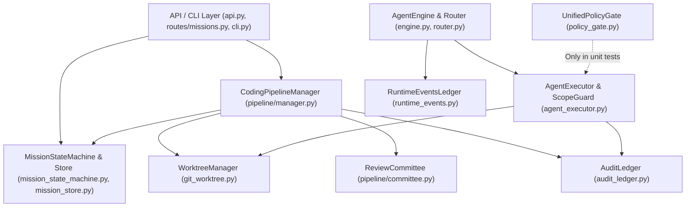
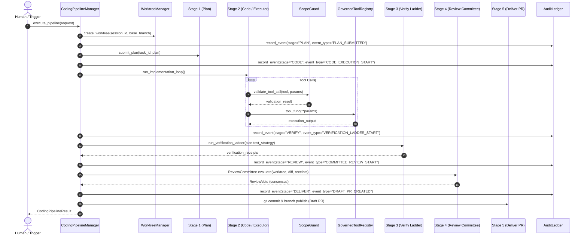

# Actual Architecture Model: LLM Agent System (LAS)

**Audit Phase**: Phase A — Architecture Reconstruction  
**Inspection Date**: 2026-09-14  
**Protocol Version**: 3.8.0  
**Authority**: Invariant 0.1 (調研先行 / Anti-Summary Invariant)  

---

## Executive Overview

This document presents the reconstructed, ground-truth architecture of the **LLM Agent System (LAS)** derived strictly from primary source code analysis. All statements, relationships, and boundaries documented herein reflect concrete runtime implementations rather than aspirational design documents.

---

## A1. Module Map

The codebase is organized into three primary operational tiers under [`agent_workspace/`](file:///d:/GitHub/LLM-Agent-System/agent_workspace):

| Module / Component | Primary Source Files | Primary Responsibility | Grounded Entry Points |
| :--- | :--- | :--- | :--- |
| **Mission Domain Model & State** | [`agent_workspace/core/mission_model.py`](file:///d:/GitHub/LLM-Agent-System/agent_workspace/core/mission_model.py) [`agent_workspace/core/mission_state_machine.py`](file:///d:/GitHub/LLM-Agent-System/agent_workspace/core/mission_state_machine.py) [`agent_workspace/core/mission_store.py`](file:///d:/GitHub/LLM-Agent-System/agent_workspace/core/mission_store.py) [`agent_workspace/core/mission_contracts.py`](file:///d:/GitHub/LLM-Agent-System/agent_workspace/core/mission_contracts.py) | Mission aggregate root, deterministic transitions, JSON/SQLite persistence, and immutable contracts. | `MissionStateMachine.transition()` (`mission_state_machine.py:44`) `MissionStore.save()` (`mission_store.py:61`) |
| **Pipeline Governance & Orchestration** | [`agent_workspace/core/pipeline/manager.py`](file:///d:/GitHub/LLM-Agent-System/agent_workspace/core/pipeline/manager.py) [`agent_workspace/core/pipeline/benchmark.py`](file:///d:/GitHub/LLM-Agent-System/agent_workspace/core/pipeline/benchmark.py) [`agent_workspace/core/pipeline/committee.py`](file:///d:/GitHub/LLM-Agent-System/agent_workspace/core/pipeline/committee.py) | 5-stage autonomous coding lifecycle (Plan -> Code -> Verify -> Review -> Deliver), benchmark suites, and reviewer consensus. | `CodingPipelineManager.execute_pipeline()` (`pipeline/manager.py:295`) `ReviewCommittee.evaluate()` (`pipeline/committee.py:40`) |
| **Agent Execution & Tool Sandbox** | [`agent_workspace/core/agent_executor.py`](file:///d:/GitHub/LLM-Agent-System/agent_workspace/core/agent_executor.py) [`agent_workspace/core/sandbox.py`](file:///d:/GitHub/LLM-Agent-System/agent_workspace/core/sandbox.py) [`agent_workspace/core/git_worktree.py`](file:///d:/GitHub/LLM-Agent-System/agent_workspace/core/git_worktree.py) | Governed tool registry, scope guarding, worktree isolation, and safe subprocess execution. | `AgentExecutor.execute_step()` (`agent_executor.py:270`) `ScopeGuard.validate_tool_call()` (`agent_executor.py:166`) `WorktreeManager.create_worktree()` (`git_worktree.py:73`) |
| **Policy Enforcement & Prechecks** | [`agent_workspace/core/policy_gate.py`](file:///d:/GitHub/LLM-Agent-System/agent_workspace/core/policy_gate.py) [`agent_workspace/core/precheck.py`](file:///d:/GitHub/LLM-Agent-System/agent_workspace/core/precheck.py) | Pre-flight validation, unified policy gating, AST taint analysis, and role scope boundaries. | `UnifiedPolicyGate.evaluate()` (`policy_gate.py:85`) `run_all_prechecks()` (`precheck.py:315`) |
| **Audit, Telemetry & Event Streams** | [`agent_workspace/core/audit_ledger.py`](file:///d:/GitHub/LLM-Agent-System/agent_workspace/core/audit_ledger.py) [`agent_workspace/core/runtime_events.py`](file:///d:/GitHub/LLM-Agent-System/agent_workspace/core/runtime_events.py) | Append-only cryptographically hashed audit ledgers, Merkle tree root calculation, and live telemetry events. | `AuditLedger.record_event()` (`audit_ledger.py:91`) `RuntimeEventsLedger.append()` (`runtime_events.py:100`) |
| **Multi-Agent Engine & Routing** | [`agent_workspace/core/engine.py`](file:///d:/GitHub/LLM-Agent-System/agent_workspace/core/engine.py) [`agent_workspace/core/router.py`](file:///d:/GitHub/LLM-Agent-System/agent_workspace/core/router.py) [`agent_workspace/core/workflow_engine.py`](file:///d:/GitHub/LLM-Agent-System/agent_workspace/core/workflow_engine.py) | High-level LLM task orchestration, role dispatch, workflow graphs, and legacy approval execution. | `AgentEngine.execute_task()` (`engine.py:151`) `AgentRouter.dispatch()` (`router.py:202`) `WorkflowEngine.run()` (`workflow_engine.py:280`) |
| **API & CLI Boundaries** | [`agent_workspace/api.py`](file:///d:/GitHub/LLM-Agent-System/agent_workspace/api.py) [`agent_workspace/routes/missions.py`](file:///d:/GitHub/LLM-Agent-System/agent_workspace/routes/missions.py) [`agent_workspace/cli.py`](file:///d:/GitHub/LLM-Agent-System/agent_workspace/cli.py) | FastAPI REST endpoints, Mission lifecycle HTTP routing, and CLI tool interfaces. | `create_app()` (`api.py:32`) `missions_router` (`routes/missions.py:35`) `main()` (`cli.py:53`) |

---

## A2. Dependency Map

The concrete module relationships exhibit both clean layered boundaries and several dual-engine coupling artifacts:

### Coupling Observations:
1. **Synchronous Core Operations**: Tool execution in [`GovernedToolRegistry`](file:///d:/GitHub/LLM-Agent-System/agent_workspace/core/agent_executor.py#L222) and Worktree management in [`WorktreeManager`](file:///d:/GitHub/LLM-Agent-System/agent_workspace/core/git_worktree.py#L73) execute synchronously via `subprocess.run`.
2. **Asynchronous HTTP/FastAPI Layer**: Mission management endpoints in [`agent_workspace/routes/missions.py`](file:///d:/GitHub/LLM-Agent-System/agent_workspace/routes/missions.py#L65) run under `async def` on FastAPI, wrapping synchronous SQLite and filesystem calls.
3. **Disconnected Engines**: [`CodingPipelineManager`](file:///d:/GitHub/LLM-Agent-System/agent_workspace/core/pipeline/manager.py#L42) acts as the P1 pipeline engine, while [`AgentEngine`](file:///d:/GitHub/LLM-Agent-System/agent_workspace/core/engine.py#L68) and [`WorkflowEngine`](file:///d:/GitHub/LLM-Agent-System/agent_workspace/core/workflow_engine.py#L125) act as parallel workflow systems with disjoint tool registries and event ledgers.

---

## A3. Runtime Execution Path

The end-to-end execution of a coding task follows this concrete path:

### Concrete Step Breakdown:
1. **Request Intake**: `CodingPipelineManager.execute_pipeline` ([`manager.py:295`](file:///d:/GitHub/LLM-Agent-System/agent_workspace/core/pipeline/manager.py#L295)) receives `CodingPipelineRequest`.
2. **Worktree Isolation**: Worktree is allocated via `WorktreeManager.create_worktree` ([`git_worktree.py:73`](file:///d:/GitHub/LLM-Agent-System/agent_workspace/core/git_worktree.py#L73)) at `.worktrees/<session_id>`.
3. **Plan Submission**: `submit_plan` ([`manager.py:88`](file:///d:/GitHub/LLM-Agent-System/agent_workspace/core/pipeline/manager.py#L88)) validates against budget and records the plan.
4. **Tool Execution**: `AgentExecutor.execute_step` ([`agent_executor.py:270`](file:///d:/GitHub/LLM-Agent-System/agent_workspace/core/agent_executor.py#L270)) queries `ScopeGuard.validate_tool_call` before invoking tool methods.
5. **Verification Ladder**: `run_verification_ladder` ([`manager.py:306`](file:///d:/GitHub/LLM-Agent-System/agent_workspace/core/pipeline/manager.py#L306)) executes `pytest`, `ruff`, or custom commands defined in the plan.
6. **Committee Review**: `ReviewCommittee.evaluate` ([`committee.py:40`](file:///d:/GitHub/LLM-Agent-System/agent_workspace/core/pipeline/committee.py#L40)) tallies votes from 3 independent reviewers.
7. **Delivery & PR Creation**: If verified and approved, creates draft branch `codex/feature-...` and records audit event.

---

## A4. Persistence Path

LAS implements two primary persistence mechanisms:

1. **Mission Aggregate State Storage**:
   - Engine: SQLite via [`SqliteMissionStore`](file:///d:/GitHub/LLM-Agent-System/agent_workspace/core/mission_store.py#L210) (`missions.db`) and JSON fallback via [`JsonFileMissionStore`](file:///d:/GitHub/LLM-Agent-System/agent_workspace/core/mission_store.py#L82).
   - Schema: Table `missions` with columns `(mission_id PRIMARY KEY, state, data TEXT, created_at, updated_at)`.
   - Invariants: `save()` enforces state consistency and idempotency via transaction isolation.
2. **Audit & Event Stream Storage**:
   - Engine 1: [`AuditLedger`](file:///d:/GitHub/LLM-Agent-System/agent_workspace/core/audit_ledger.py#L42) (`memory/audit_ledger.db`).
     - Table `audit_events` stores `(event_id, timestamp, session_id, task_id, stage, event_type, payload, prev_hash, current_hash)`.
     - Cryptographic chaining: SHA-256 over `prev_hash + timestamp + payload`.
     - Merkle root calculation via `calculate_merkle_root()` ([`audit_ledger.py:155`](file:///d:/GitHub/LLM-Agent-System/agent_workspace/core/audit_ledger.py#L155)).
   - Engine 2: [`RuntimeEventsLedger`](file:///d:/GitHub/LLM-Agent-System/agent_workspace/core/runtime_events.py#L40) (`memory/runtime_events.db`).
     - Separate ledger recording operational stream events for `AgentEngine` / `LiveFeedbackRunner`.

---

## A5. Policy Enforcement Points

| Enforcement Point | Concrete File & Line | Enforced Constraints | Bypass Potential |
| :--- | :--- | :--- | :--- |
| **Worktree Boundary** | [`agent_workspace/core/agent_executor.py:187-219`](file:///d:/GitHub/LLM-Agent-System/agent_workspace/core/agent_executor.py#L187-L219) | Prevents directory traversal (`..`) and resolves paths relative to task workspace. | Path cannot escape workspace root. |
| **ScopeGuard** | [`agent_workspace/core/agent_executor.py:166-186`](file:///d:/GitHub/LLM-Agent-System/agent_workspace/core/agent_executor.py#L166-L186) | Checks `is_path_mutable` and regex bans destructive commands (`rm -rf`, `git reset`). | Bypassed if tool function in `GovernedToolRegistry` is invoked directly. |
| **UnifiedPolicyGate** | [`agent_workspace/core/policy_gate.py:85-133`](file:///d:/GitHub/LLM-Agent-System/agent_workspace/core/policy_gate.py#L85-L133) | AST syntax parsing, forbidden import analysis, and role forbidden path prefixes. | Not wired into default execution paths of `AgentEngine` or `WorkflowEngine`. |
| **Precheck Engine** | [`agent_workspace/core/precheck.py:315-345`](file:///d:/GitHub/LLM-Agent-System/agent_workspace/core/precheck.py#L315-L345) | Git clean working tree, valid Python environment, disk space, AST taint scan. | Run manually or before pipeline, not blocking individual tool steps. |

---

## A6. Approval Boundaries

1. **Human-in-the-Loop Gates**:
   - `MissionStateMachine`: Approval gates (`APPROVAL_REQUIRED`) triggered when `requires_approval=True` ([`mission_state_machine.py:142`](file:///d:/GitHub/LLM-Agent-System/agent_workspace/core/mission_state_machine.py#L142)).
   - `ApprovalGate` recorded in `Mission.approval_gates` ([`mission_model.py:291`](file:///d:/GitHub/LLM-Agent-System/agent_workspace/core/mission_model.py#L291)).
2. **Review Committee Gates**:
   - `ReviewCommittee.evaluate()` ([`committee.py:40`](file:///d:/GitHub/LLM-Agent-System/agent_workspace/core/pipeline/committee.py#L40)) evaluates:
     - Diff size (`max_diff_lines: 500`).
     - Verification status (requires `VerificationStatus.PASS`).
     - Lint clean status (`ruff` clean).
   - Requires unanimous or majority vote before delivery.

---

## A7. Evidence Generation Path

Evidence generation is structured as follows:
1. **Stage Audit Events**: `AuditLedger.record_event()` ([`audit_ledger.py:91`](file:///d:/GitHub/LLM-Agent-System/agent_workspace/core/audit_ledger.py#L91)) creates an SHA-256 hash chain linking consecutive events.
2. **Verification Receipts**: `VerificationReceipt` ([`manager.py:24`](file:///d:/GitHub/LLM-Agent-System/agent_workspace/core/pipeline/manager.py#L24)) captures command, exit code, stdout snippet, and execution timestamp.
3. **Merkle Trees**: `AuditLedger.calculate_merkle_root(session_id)` builds a binary Merkle tree over all session event hashes to produce an immutable root signature.

---

## A8. Recovery Path

1. **Worktree Cleanup**: `WorktreeManager.cleanup_worktree()` ([`git_worktree.py:112`](file:///d:/GitHub/LLM-Agent-System/agent_workspace/core/git_worktree.py#L112)) safely removes git worktree branches using `git worktree remove --force`.
2. **Mission Resumption**: `SqliteMissionStore.get(mission_id)` reloads serialized aggregate state from disk, allowing `MissionStateMachine` to resume from the last recorded durable status.
3. **Audit Ledger Replay**: `AuditLedger.get_events(session_id)` ([`audit_ledger.py:130`](file:///d:/GitHub/LLM-Agent-System/agent_workspace/core/audit_ledger.py#L130)) returns an ordered sequence of events for state reconstruction and compliance verification.

---

## A9. Encoded Architecture Assumptions

1. **Local Filesystem Isolation Model**: Assumes git worktree on the local filesystem provides sufficient process boundary isolation (not a Docker container or hardware virtualization).
2. **Process Synchrony**: Assumes git and tool operations complete within local subprocess timeout limits (`30s` - `60s`).
3. **Actor Trust Boundary**: Assumes human callers authenticate externally before reaching FastAPI endpoints; currently, the mission state machine does not cryptographically authenticate `actor_id`.
