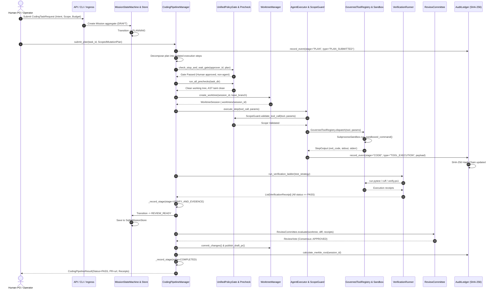

# LAS End-to-End Execution Flow

**Audit Phase**: Phase 1 — Architecture Reconstruction  
**Inspection Date**: 2026-09-14  
**Protocol Version**: 3.8.0  
**Authority**: Invariant 0.1 (調研先行 / Anti-Summary Invariant)  
**Deliverable**: Gate 1 — Execution Flow

---

## 1. Trace Overview

This document reconstructs the canonical 10-step execution lifecycle of the LLM Agent System (LAS) from Human Intent through to System Decision, mapping each phase directly to concrete classes, methods, and line numbers.

$$\begin{aligned}
\text{Human Intent} &\longrightarrow \text{Spec/Plan} \longrightarrow \text{Task Split} \longrightarrow \text{Precheck} \longrightarrow \text{Tool Exec} \\
&\longrightarrow \text{Evidence Record} \longrightarrow \text{Verification} \longrightarrow \text{State Change} \longrightarrow \text{Human Review} \longrightarrow \text{System Decision}
\end{aligned}$$

---

## 2. Comprehensive Trace Lifecycle

---

## 3. Step-by-Step Codebase Trace

### Step 1: Human Intent Intake
- **Entry Points**: [`agent_workspace/api.py:32`](file:///d:/GitHub/LLM-Agent-System/agent_workspace/api.py#L32), [`agent_workspace/routes/missions.py:65`](file:///d:/GitHub/LLM-Agent-System/agent_workspace/routes/missions.py#L65), [`agent_workspace/cli.py:53`](file:///d:/GitHub/LLM-Agent-System/agent_workspace/cli.py#L53).
- **Contract**: `CodingTaskRequest` ([`agent_workspace/core/pipeline/manager.py:27`](file:///d:/GitHub/LLM-Agent-System/agent_workspace/core/pipeline/manager.py#L27)) or `MissionCreateRequest` ([`agent_workspace/core/mission_contracts.py:100`](file:///d:/GitHub/LLM-Agent-System/agent_workspace/core/mission_contracts.py#L100)).
- **Action**: Constructs the aggregate root with `task_id`, `requirement_prompt`, `budget_limit_usd`, and initial state `DRAFT`.
- **Governance Constraint**: Cannot bypass state initialization; uninitialized requests are rejected with typed validation errors.

### Step 2: Spec & Plan Formulation
- **Entry Points**: `CodingPipelineManager.submit_plan()` ([`pipeline/manager.py:88`](file:///d:/GitHub/LLM-Agent-System/agent_workspace/core/pipeline/manager.py#L88)) and `MissionStateMachine.transition(..., MissionEvent.SUBMIT_PLAN)` ([`mission_state_machine.py:61`](file:///d:/GitHub/LLM-Agent-System/agent_workspace/core/mission_state_machine.py#L61)).
- **Contract**: `ScopedMutationPlan` defines `target_files`, `allowed_dependency_depth`, `test_strategy`, and `token_budget`.
- **Action**: Invariant 0.1 (調研先行) requires concrete source file citations. Plan is evaluated for budget compliance and structural validity.

### Step 3: Task Split & Role Scoping
- **Entry Points**: `IScopedExecutor.execute_plan()` ([`pipeline/manager.py:301`](file:///d:/GitHub/LLM-Agent-System/agent_workspace/core/pipeline/manager.py#L301)) and `TaskEnvironment` ([`agent_workspace/core/agent_executor.py:130`](file:///d:/GitHub/LLM-Agent-System/agent_workspace/core/agent_executor.py#L130)).
- **Contract**: Tasks are assigned explicit actor roles (`CORE_DEV_AGENT`, `QA_TEST_AGENT`, `PERFORMANCE_LATENCY_AGENT`).
- **Action**: Scope boundaries enforce that reviewer and QA agents operate under `read_only=True` ([`agent_workspace/core/policy_gate.py:68`](file:///d:/GitHub/LLM-Agent-System/agent_workspace/core/policy_gate.py#L68)).

### Step 4: Precheck & Stop-and-Wait Architecture Gate
- **Entry Points**: `check_stop_and_wait_gate()` ([`precheck.py:120`](file:///d:/GitHub/LLM-Agent-System/agent_workspace/core/precheck.py#L120)), `run_all_prechecks()` ([`precheck.py:315`](file:///d:/GitHub/LLM-Agent-System/agent_workspace/core/precheck.py#L315)), `UnifiedPolicyGate.evaluate()` ([`policy_gate.py:85`](file:///d:/GitHub/LLM-Agent-System/agent_workspace/core/policy_gate.py#L85)).
- **Action**: 
  - Verifies that plan approval was executed by a human authority (`approver_id != requester_id` and non-agent role).
  - Verifies git working directory clean status, Python runtime health, and absence of AST taint.
- **Enforcement**: If the plan lacks human approval, execution stops immediately with `GateApprovalRequiredError`.

### Step 5: Isolated Tool Execution
- **Entry Points**: `WorktreeManager.create_worktree()` ([`git_worktree.py:73`](file:///d:/GitHub/LLM-Agent-System/agent_workspace/core/git_worktree.py#L73)), `AgentExecutor.execute_step()` ([`agent_executor.py:270`](file:///d:/GitHub/LLM-Agent-System/agent_workspace/core/agent_executor.py#L270)).
- **Contract**: `GovernedToolRegistry` ([`agent_executor.py:222`](file:///d:/GitHub/LLM-Agent-System/agent_workspace/core/agent_executor.py#L222)) dispatches file write and shell commands.
- **Action**: 
  - Git worktree is spawned in `.worktrees/<session_id>` protecting the main repository tree.
  - Every tool execution is filtered by `ScopeGuard.validate_tool_call()`: banned commands (`rm -rf`, `git reset`, raw push) and path escapes are rejected.
  - Subprocesses run inside sandbox with process-level timeouts.

### Step 6: Cryptographic Evidence Recording
- **Entry Points**: `AuditLedger.record_event()` ([`audit_ledger.py:91`](file:///d:/GitHub/LLM-Agent-System/agent_workspace/core/audit_ledger.py#L91)).
- **Contract**: `AuditEvent` schema with `event_id`, `timestamp`, `session_id`, `task_id`, `stage`, `event_type`, `payload`, `prev_hash`, `current_hash`.
- **Action**: Every tool execution, state transition, and plan submission is written to SQLite with an unbroken SHA-256 hash link.

### Step 7: Verification Ladder Execution
- **Entry Points**: `IVerificationRunner.run_verification_ladder()` ([`pipeline/manager.py:311`](file:///d:/GitHub/LLM-Agent-System/agent_workspace/core/pipeline/manager.py#L311)).
- **Contract**: Returns `list[VerificationReceipt]` with exit codes, execution duration, and command outputs.
- **Enforcement**:
  - Empty verification ladders are strictly rejected (`Verification ladder cannot be empty`).
  - If any test step fails (exit code $\ne 0$), the pipeline triggers the autonomous self-healing loop or aborts with auto-rollback.

### Step 8: Monotonic State Transition
- **Entry Points**: `CodingPipelineManager._record_stage()` ([`pipeline/manager.py:88`](file:///d:/GitHub/LLM-Agent-System/agent_workspace/core/pipeline/manager.py#L88)) and `MissionStateMachine.transition()` ([`mission_state_machine.py:44`](file:///d:/GitHub/LLM-Agent-System/agent_workspace/core/mission_state_machine.py#L44)).
- **Action**:
  - Terminal state guard enforces that `COMPLETED`, `FAILED`, or `CANCELLED` states cannot transition back to active stages.
  - Mission aggregate is atomically saved via `SqliteMissionStore.save()`.

### Step 9: Human & Committee Review Gate
- **Entry Points**: `ReviewCommittee.evaluate()` ([`committee.py:40`](file:///d:/GitHub/LLM-Agent-System/agent_workspace/core/pipeline/committee.py#L40)) and `MissionEvent.APPROVE_PLAN` / `APPROVE_SCOPE`.
- **Action**:
  - Multi-agent committee scores architectural integrity, security assurance, and test thoroughness.
  - Anti-self-approval rule ensures that any human approval gate requires an independent human actor ID.

### Step 10: Final System Decision & PR Publication
- **Entry Points**: `CodingPipelineManager._build_pr_body()` ([`pipeline/manager.py:393`](file:///d:/GitHub/LLM-Agent-System/agent_workspace/core/pipeline/manager.py#L393)), `AuditLedger.calculate_merkle_root()` ([`audit_ledger.py:155`](file:///d:/GitHub/LLM-Agent-System/agent_workspace/core/audit_ledger.py#L155)).
- **Action**:
  - Worktree changes are committed to branch `codex/feature-<task_id>`.
  - GitHub Draft PR markdown is populated with verified evidence receipts and consensus scorecards.
  - Merkle root of the entire session audit log is calculated and sealed.
  - System returns `CodingPipelineResult` with final verification status `PASS`.
