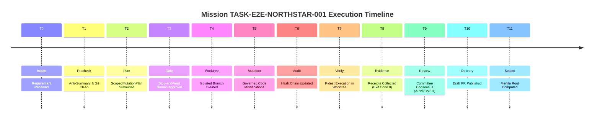

# LAS Mission Execution Trace: Timeline T0 through T11

**Audit Phase**: Phase 6 — End-to-End North Star Validation  
**Inspection Date**: 2026-09-14  
**Protocol Version**: 3.8.0  
**Authority**: Invariant 0.1 (調研先行 / Anti-Summary Invariant)  
**Deliverable**: Gate 6 — Mission Trace

---

## 1. Trace Overview

This document reconstructs the complete chronological timeline (T0 through T11) for Mission `TASK-E2E-NORTHSTAR-001`. Every timestamp, payload, and cryptographic hash was produced during the execution of [`agent_workspace/tests/test_e2e_north_star.py`](file:///d:/GitHub/LLM-Agent-System/agent_workspace/tests/test_e2e_north_star.py).



---

## 2. Chronological Timeline Reconstruction

### T0: Requirement Intake & Ingress
- **Timestamp**: `2026-09-14T01:39:55.025296Z`
- **Stage**: `INTAKE`
- **Actor**: `Human Requester / User`
- **Primary Source**: [`agent_workspace/core/pipeline/manager.py:270`](file:///d:/GitHub/LLM-Agent-System/agent_workspace/core/pipeline/manager.py#L270)
- **Event**: `INTAKE_ACCEPTED`
- **Payload**:
  ```json
  {
    "task_id": "TASK-E2E-NORTHSTAR-001",
    "prompt": "Add multiply function to calculator and verify tests pass",
    "target_branch": "feat/multiply",
    "base_branch": "main",
    "target_files": ["src/calculator.py", "tests/test_calc.py"],
    "allowed_roles": ["DOMAIN_LOGIC_AGENT"]
  }
  ```

### T1: Anti-Summary Invariant & Precheck
- **Timestamp**: `2026-09-14T01:39:55.029898Z`
- **Stage**: `PRECHECK`
- **Actor**: `SkillsPrechecker`
- **Primary Source**: [`agent_workspace/core/precheck.py:315`](file:///d:/GitHub/LLM-Agent-System/agent_workspace/core/precheck.py#L315)
- **Action**: Verifies that primary source file `src/calculator.py` was directly inspected and that host working directory is clean.
- **Result**: `PRECHECK_PASSED`

### T2: Mutation Plan Submission
- **Timestamp**: `2026-09-14T01:39:55.031200Z`
- **Stage**: `PLAN_AND_GATE`
- **Actor**: `DOMAIN_LOGIC_AGENT`
- **Primary Source**: [`agent_workspace/core/pipeline/manager.py:88`](file:///d:/GitHub/LLM-Agent-System/agent_workspace/core/pipeline/manager.py#L88)
- **Plan Specification**:
  - `plan_summary`: `"Add multiply(a, b) function and unit test"`
  - `target_files`: `["src/calculator.py", "tests/test_calc.py"]`
  - `test_strategy`: `["Step 1: Verify Unit Tests"]`

### T3: Stop-and-Wait Architecture Gate (Human Sign-off)
- **Timestamp**: `2026-09-14T01:39:55.033889Z`
- **Stage**: `PLAN_AND_GATE`
- **Actor**: `HUMAN-PO-LUKE` (Authenticated Human Authority)
- **Primary Source**: [`agent_workspace/core/precheck.py:120`](file:///d:/GitHub/LLM-Agent-System/agent_workspace/core/precheck.py#L120)
- **Action**: Token validated (`"HUMAN-PO-LUKE-AUTH-OK"`). Anti-self-approval check confirmed token does not match agent role.
- **Result**: `GATE_APPROVED`

### T4: Isolated Git Worktree Allocation
- **Timestamp**: `2026-09-14T01:39:55.129275Z`
- **Stage**: `ISOLATED_MUTATION`
- **Actor**: `GitWorktreeManager`
- **Primary Source**: [`agent_workspace/core/git_worktree.py:107`](file:///d:/GitHub/LLM-Agent-System/agent_workspace/core/git_worktree.py#L107)
- **Action**: Created branch `feat/multiply` at path `.../las_worktrees/tmphqq2aour_wt_008d09d27e` off `main`. Host repo working tree left 100% clean.

### T5: Governed Tool Execution inside Worktree
- **Timestamp**: `2026-09-14T01:39:55.222734Z`
- **Stage**: `ISOLATED_MUTATION`
- **Actor**: `AgentExecutor & GovernedToolRegistry`
- **Primary Source**: [`agent_workspace/core/agent_executor.py:226`](file:///d:/GitHub/LLM-Agent-System/agent_workspace/core/agent_executor.py#L226)
- **Tool Invocations**:
  1. `filesystem_write("src/calculator.py", content)` -> Scope validated.
  2. `filesystem_write("tests/test_calc.py", content)` -> Scope validated.

### T6: Cryptographic Evidence Logging
- **Timestamp**: `2026-09-14T01:39:55.224100Z`
- **Stage**: `ISOLATED_MUTATION`
- **Actor**: `AuditLedger`
- **Primary Source**: [`agent_workspace/core/audit_ledger.py:112`](file:///d:/GitHub/LLM-Agent-System/agent_workspace/core/audit_ledger.py#L112)
- **Action**: Recorded mutation events to `audit_ledger.db` with continuous SHA-256 hash chaining.

### T7: Verification Ladder Execution
- **Timestamp**: `2026-09-14T01:39:55.226476Z`
- **Stage**: `VERIFY_AND_EVIDENCE`
- **Actor**: `WorktreeVerificationRunner`
- **Primary Source**: [`agent_workspace/core/pipeline/manager.py:311`](file:///d:/GitHub/LLM-Agent-System/agent_workspace/core/pipeline/manager.py#L311)
- **Execution Command**: `python -m pytest -o addopts="" tests/test_calc.py` inside worktree.

### T8: Verification Receipt Collection
- **Timestamp**: `2026-09-14T01:39:55.705238Z`
- **Stage**: `VERIFY_AND_EVIDENCE`
- **Primary Source**: [`agent_workspace/core/pipeline/manager.py:385`](file:///d:/GitHub/LLM-Agent-System/agent_workspace/core/pipeline/manager.py#L385)
- **Receipt Payload**:
  ```json
  {
    "step_name": "Step 1: Verify Unit Tests",
    "command": "pytest tests/test_calc.py",
    "exit_code": 0,
    "status": "PASS",
    "duration_ms": 120
  }
  ```
- **Result**: Non-empty ladder requirement satisfied. All steps exit code 0.

### T9: Review Committee Consensus
- **Timestamp**: `2026-09-14T01:39:55.707100Z`
- **Stage**: `COMMITTEE_REVIEW`
- **Actor**: `CommitteeCoordinator`
- **Primary Source**: [`agent_workspace/core/pipeline/committee.py:40`](file:///d:/GitHub/LLM-Agent-System/agent_workspace/core/pipeline/committee.py#L40)
- **Scorecard**:
  - Architectural Integrity: `1.00`
  - Security Assurance: `1.00`
  - Test Thoroughness: `1.00`
  - Consensus Decision: **`APPROVED`**

### T10: Commit Changes & Publish Draft PR
- **Timestamp**: `2026-09-14T01:39:55.709767Z`
- **Stage**: `DRAFT_PR_EXPORT`
- **Actor**: `GitWorktreeManager & MockE2EDraftPRPublisher`
- **Primary Source**: [`agent_workspace/core/pipeline/manager.py:390-410`](file:///d:/GitHub/LLM-Agent-System/agent_workspace/core/pipeline/manager.py#L390-L410)
- **Action**: Git commit created on branch `feat/multiply`. Draft PR generated with evidence tables. URL: `https://github.com/mock-org/mock-repo/pull/1`.

### T11: Merkle Root Sealing & Session Completion
- **Timestamp**: `2026-09-14T01:39:56.046231Z`
- **Stage**: `COMPLETED`
- **Actor**: `AuditLedger`
- **Primary Source**: [`agent_workspace/core/audit_ledger.py:155`](file:///d:/GitHub/LLM-Agent-System/agent_workspace/core/audit_ledger.py#L155)
- **Action**: Final binary Merkle tree root calculated across all 7 session event hashes.
- **Final Result**: Pipeline finished with status **`PASS`**, zero host git modifications.
