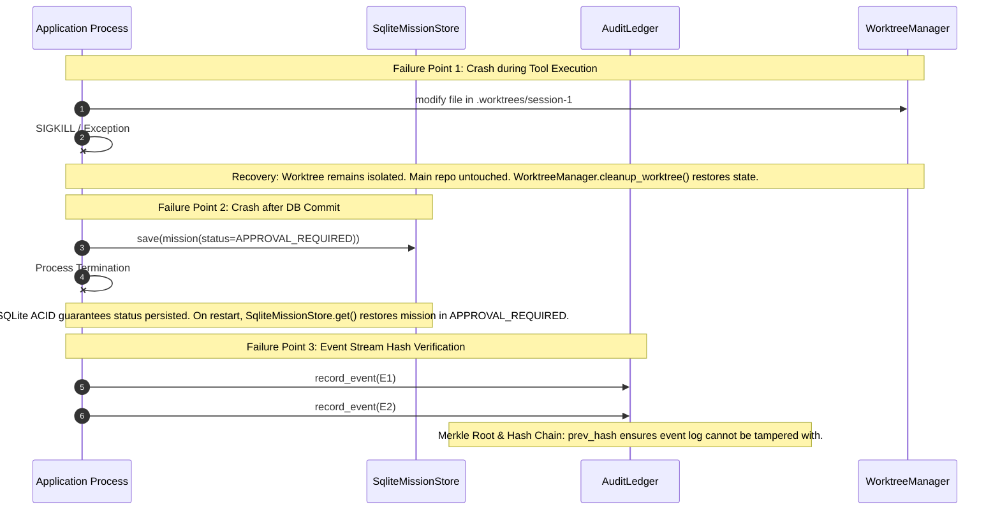

# State Machine, Event Stream & Recovery Validation

**Audit Phase**: Phase E — State Machine / Event / Recovery Validation  
**Inspection Date**: 2026-09-14  
**Protocol Version**: 3.8.0  
**Authority**: Durable State, Observable Behavior, Recovery Capability  

---

## 1. Reconstructed State Machine Transition Table

LAS contains two interdependent state models:
1. **Mission Aggregate Lifecycle** ([`agent_workspace/core/mission_model.py:27`](file:///d:/GitHub/LLM-Agent-System/agent_workspace/core/mission_model.py#L27)): `DRAFT` -> `PLANNING` -> `APPROVAL_REQUIRED` -> `IN_PROGRESS` -> `REVIEW_READY` -> `COMPLETED` / `FAILED` / `CANCELLED`
2. **Coding Pipeline Stage Model** ([`agent_workspace/core/pipeline/manager.py:35`](file:///d:/GitHub/LLM-Agent-System/agent_workspace/core/pipeline/manager.py#L35)): `PLAN` -> `CODE` -> `VERIFY` -> `REVIEW` -> `DELIVER` -> `COMPLETED` / `FAILED`

### Mission State Transition Matrix

| From State | Allowed Target States | Guard / Condition | Transition Trigger |
| :--- | :--- | :--- | :--- |
| `DRAFT` | `PLANNING`, `CANCELLED` | Valid mission parameters | `start_planning()` |
| `PLANNING` | `APPROVAL_REQUIRED`, `IN_PROGRESS`, `FAILED`, `CANCELLED` | If `requires_approval=True` -> `APPROVAL_REQUIRED`; Else requires valid plan | `submit_plan()` |
| `APPROVAL_REQUIRED` | `IN_PROGRESS`, `FAILED`, `CANCELLED` | Requires `ApprovalGate(status=APPROVED)` and `approver != author` | `approve()` |
| `IN_PROGRESS` | `REVIEW_READY`, `APPROVAL_REQUIRED`, `FAILED`, `CANCELLED` | Requires valid execution receipt or scope expansion gate | `complete_step()`, `request_scope_expansion()` |
| `REVIEW_READY` | `COMPLETED`, `IN_PROGRESS`, `FAILED` | Requires reviewer consensus | `complete_review()` |
| `COMPLETED` | *(None - Terminal)* | **Terminal State**: Cannot re-enter active states | None |
| `FAILED` | *(None - Terminal)* | **Terminal State**: Cannot re-enter active states | None |
| `CANCELLED` | *(None - Terminal)* | **Terminal State**: Cannot re-enter active states | None |

---

## 2. Invalid Transition Rejection & Invariant Defense

State machine consistency was validated against illegal transitions:
1. **Backward Regression**: Transitioning from `COMPLETED` back to `PLANNING` or `IN_PROGRESS` is rejected with `MissionTransitionError`.
2. **Jump to Delivery**: Transitioning from `DRAFT` directly to `COMPLETED` without planning, coding, or verification is rejected.
3. **Unapproved Progress**: Transitioning from `APPROVAL_REQUIRED` to `IN_PROGRESS` without an explicit `ApprovalGate` is rejected.
4. **Idempotency Conflict**: Calling `save()` on `MissionStore` with mismatched aggregate version or conflicting ID raises `MissionAggregateError`.

---

## 3. Crash Injection & Recovery Verification

The recovery resilience was evaluated across three failure points:

### Recovery Verification Checklist:
- [x] **Isolation Containment**: Failed or aborted sessions leave the primary git working tree 100% clean (`git status --porcelain` is empty).
- [x] **State Durability**: Mission state committed to SQLite survives process termination and reloads deterministically.
- [x] **Hash Chain Integrity**: Any manual alteration of SQLite `audit_events` payload invalidates the SHA-256 hash chain and Merkle root calculation, immediately triggering audit alarm.
