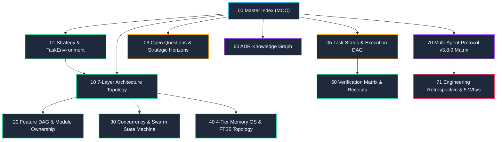

---
tags:
  - architecture/index
  - map-of-content
  - moc
  - protocol/v3-8-0
type: master_index
layer: control-plane-root
sync_status: verified
---

# LLM-Agent-System (LAS) Master Knowledge Topology Index (00)

> **Canonical System Workspace**: `D:\GitHub\LLM-Agent-System`
> **Obsidian Vault Target**: `C:\Users\luke2\OneDrive\文件\Obsidian Vault\Projects\LLM-Agent-System`
> **Required Protocol Version**: `3.8.0` (`Universal_Coding_Agent_Development_Protocol.md`)
> **Domain Authority**: Luke (PO / Domain Owner)
> **Last Synchronized**: 2026-09-10

---

## 1. Topological Navigation Map (Start Here)

This repository-grounded Obsidian topology serves as the canonical Tier 3 cognitive architecture memory for all collaborating AI Agents (`UI_UX_AGENT`, `BACKEND_INFRA_AGENT`, `DOMAIN_LOGIC_AGENT`, etc.) and human developers.

---

## 2. Core Topological Notes Matrix

| Note Identifier | Focus Area | Key Systems & Files Covered | Link |
|---|---|---|---|
| **00** | Master Orientation (MOC) | High-level topology, rules of engagement, vault sync | [[00 LLM-Agent-System Index]] |
| **01** | Strategy & TaskEnvironment | Antigravity+Claude+Codex synthesis, PDAD, TaskEnvironment spec, 6 Pillars | [[01 Agent Strategy Integration & TaskEnvironment Architecture]] |
| **05** | Task Status & Execution DAG | Project task flow, UI/UX, backend, bridge, optimization plan | [[05 Task Status & Multi-Agent Execution DAG]] |
| **09** | Open Questions & Horizons | Strategic trade-offs, protocol compatibility, roadmap | [[09 Open Questions & Strategic Horizons]] |
| **10** | 7-Layer System Architecture | Ingress, PAP Boundary, Swarm Runtime, Memory OS, Sandbox, Matrix | [[10 7-Layer System Architecture & Control Plane Topology]] |
| **20** | Feature DAG & Ownership | Feature slicing, 10 Grounded Roles, mutable scope boundaries | [[20 Feature DAG & Feature-Based Ownership Topology]] |
| **30** | Concurrency State Machine | `latest-request-wins`, WebSocket, P2P failover, async lifecycle | [[30 Concurrency Lifecycle & Swarm State Machine]] |
| **40** | 4-Tier Memory OS Topology | Ephemeral, Session, SQLite FTS5 Persistent, Shared Wiki | [[40 4-Tier Memory OS & SQLite FTS5 Persistence Topology]] |
| **50** | Verification & Receipt Ledger | 5 objective statuses, verification ladder, CI scripts | [[50 Verification Matrix & Quality Receipt Ledger]] |
| **60** | Decision & ADR Graph | ADR-001 ~ ADR-005, durable architectural records | [[60 Architectural Decision Records (ADR) Graph]] |
| **70** | Multi-Agent Protocol v3.8.0 | Protocol v3.8.0 bootstrap, 10 Grounded Roles, host skill bindings | [[70 Multi-Agent Protocol v3.8.0 & 10 Grounded Roles Matrix]] |
| **71** | Engineering Retrospective | 5-Whys incident root causes, 4 highest invariants, anti-corruption | [[71 Engineering Retrospective & 5-Whys Post-Mortem]] |
| **80** | Project Milestone History | Structured milestone history (Goal, Process, Result, receipts) | [[80 Project Execution History & Milestone Logs]] |

---

## 3. Cognitive Relay Operating Rules for AI Agents

1. **Anti-Summary Invariant (調研先行)**:
   - Always open concrete repository files and inspect line numbers before proposing architectural or code changes.
2. **Three-Tier Cognitive Relay Discipline**:
   - **Tier 1 (`stage.md`)**: Local real-time thoughts. Must be `.gitignore`d.
   - **Tier 2 (`handoff.md` + Git)**: Team Source of Truth. 3-line plain summary + receipts. Updated only on test pass.
   - **Tier 3 (`docs/obsidian/` + Vault)**: Long-term topology. Append 3-line English code annotations on leaf notes upon PR merge.
3. **Stop-and-Wait Architecture Gate**:
   - Propose diff plan, target files, and edge cases. Wait for explicit human approval before invoking file mutation tools.
4. **Evidence Before Assertions**:
   - Only use standard status labels: `PASS`, `FAIL`, `BLOCKED`, `NOT_RUN`, `UNVERIFIED`.

---

## 4. Subsystem Architectural Layers (Level 1 Topologies)

| Layer | Subsystem Name | Focus Area | Link |
|---|---|---|---|
| **L1** | Ingress & Cockpit Surface | WebSockets, Cockpit UI Shell, ReactFlow Graph | [[L1-Ingress-and-Cockpit-Surface]] |
| **L2** | Protocol & Contract Gateways | Zero-Trust Routing, Policy Gate, Provider Adapters | [[L2-Protocol-and-Contract-Gateways]] |
| **L3** | Runtime Execution & Swarm | AgentCrew Swarm, Workflow DAG, Discussion Quorum | [[L3-Runtime-Execution-and-Swarm]] |
| **L4** | Cognitive & Memory OS | CRDT Delta State, SQLite FTS5 Persistence, Defrag | [[L4-Cognitive-and-Memory-OS]] |
| **L5** | Security Sandbox & Merkle | Sandbox File Snapshot, Merkle Chain, mTLS PKI | [[L5-Security-Sandbox-and-Merkle]] |
| **L6** | Verification Matrix & Receipts | Quality Gate, Precheck Invariants, SaaS Billing | [[L6-Verification-Matrix-and-Receipts]] |
| **L7** | Distributed Mesh & P2P | E2EE P2P Router, Redis/InMemory Event Broker | [[L7-Distributed-Mesh-and-P2P]] |

---

## 5. Concrete Code Component Topologies (Level 2~4 Leaf Notes)

### 5.1 Backend Core Modules (agent_workspace/core/)
- [[core-engine]]: Core runtime execution loop, single/streaming turn dispatcher.
- [[core-workflow-engine]]: Asynchronous DAG execution, self-healing loop, checkpoint persistence.
- [[core-router]]: Intent classifier, zero-trust tool router, HITL approval gatekeeper.
- [[core-agent-crew]]: 10 Grounded Swarm Roles matrix, skill bindings, checkpoint signatures.
- [[core-policy-gate]]: Unified RBAC evaluator, role mutable scope enforcer.
- [[core-precheck]]: Preflight operational invariant verifier, Seven Anti-Corruption scanner.
- [[core-audit-ledger]]: Append-only SHA256 cryptographic event chain, Merkle trees, ZK proofs.
- [[core-sandbox]]: Filesystem snapshot transaction wrapper, atomic rollback, AST guard.
- [[core-broker]]: InMemory and Redis Pub/Sub event broker for swarm messaging.
- [[core-discussion-room]]: Structured multi-agent debate, verifier verdicts, ProofOfConsensus.
- [[core-memory]]: CRDT OR-Set delta state, sliding window context defragmentation.
- [[core-p2p-router]]: End-to-end encrypted (X25519 + AES-GCM-256) WebSocket mesh router.
- [[core-ws-manager]]: WebSocket connection lifecycle manager, non-blocking telemetry broadcast.
- [[core-providers]]: Multi-model adapter fabric (Gemini, OpenAI, Claude, Ollama).
- [[core-billing]]: SaaS metered token billing tracker, tenant rate limiting, quota enforcement.
- [[core-cert-manager]]: Self-signed X.509 mTLS certificate generator, PKI rotation manager.
- [[core-pipeline]]: Autonomous coding pipeline lifecycle, Stop-and-Wait Gate, Draft PR generation.
- [[core-pipeline-benchmark]]: Official golden flow benchmark engine, 3 canonical scenarios, ADR-006 6 KPIs scorecard.
- [[core-pipeline-committee]]: Multi-agent committee consensus debate, dynamic role assembly, weighted scorecards, and veto protocol.
- [[core-reasoning-router]]: Heterogeneous reasoning model adapters, thinking budgets, and air-gapped offline routing.
- [[core-federated-mesh]]: Distributed P2P mesh coordinator, peer capabilities, Merkle patch bundles, and remote debate/test ladder delegation.
- [[core-mesh-pki]]: Zero-Trust dynamic node attestation, ephemeral X.509 PKI, single-use nonce challenges, and signed stage delegations.
- [[core-raft-consensus]]: Distributed Committee Raft Consensus engine, term elections, replicated debate state machine, and quorum commits.
- [[core-vector-memory]]: Federated vector memory, semantic cosine similarity search, deterministic Merkle delta sync, and committee debate RAG.
- [[core-cli-and-packaging]]: Unified developer CLI toolbelt (las), onboarding engine, and PEP 517/621 packaging.
- [[core-repository]]: Repository environment sensing, protected paths, native Git worktree isolation.
- [[core-mission]]: Mission domain aggregate root, durable SQLite mission store, lifecycle state machine.
- [[core-merkle]]: Deterministic binary Merkle tree, leaf pre-hashing, cryptographic state proofs.

### 5.2 Frontend Cockpit & UI Components (`viewer/src/`)
- [[viewer-app]]: Root shell component, multi-session tab navigation, global shortcut bindings.
- [[viewer-mission-control]]: Operator prompt bar, streaming reasoning tokens, tool approval modals.
- [[viewer-task-flow]]: Interactive ReactFlow workflow DAG canvas, step playback stepper.
- [[viewer-topology-view]]: Swarm topology graph, real-time agent/tool nodes, handoff latency indicators.
- [[viewer-swarm-governance]]: Mesh health monitor, mTLS rotation countdowns, ZK proof inspector.
- [[viewer-admin-dashboard]]: Multi-tenant SaaS billing, live packet interceptors, audit logs.
- [[viewer-primitives]]: Foundation UI component library, dark-mode design tokens, Radix accessible atoms.

### 5.3 Specifications, Schemas & Tool Catalogs (spec/)
- [[spec-schemas-and-contracts]]: Formal JSON Schemas for workflows, agents, checkpoints, and reviews.
- [[skills-inventory-and-tools]]: Catalog of 25 host skills and sandboxed tools mapped to role boundaries.
