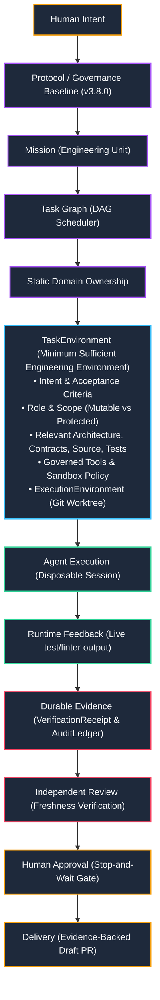

---
tags:
  - architecture/strategy
  - governance/pdad
  - task-environment/spec
  - protocol/v3-8-0
  - layer/control-plane
type: strategic_architecture
layer: L2-Protocol-and-Contract-Gateways
sync_status: verified
---

# LAS Agent Strategy Integration & TaskEnvironment Architecture (01)

> **Parent Index**: [[00 LLM-Agent-System Index]]
> **Related Architecture**: [[10 7-Layer System Architecture & Control Plane Topology]], [[20 Feature DAG & Feature-Based Ownership Topology]]
> **ADR Reference**: [[60 Architectural Decision Records (ADR) Graph#ADR-006|ADR-006: Agent Strategy Integration & Task Environment Architecture]]
> **Protocol Baseline**: `3.8.0` (`Universal_Coding_Agent_Development_Protocol.md`)
> **Domain Owner / PO**: Luke
> **Status**: APPROVED & ACTIVE BASELINE

---

## 0. 一句話定位與願景 (Vision & North Star)

### Product Tagline
> **Let AI write the code. LAS keeps the work controlled, observable, and verifiable.**

### Product Vision
> **LAS is the control plane for governed Human–AI software teams.**
> *(LAS 是用來治理 Human + AI 混編軟體工程團隊的 Developer Control Plane。)*

### System Vision
> **LAS turns software repositories into governed, agent-operable engineering environments.**
> *(LAS 將普通的軟體儲存庫轉變為可治理、可由 Agent 安全操作的工程環境。)*

### Architecture Philosophy
> **Abundant agents. Bounded authority. Strong harness. Durable evidence. Human control.**
> *(大量 Agent 工作；權限永遠受限；強大工程環境；不可篡改存證；人類終極控制。)*

---

## 1. 最終決策與三大哲學融合 (The Triad of Philosophies)

LAS 不追求做出一個比 Antigravity、Claude Code、Codex 更強的獨立 Coding Agent。
LAS 的核心價值在於吸收三大頂尖 AI 系統背後的工程哲學，熔煉出最適合人機混編團隊的控制平面：

```text
Antigravity → Design for Abundance (算力豐沛、平行擴展、拋棄式 Session)
Claude      → Design for Failure & Containment (假設一定犯錯、收容隔離、物理邊界)
Codex       → Design the Harness / Environment (環境放大智慧、Agent Legibility)
────────────────────────────────────────────────────────────────────────
LAS 綜效架構：
        Abundant Capacity (Antigravity)
               +
        Bounded Authority (Claude)
               +
        Strong Harness (Codex)
               =
   Verified Engineering Throughput (LAS 核心競爭力)
```

| 策略來源 | LAS 吸收的核心思想 | 絕對不代表什麼 |
|---|---|---|
| **Antigravity 型** | **Agent Abundance**：Agent 算力未來越來越便宜、快速、可平行分配 | 不是無腦開啟大量 Agent Swarm 互相空轉 |
| **Claude 型** | **Bounded Autonomy**：假設 Agent 必然可能犯錯，依靠物理權限與 Sandbox 收容 | 不是宣稱模型具備「零幻覺」或能透過 Prompt 自律 |
| **Codex 型** | **Harness Amplification**：$\text{Model Intelligence} \times \text{Environment Quality}$ | 不是 LAS 自己再重造一個閉門造車的 Coding Agent |

---

## 2. 升級版 PDAD 工作流 (Protocol-Driven Agentic Development)

原本的 PDAD 鏈條正式升級，引入 **`TaskEnvironment`** 作為代理人執行的第一等公民聚合模型：



---

## 3. TaskEnvironment 聚合模型規格詳解

傳統 AI 輔助開發僅提供 `Prompt + 若干 source files`，極易導致上下文膨脹或越界破壞。
LAS 透過 `TaskEnvironment` 為 Agent 配發完成特定 Task 所需的 **最小充分工程環境 (Minimum Sufficient Engineering Environment)**：

```text
TaskEnvironment
├── 1. Intent (人類意圖與工程目標)
├── 2. Acceptance Criteria (客觀可驗收標準)
├── 3. Agent Role (指派之實體專家角色)
├── 4. Mutable Scope (嚴格允許變更的路徑白名單)
├── 5. Protected Scope (嚴格禁止變更的路徑黑名單，如 .env*, .git/, CI)
├── 6. Relevant Architecture (相關架構視圖與拓撲定義)
├── 7. Relevant Contracts (相關領域介面與 Pydantic 資料模型)
├── 8. Relevant Source (針對此任務精準定位之真實源代碼)
├── 9. Relevant Tests (針對此變更相關之測試案例)
├── 10. Current Failure Evidence (當前錯誤日誌、堆疊追蹤或重現步驟)
├── 11. Available Governed Tools (受限白名單工具集)
├── 12. Sandbox Policy (沙箱隔離層級與資源硬上限)
├── 13. ExecutionEnvironment (原生 Git Worktree 物理隔離目錄)
├── 14. Required Reviews (必備之獨立審查要求)
└── 15. Stop Condition (迴圈硬上限 <= 3 輪與終止條件)
```

> **Context Invariant**：**「Context is allocated, not accumulated」**（上下文是按需分配的，不是無限累積的）。完全對齊 Progressive Disclosure：Thin invariants → mental map → task-specific deep dive。

---

## 4. 三大系統策略的具體落地實踐

### 4.1 Antigravity 型策略：Design for Abundance
- **核心假設**：Agent 算力日益廉價、快速、可平行。不依賴「單一全知超級 Agent」，而是將 Mission 解構為 Task DAG。
- **有用平行原則**：嚴格遵循 `useful parallelism > maximal parallelism`。
- **無重疊範圍約束**：平行運作之 Agent 之間嚴禁出現 overlapping mutable scope。
- **拋棄式 Session**：`AgentSession` 是廉價且可隨時銷毀的執行個體，失敗或逾時即可重新 dispatch，狀態由 LAS 核心存證與恢復。

### 4.2 Claude 型策略：Design for Failure & Containment
- **核心哲學**：**「Never build autonomy on trust alone. Build autonomy on containment.」**（永遠不要將自主性建立在信任上，而要建立在收容邊界上）。
- **權限與自主性反比定理**：收容邊界越可靠、越硬，系統才能放手給予 Agent 更多的自主執行權限。
- **Prompt 不再是安全邊界**：嚴禁只依賴 Prompt 叮嚀「請不要修改 .env」。必須透過核心管線攔截：
  $$\text{Agent} \to \text{ToolCall} \to \text{Tool Registry} \to \text{Mission Policy} \to \text{ScopeGuard} \to \text{Approval Policy} \to \text{Sandbox} \to \text{Executor} \to \text{Evidence}$$
- **越界即阻斷**：任何試圖修改白名單以外檔案的行為，直接由 `ScopeGuard` 拋出 `ScopeExpansionRequest`，強制停下等待人類審批。

### 4.3 Codex 型策略：Harness Amplification & Agent Legibility
- **核心公式**：
  $$\text{Agent Effectiveness} \approx \text{Model Capability} \times \text{Context Quality} \times \text{Tool Quality} \times \text{Environment Legibility} \times \text{Feedback Quality}$$
- **Agent Legibility（代理人可讀性）**：
  - 定義：工程環境中的資訊是否能以低歧義、結構化、可操作的形式被 Agent 理解與執行。
  - 差的環境：「Bug 壞了，你找看看。」（高歧義、盲目搜尋、高 Token 消耗）
  - 好的環境：給定具體失敗測試路徑、精確合約類型、允許寫入範圍、嚴格驗收條件。相同的模型在後者表現大幅提升。

---

## 5. LAS 六大架構支柱 (Six Architecture Pillars)

| 支柱 (Pillar) | 核心職責 | 關鍵對應模組與機制 |
|---|---|---|
| **1. Orchestrate** | Mission 管理、Task DAG 排程、Static Domain Ownership、有效平行治理 | `agent_workspace/core/pipeline/`, `workflow_engine.py` (Planned: `mission_store.py`) |
| **2. Contextualize** | `TaskEnvironment` 生成、最小充分上下文精準投放、漸進式揭露 | `agent_workspace/core/repository.py`, `prompt_composer.py` |
| **3. Contain** | 物理隔離、ScopeGuard 越界阻斷、受限工具鏈、沙箱原子快照回滾 | `agent_workspace/core/git_worktree.py`, `policy_gate.py`, `sandbox.py` |
| **4. Observe** | 執行狀態投影、結構化事件流、即時 Telemetry 廣播 | `agent_workspace/core/ws_manager.py`, `topology_stream.py` |
| **5. Verify** | 4 階驗證天梯、客觀 5 大狀態標籤、不可篡改 Merkle 存證收據、獨立 Review | `agent_workspace/core/pipeline/`, `audit_ledger.py`, `merkle.py` |
| **6. Recover** | 斷點 Checkpoint 恢復、拋棄式 Session 重試、主庫零污染復原 | `CanonicalPreservationReceipt`, `WorkflowRunState` |

---

## 6. 三層控制平面架構映射 (The Control Plane Triad)

### 6.1 Coordination Plane（協調平面）
- **實體**：`.agent/`、`MissionStore`、`TaskDAG`。
- **職責**：管理任務分解、`AgentCapabilityRequirement`、角色授權與 `TaskEnvironment` 綁定。
- **原則**：檔案即權威，零 Vendor Routing 負擔。

### 6.2 Execution Plane（執行平面）
- **實體**：`ExecutionAttempt`、`AgentSession`、`GitWorktreeManager`、`ScopeGuard`。
- **職責**：在獨立 Git Worktree 內運行受限 Agent，攔截越界行為，捕獲即時編譯與測試反饋。
- **最小工具鏈**：`filesystem.read`, `filesystem.write`, `shell.exec`, `git.diff`。

### 6.3 Evidence Plane（存證平面）
- **實體**：`AuditLedger` (SHA-256 Merkle)、`VerificationReceipt`、`CanonicalPreservationReceipt`。
- **職責**：精確紀錄「哪一次 Attempt、哪一個 Revision、哪一組測試、哪一位獨立 Reviewer、對應哪一個 Draft PR」，實現完全的端到端追溯。

---

## 7. 產品核心 KPI：Verified Engineering Throughput

LAS 放棄以單純的「Token 消耗少」或「Agent 數量多」作為北極星指標，正式確立工程交付 KPI：

$$\text{Verified Engineering Throughput} \approx \frac{\text{Accepted Engineering Work}}{\text{Time} \times \text{Compute} \times \text{Human Attention}}$$

### 具體觀測與遙測維度：
1. **Mission Completion Rate**：任務驗證通過並產出合格 Draft PR 的比率。
2. **Time to Verified Completion**：從需求輸入到所有驗證天梯 PASS 的總耗時。
3. **Human Intervention Count**：非必要的人工介入次數（越低代表 Containment 與 Harness 越健全）。
4. **Scope Violation Rate**：Agent 試圖越界修改被 ScopeGuard 成功阻斷的頻率。
5. **Review Rejection Rate**：獨立審查未通過而觸發自我修復的輪數。
6. **Context Token Efficiency**：完成任務所需之平均上下文分配量。

---

## 8. 階段推進 Roadmap (P1 ~ P5)

```text
P1: Product Contract & Mission Foundation (CLOSED)
    ├── PR #6 Squash & Merged into main (e17a1b7)
    └── 建立 Mission aggregate、狀態機與 API 契約骨架
    ↓
P2: Mission Orchestration Backend (CLOSED)
    ├── P2-A: Repository Control Plane & Execution Environment (DONE)
    │   ├── RepositoryProfile 生態感知與敏感路徑保護
    │   ├── GitWorktreeManager 原生物理隔離
    │   └── CanonicalPreservationReceipt 主庫零污染收據
    ├── P2-B: Planning & TaskEnvironment (DONE)
    │   ├── TaskGraph DAG 排程器
    │   ├── AgentCapabilityRequirement 需求規格
    │   └── TaskEnvironment 最小充分工程環境生成
    ├── P2-C: Governed Execution (DONE)
    │   ├── AgentExecutor 執行迴圈
    │   ├── ScopeGuard 物理阻斷守衛
    │   └── 最小工程工具集 (fs.read, fs.write, shell.exec, git.diff)
    └── P2-D: Evidence, Feedback & Recovery (DONE)
        ├── RuntimeEvents 密碼學事件日誌
        ├── Live Feedback Loop (Fail-Fast 階梯診斷)
        ├── IndependentReviewVerifier 審查新鮮度驗證
        ├── Checkpoint 重試與重啟恢復
        └── GitHubDraftPRPublisher 與離線 Patch Bundle 回退
    ↓
P3: Golden Path Viewer & Gateway Integration (CLOSED)
    ├── FastAPI REST 管道網關 (10 條端點) 與 WebSocket 串流廣播
    └── CodingPipelineView 前端座艙 (5 階 Stepper, Stop-and-Wait 審批 Modal, 測試階梯收據表)
    ↓
P4: Official Golden Flow Benchmark & E2E Verification Harness (CLOSED)
    ├── GoldenFlowBenchmarkEngine 標竿引擎與可重現目標庫腳手架
    ├── 3 大經典工程場景 (Happy Path, Security Containment, Fail-Fast Diagnostic)
    ├── 6 大 ADR-006 北極星工程 KPI 計分卡 (100% 完工率, 100% 收容率, 100% 主幹零污染)
    └── CLI (run_golden_benchmark.py), REST API 與前端座艙即時評分卡
    ↓
P5: Developer Beta & Packaging (NEXT)
    ├── CLI 一鍵安裝與獨立發行打包 (pip / wheel / standalone binary)
    ├── 輕量化 Local Daemon / Server 啟動腳本與配置引導
    ├── 一鍵 Target Repo 快速接入與設定嚮導 (las init / las onboard)
    └── 完整開發者使用文件與端到端快速上手指南 (Developer Quickstart Guide)
```

---

## 9. 嚴格邊界約束 (DO NOT BUILD)

在 P2 推進期間，全體 Agent 與工程師嚴格禁止開發以下項目：
1. ❌ **通用 Model Router / Token 輪詢套利**：LAS 是工程控制平面，不是免費 API 代理。
2. ❌ **無限 Swarm 自由辯論**：禁止無預算、無終止條件的多 Agent 社交空轉。
3. ❌ **無人值守自動 Merge**：最終交付終點永遠為帶有證據的 Draft PR，Merge 決策權 100% 屬於 Human。
4. ❌ **複雜 SaaS Multi-Tenant Billing / IAM**：專注於單機/團隊工程工作流，不重造企業級帳務系統。
5. ❌ **微小 CSS / UI 零碎調整**：P2 期間完全凍結 presentation 微調，所有算力集中於後端控制平面。

---

## 10. 最新六大架構哲學 (Architecture Invariants)

```text
1. Assume agent capacity becomes abundant. (假定 Agent 運算資源將極度豐富)
2. Assume every agent can fail. (假定所有 Agent 都必然會出錯)
3. Autonomy must come from containment. (自主性必須源自嚴密的邊界收容)
4. Context should be allocated, not accumulated. (上下文必須按需分配，而非盲目累積)
5. Model intelligence must be amplified by a strong harness. (模型智慧必須依靠強大環境放大)
6. No completion without durable evidence. (沒有客觀存證收據，絕不宣告完工)
```
