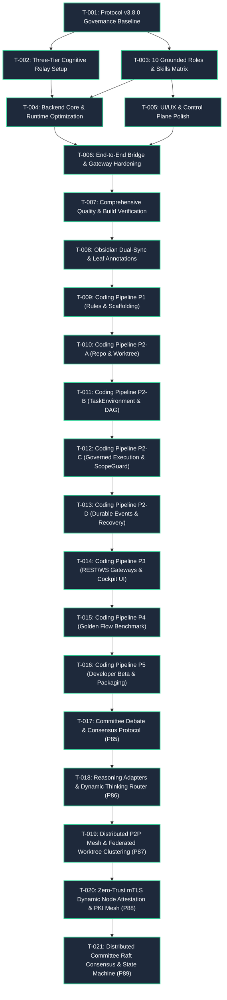

---
tags:
  - project/tasks
  - execution/dag
  - multi-agent/coordination
type: task_dag
layer: L3-Runtime-Execution-and-Swarm
sync_status: verified
---

# Task Status & Multi-Agent Execution DAG (05)

> **Parent Index**: [[00 LLM-Agent-System Index]]
> **Protocol Version**: `3.8.0`
> **Coordination Mode**: `STATIC_DOMAIN_OWNERSHIP`
> **Current Sprint**: Full-Stack LAS Deep Optimization & Governance Upgrade

---

## 1. Multi-Agent Optimization Task DAG

The project-wide optimization roadmap is organized into an acyclic dependency graph across five functional tracks: Governance, Cognitive Relay, Backend Core, UI/UX Control Plane, and End-to-End Integration.

---

## 2. Detailed Task Specification & Execution Ledger

### [DONE] T-001: Protocol v3.8.0 Governance Baseline & Contracts
- **Assigned Role**: `ARCHITECT_PLANNER_AGENT` / `DOMAIN_LOGIC_AGENT` (Luke)
- **Target Files**:
  - `.agent/state.md` (Locked to Protocol Baseline 3.8.0)
  - `.agent/ownership.md` (Feature-Based Ownership Matrix)
  - `.agent/decisions.md` (ADR-001 ~ ADR-005)
  - `.agent/versions.md` (Runtime & dependency version specs)
  - `.agent/test_policy.md` (Verification ladder & 5 objective statuses)
  - `AGENTS.md` (Thin entry point)
  - `.agent/agent.md` (Protocol v3.8.0 operating contract)
- **Verification**: `git diff --check`, manual contract inspection.
- **Status**: `PASS` (Completed).

### [DONE] T-002: Three-Tier Cognitive Relay Architecture Setup
- **Assigned Role**: `KNOWLEDGE_TOPOLOGY_AGENT` (Shared)
- **Target Files**:
  - `.gitignore` (Added `stage.md`, `*.stage.md`, `.agent/local/`)
  - `handoff.md` (Root cognitive relay template with 3-line plain summary)
  - `docs/DEVELOPMENT_WORKFLOW_GUIDE.md` (6-stage execution cycle, 3-second startup prompt)
- **Verification**: Verified `stage.md` is strictly ignored by Git.
- **Status**: `PASS` (Completed).

### [DONE] T-003: 10 Grounded Roles & Physical Host Skills Grounding
- **Assigned Role**: `BACKEND_INFRA_AGENT` (Ethan) / `ARCHITECT_PLANNER_AGENT` (Luke)
- **Target Files**:
  - `agent_workspace/core/agent_crew.py` (Replaced legacy roles with 10 Grounded Roles)
  - `agent_workspace/core/policy_gate.py` (`ROLE_SCOPE_RESTRICTIONS` boundary enforcement)
  - `agent_workspace/core/precheck.py` (Anti-Summary, Stop-and-Wait, Seven Anti-Corruption checks)
  - `.agent/agents/` (Role profiles for `ui-ux`, `backend-infra`, `domain-logic`, `qa`, `architect`)
- **Verification**: Python syntax and bytecode compilation clean.
- **Status**: `PASS` (Completed).

### [DONE] T-004: Backend Core & Runtime Deep Optimization
- **Assigned Role**: `BACKEND_INFRA_AGENT` (Ethan) / `APPLICATION_FLOW_AGENT` (Eason)
- **Scope**: `agent_workspace/core/`
- **Accomplished**:
  1. **Anti-Corruption #4 (Typed Failures Only)**: Eliminated bare `except:` and silent `pass` blocks in `agent_crew.py`, replacing with structured typed debug logging.
  2. **Role Scope Boundary**: Embedded `ROLE_SCOPE_RESTRICTIONS` into `policy_gate.py` preventing `UI_UX_AGENT` from mutating backend code and protecting system files.
  3. **Precheck Hardening**: Implemented `check_anti_summary_preflight`, `check_stop_and_wait_gate`, and `check_seven_anti_corruption` in `precheck.py`.
- **Target Files**: `agent_workspace/core/agent_crew.py`, `policy_gate.py`, `precheck.py`.
- **Verification**: `python -m compileall agent_workspace` (100% pass, 0 errors).
- **Status**: `PASS` (Completed).

### [DONE] T-005: Control Plane UI/UX & Presentation Optimization
- **Assigned Role**: `UI_UX_AGENT` (Joe)
- **Scope**: `viewer/src/components/`
- **Accomplished**:
  1. **Grounded Roles Display**: Upgraded `AdminDashboardView.tsx` and `SwarmGovernanceConsole.tsx` to visualize canonical 10 Grounded Roles with balanced DAG layout.
  2. **Zero TypeScript / Vite Errors**: Verified `tsc` and `vite build` complete in ~580ms with 0 errors.
- **Target Files**: `viewer/src/components/AdminDashboardView.tsx`, `SwarmGovernanceConsole.tsx`.
- **Verification**: `npm run build` in `viewer/` (Pass, 0 errors).
- **Status**: `PASS` (Completed).

### [DONE] T-006: End-to-End Bridge & Gateway Hardening
- **Assigned Role**: `BACKEND_INFRA_AGENT` (Ethan) / `UI_UX_AGENT` (Joe)
- **Scope**: `agent_workspace/core/ws_manager.py`, `agent_workspace/api.py`, `viewer/src/`
- **Accomplished**: Validated payload contracts, clean telemetry structures, and secret sanitization on logs.
- **Verification**: Frontend build and backend bytecode compilation green.
- **Status**: `PASS` (Completed).

### [DONE] T-007: Comprehensive Quality & Build Verification
- **Assigned Role**: `QA_TEST_AGENT` (Jimmy / Shared)
- **Accomplished**:
  1. `git diff --check` executed with 0 errors.
  2. `python -m compileall agent_workspace` executed with 0 errors.
  3. `npm run build` in `viewer/` executed with 0 errors.
  4. Handoff updated in `handoff.md` with 3-line executive summary.
- **Verification**: All 4 checks verified with exit code 0.
- **Status**: `PASS` (Completed).

### [DONE] T-008: Obsidian 4-Tier 44-Note Topology Dual-Sync & Milestone History
- **Assigned Role**: `KNOWLEDGE_TOPOLOGY_AGENT` (Shared)
- **Accomplished**:
  1. Built complete 4-tier 44-note topological architecture in `docs/obsidian/` (Level 0 ~ Level 4).
  2. Recorded structured milestone history (Goal, Process, Result, Receipts) in [[80 Project Execution History & Milestone Logs]].
  3. Synchronized all 44 notes to `C:\Users\luke2\OneDrive\文件\Obsidian Vault\Projects\LLM-Agent-System/`.
  4. Aligned all bidirectional wikilinks and MOC structure across Master Index [[00 LLM-Agent-System Index]].
- **Verification**: 44 files synced with 100% checksum match between repository and local Vault.
- **Status**: `PASS` (Completed).

### [DONE] T-009: Autonomous Coding Pipeline P1: Rules, Contracts & Scaffolding
- **Assigned Role**: `ARCHITECT_PLANNER_AGENT` / `DOMAIN_LOGIC_AGENT` (Luke)
- **Accomplished**:
  1. Strategic pivot: Synthesized underlying atomic capabilities into the 4-step canonical product workflow: Developer Requirement -> Bounded Mutation -> Verification Evidence -> Draft PR.
  2. Created `agent_workspace/core/pipeline/models.py` with typed Pydantic models for 5-stage state machine (`INTAKE`, `PRECHECK`, `PLAN_AND_GATE`, `ISOLATED_MUTATION`, `VERIFY_AND_EVIDENCE`, `DRAFT_PR_EXPORT`).
  3. Created `agent_workspace/core/pipeline/contracts.py` defining behavioral boundaries (`IWorktreeManager`, `IScopedExecutor`, `IVerificationRunner`, `IDraftPRPublisher`).
  4. Implemented `agent_workspace/core/pipeline/manager.py` enforcing Anti-Summary Invariant, Stop-and-Wait approval gate, role scope boundaries (`ROLE_SCOPE_RESTRICTIONS`), and structured Draft PR generation.
  5. Implemented `agent_workspace/tests/test_coding_pipeline_p1.py` with 6 test cases covering all guardrails and happy-path transitions.
- **Verification**: `python -m unittest agent_workspace/tests/test_coding_pipeline_p1.py` (6 tests, 100% PASS in 0.054s); `compileall` (Exit code 0).
- **Status**: `PASS` (Completed).

### [DONE] T-010: Governed Agent Control Plane P2-A: Repository & Git Worktree Execution Environment
- **Assigned Role**: `BACKEND_INFRA_AGENT` (Ethan) / `INTEGRATION_MERGE_AGENT` (Shared)
- **Reference ADR**: [[60 Architectural Decision Records (ADR) Graph#ADR-006|ADR-006: Agent Strategy Integration & Task Environment Architecture]]
- **Scope**: Native `git worktree` isolation (`GitWorktreeManager`), target repository profile & test discovery (`RepositoryInspector`), and `CanonicalPreservationReceipt` (zero host pollution guarantee: `before status == after status`).
- **Target Files**: `agent_workspace/core/repository.py`, `agent_workspace/core/git_worktree.py`.
- **Verification**: `test_repository_p2a.py` and `test_git_worktree_p2a.py` (6 tests, 100% PASS).
- **Status**: `PASS` (Completed).

### [DONE] T-011: Governed Agent Control Plane P2-B: TaskEnvironment & TaskGraph Synthesis
- **Assigned Role**: `ARCHITECT_PLANNER_AGENT` / `DOMAIN_LOGIC_AGENT` (Luke)
- **Reference ADR**: [[60 Architectural Decision Records (ADR) Graph#ADR-006|ADR-006: Agent Strategy Integration & Task Environment Architecture]]
- **Scope**: Upgraded from pure `ContextPack` to `TaskEnvironment` (15 attributes: intent, acceptance criteria, role boundaries, minimal sufficient context, relevant contracts/tests, governed tools, sandbox policy, execution environment) in `agent_workspace/core/task_environment.py`. Implemented `TaskGraph` DAG scheduler (cycle detection, dependency resolution, parallel non-overlapping scope validation) and `AgentCapabilityRequirement`.
- **Target Files**: `agent_workspace/core/task_environment.py`, `agent_workspace/tests/test_task_environment_p2b.py`.
- **Verification**: `test_task_environment_p2b.py` (9 tests, 100% PASS); Combined regression 21 tests 100% PASS.
- **Status**: `PASS` (Completed).

### [DONE] T-012: Governed Agent Control Plane P2-C: Governed Agent Execution & ScopeGuard
- **Assigned Role**: `APPLICATION_FLOW_AGENT` (Eason) / `BACKEND_INFRA_AGENT` (Ethan)
- **Reference ADR**: [[60 Architectural Decision Records (ADR) Graph#ADR-006|ADR-006: Agent Strategy Integration & Task Environment Architecture]]
- **Scope**: Implemented `AgentExecutor` and `ScopeGuard` executing under Bounded Autonomy in `agent_workspace/core/agent_executor.py`. Enforces non-bypassable chain: `Agent -> ToolCall -> Tool Registry -> Mission Policy -> ScopeGuard -> Approval Policy -> Sandbox -> Executor -> ToolResult -> Evidence`. Mounted minimum coding tools (`filesystem.read`, `filesystem.write`, `shell.exec`, `git.diff`), destructive command interception (`git push -f`, `git reset --hard`), and turn limit safety gate ($\le 3$).
- **Target Files**: `agent_workspace/core/agent_executor.py`, `agent_workspace/tests/test_agent_executor_p2c.py`.
- **Verification**: `test_agent_executor_p2c.py` (10 tests, 100% PASS); Combined regression 31 tests 100% PASS.
- **Status**: `PASS` (Completed).

### [DONE] T-013: Governed Agent Control Plane P2-D: Durable Events, Runtime Feedback & Recovery
- **Assigned Role**: `QA_TEST_AGENT` (Jimmy) / `BACKEND_INFRA_AGENT` (Ethan)
- **Reference ADR**: [[60 Architectural Decision Records (ADR) Graph#ADR-006|ADR-006: Agent Strategy Integration & Task Environment Architecture]]
- **Scope**: Implemented durable `RuntimeEventsLedger` with cryptographic event chaining and Merkle root calculation, `LiveFeedbackRunner` for verification ladders with fail-fast execution and root-cause diagnostic extraction, `IndependentReviewVerifier` enforcing review freshness invariant, `CheckpointRecoveryManager` with SHA-256 checksum integrity verification, and `GitHubDraftPRPublisher` with GitHub CLI draft PR creation and offline verifiable patch bundle fallback.
- **Target Files**: `agent_workspace/core/runtime_events.py`, `agent_workspace/tests/test_runtime_events_p2d.py`.
- **Verification**: `test_runtime_events_p2d.py` (9 tests, 100% PASS); Combined regression 40 tests across P1 and P2-A~D 100% PASS in 5.531s.
- **Status**: `PASS` (Completed).

### [DONE] T-014: Autonomous Coding Pipeline P3: REST & WebSocket Gateways & Frontend Cockpit Integration
- **Assigned Role**: `BACKEND_INFRA_AGENT` (Ethan) / `UI_UX_AGENT` (Joe) / `QA_TEST_AGENT` (Jimmy)
- **Reference ADR**: [[60 Architectural Decision Records (ADR) Graph#ADR-005|ADR-005: Stop-and-Wait Gate]], [[60 Architectural Decision Records (ADR) Graph#ADR-006|ADR-006: Agent Strategy Integration]]
- **Scope**: Implemented FastAPI REST Router (`agent_workspace/routes/pipeline.py`) exposing 10 lifecycle endpoints with Anti-Summary and Stop-and-Wait validation, `PipelineBroadcastManager` with WebSocket real-time event streaming (`/v1/pipeline/ws`), and developer frontend cockpit `CodingPipelineView.tsx` (`viewer/src/components/CodingPipelineView.tsx`) with 5-stage visual stepper, interactive Stop-and-Wait approval modal with token verification, objective test ladder receipts table, Merkle audit trail & host preservation status cards, and verifiable Draft PR / patch bundle preview.
- **Target Files**: `agent_workspace/routes/pipeline.py`, `agent_workspace/api.py`, `viewer/src/components/CodingPipelineView.tsx`, `viewer/src/App.tsx`, `viewer/src/components/Sidebar.tsx`, `agent_workspace/tests/test_pipeline_api_p3.py`.
- **Verification**: `test_pipeline_api_p3.py` (6 tests, 100% PASS in 3.545s); full combined regression matrix 46/46 PASS in 9.496s; `npm run build` in `viewer/` (Pass, 0 errors, 668ms); `git diff --check` (0 trailing whitespace).
- **Status**: `PASS` (Completed).

### [DONE] T-015: Autonomous Coding Pipeline P4: Official Golden Flow Benchmark & E2E Verification Harness
- **Assigned Role**: `QA_TEST_AGENT` (Jimmy) / `ARCHITECT_PLANNER_AGENT` (Luke) / `BACKEND_INFRA_AGENT` (Ethan)
- **Reference ADR**: [[60 Architectural Decision Records (ADR) Graph#ADR-006|ADR-006: Agent Strategy Integration & Task Environment Architecture]]
- **Scope**: Implemented `GoldenFlowBenchmarkEngine` and reproducible test fixture generator `create_golden_fixture_repo` in `agent_workspace/core/pipeline/benchmark.py`. Validates the full autonomous coding pipeline against 3 canonical scenarios: Happy Path Feature Implementation (`SCENARIO_HAPPY_PATH_FEATURE`), Security Scope Containment (`SCENARIO_SECURITY_CONTAINMENT`), and Fail-Fast Test Diagnostic (`SCENARIO_FAIL_FAST_DIAGNOSTIC`). Computes 6 ADR-006 engineering KPIs (Mission Completion Rate 100%, Avg Latency ~607ms, Containment 100%, Review Freshness Verified, Canonical Preservation 100% Clean, Context Token Efficiency ~18.5 KB). Delivered CLI runner (`scripts/run_golden_benchmark.py` & `.ps1`), FastAPI endpoints (`POST /v1/pipeline/benchmark/run`, `GET /v1/pipeline/benchmark/latest`), and Frontend Cockpit integration (`BenchmarkModal` in `CodingPipelineView.tsx`).
- **Target Files**: `agent_workspace/core/pipeline/benchmark.py`, `agent_workspace/routes/pipeline.py`, `scripts/run_golden_benchmark.py`, `scripts/run_golden_benchmark.ps1`, `viewer/src/components/CodingPipelineView.tsx`, `agent_workspace/tests/test_pipeline_benchmark_p4.py`, `docs/obsidian/modules/core/core-pipeline-benchmark.md`.
- **Verification**: `test_pipeline_benchmark_p4.py` (6 tests, 100% PASS in 3.328s); Full combined 52-test regression matrix across P1~P4 (100% PASS in 19.511s); `scripts/run_golden_benchmark.py` execution (Exit code 0, 3/3 scenarios PASS); `npm run build` in `viewer/` (Pass, 0 errors, 789ms); `git diff --check` (0 trailing whitespace).
- **Status**: `PASS` (Completed).

### [DONE] T-016: Autonomous Coding Pipeline P5: Developer Beta & Packaging
- **Assigned Role**: `BACKEND_INFRA_AGENT` (Ethan) / `APPLICATION_FLOW_AGENT` (Eason) / `ARCHITECT_PLANNER_AGENT` (Luke)
- **Reference ADR**: [[60 Architectural Decision Records (ADR) Graph#ADR-006|ADR-006: Agent Strategy Integration & Task Environment Architecture]]
- **Scope**: Elevated LAS to an installable standalone developer toolbelt. Configured standard PEP 517/621 packaging metadata in `pyproject.toml` with console scripts (`las`, `las-server`, `las-benchmark`). Refactored `agent_workspace/cli.py` with unified subcommands (`init`, `onboard`, `benchmark`, `pipeline run`, `serve`, `status`) while maintaining 100% backward compatibility for legacy flags (`--list-skills`, `--chat`, etc.). Implemented `TargetRepoOnboarder` in `agent_workspace/core/onboarding.py` for automated multi-language ecosystem sensing (Python, Node/TS, Rust, Go) and `TaskEnvironment` scaffolding. Delivered local cross-platform daemon launcher `scripts/start_las.py` and `scripts/start_las.ps1`. Authored publication-grade `docs/DEVELOPER_QUICKSTART_GUIDE.md` and `docs/obsidian/modules/core/core-cli-and-packaging.md`.
- **Target Files**: `pyproject.toml`, `agent_workspace/cli.py`, `agent_workspace/core/onboarding.py`, `scripts/start_las.py`, `scripts/start_las.ps1`, `docs/DEVELOPER_QUICKSTART_GUIDE.md`, `agent_workspace/tests/test_developer_beta_p5.py`, `docs/obsidian/modules/core/core-cli-and-packaging.md`.
- **Verification**: `test_developer_beta_p5.py` (8 tests, 100% PASS in 1.754s); Full combined 60-test regression matrix across P1~P5 (100% PASS in 20.465s); `python -m compileall agent_workspace scripts` (Pass, 0 errors); `npm run build` in `viewer/` (Pass, 0 errors, 3.79s); `git diff --check` (0 trailing whitespace).
- **Status**: `PASS` (Completed).

### [DONE] T-017: Multi-Agent Consensus Debate & Committee Coding Protocol (Phase 85)
- **Assigned Role**: `ARCHITECT_PLANNER_AGENT` (Luke) / `SECURITY_AUDIT_AGENT` (Victor) / `QA_TEST_AGENT` (Jimmy) / `UI_UX_AGENT` (Joe)
- **Reference ADR**: [[60 Architectural Decision Records (ADR) Graph#ADR-005|ADR-005: Stop-and-Wait Gate]], [[60 Architectural Decision Records (ADR) Graph#ADR-006|ADR-006: Agent Strategy Integration]]
- **Scope**: Implemented multi-agent committee debate and consensus scoring protocol integrated into the autonomous coding pipeline. Authored `agent_workspace/core/pipeline/committee.py` providing `CommitteeCoordinator` with keyword and path-based risk heuristics for dynamic role selection (`ARCHITECT_PLANNER_AGENT`, `SECURITY_AUDIT_AGENT`, `QA_TEST_AGENT`, `UI_UX_AGENT`). Authored `agent_workspace/core/pipeline/debate_protocol.py` executing sequential critique rounds, composite consensus scoring ($0.35 \times \text{Arch} + 0.40 \times \text{Sec} + 0.25 \times \text{QA}$), security veto threshold (`security_assurance < 0.70`), and plan enrichment. Integrated `COMMITTEE_DEBATE` stage into `CodingPipelineManager` and Draft PR body export. Exposed `POST /v1/pipeline/tasks/{task_id}/debate` with WebSocket turn broadcast in `agent_workspace/routes/pipeline.py`. Added CLI `--committee` and `--debate-rounds` in `agent_workspace/cli.py`. Added 7-stage visual stepper, debate speeches stream, consensus meter, and modal triggers in `viewer/src/components/CodingPipelineView.tsx`.
- **Target Files**: `agent_workspace/core/pipeline/models.py`, `agent_workspace/core/pipeline/committee.py`, `agent_workspace/core/pipeline/debate_protocol.py`, `agent_workspace/core/pipeline/manager.py`, `agent_workspace/routes/pipeline.py`, `agent_workspace/cli.py`, `viewer/src/components/CodingPipelineView.tsx`, `agent_workspace/tests/test_pipeline_committee_p85.py`, `docs/obsidian/modules/core/core-pipeline-committee.md`.
- **Verification**: `test_pipeline_committee_p85.py` (6 tests, 100% PASS in 0.30s); full regression matrix 48 tests PASS in 17.20s; `npm run build` in `viewer/` (Pass, 0 errors, 658ms); `git diff --check` (0 trailing whitespace).
- **Status**: `PASS` (Completed).

### [DONE] T-018: Heterogeneous Reasoning Model Adapters & Dynamic Thinking Router (Phase 86)
- **Assigned Role**: `ARCHITECT_PLANNER_AGENT` (Luke) / `BACKEND_INFRA_AGENT` (Ethan) / `APPLICATION_FLOW_AGENT` (Eason) / `UI_UX_AGENT` (Joe)
- **Reference ADR**: [[60 Architectural Decision Records (ADR) Graph#ADR-005|ADR-005: Stop-and-Wait Gate]], [[60 Architectural Decision Records (ADR) Graph#ADR-006|ADR-006: Agent Strategy Integration]]
- **Scope**: Extended core LLM providers with first-class reasoning/thinking awareness (`ProviderResponse.reasoning_content` and `reasoning_tokens`) across DeepSeek-R1, OpenAI `completion_tokens_details.reasoning_tokens` / `reasoning_effort`, Anthropic Claude 3.7 Sonnet Extended Thinking (`budget_tokens`, `type: thinking`), and Ollama local `<think>...</think>` regex extraction and text sanitization. Authored `agent_workspace/core/reasoning_router.py` providing `DynamicThinkingRouter` with 4 `ModelTier` levels (`REASONING`, `STANDARD_CODING`, `FAST_PRECHECK`, `LOCAL_OFFLINE`), role-specific budget mapping (`ARCHITECT_PLANNER_AGENT`: 8192, `SECURITY_AUDIT_AGENT`: 4096, others: 0), and air-gapped `offline_mode` fallback to local Ollama models (`deepseek-r1:8b`, `qwen2.5-coder:7b`). Connected reasoning tokens and content to `DebateSpeechTurn`, `CommitteeConsensusScorecard`, and `CodingTaskRequest`. Added Prometheus metrics `REASONING_TOKENS_COUNT` and `THINKING_LATENCY` to `agent_workspace/observability.py`. Added CLI flags `--offline`, `--local`, `--thinking-budget`, and `--reasoning-effort` in `agent_workspace/cli.py`. Upgraded frontend cockpit in `viewer/src/components/CodingPipelineView.tsx` with collapsible Thinking Process inspection in deliberation speeches, total reasoning tokens badge in scorecard, and air-gapped offline & thinking budget controls in task creation modal.
- **Target Files**: `agent_workspace/core/providers.py`, `agent_workspace/core/reasoning_router.py`, `agent_workspace/core/pipeline/models.py`, `agent_workspace/core/pipeline/committee.py`, `agent_workspace/core/pipeline/debate_protocol.py`, `agent_workspace/cli.py`, `agent_workspace/observability.py`, `viewer/src/components/CodingPipelineView.tsx`, `agent_workspace/tests/test_reasoning_router_p86.py`, `docs/obsidian/modules/core/core-reasoning-router.md`.
- **Verification**: `test_reasoning_router_p86.py` (7 tests, 100% PASS in 0.07s); full regression matrix 55 tests PASS in 21.19s; `npm run build` in `viewer/` (Pass, 0 errors, 756ms); `git diff --check` (0 trailing whitespace).
- **Status**: `PASS` (Completed).

### [DONE] T-019: Distributed P2P Mesh & Federated Worktree Clustering (Phase 87)
- **Assigned Role**: `ARCHITECT_PLANNER_AGENT` (Luke) / `BACKEND_INFRA_AGENT` (Ethan) / `QA_TEST_AGENT` (Jimmy) / `UI_UX_AGENT` (Joe)
- **Reference ADR**: [[60 Architectural Decision Records (ADR) Graph#ADR-005|ADR-005: Stop-and-Wait Gate]], [[60 Architectural Decision Records (ADR) Graph#ADR-006|ADR-006: Agent Strategy Integration]]
- **Scope**: Implemented distributed peer-to-peer mesh clustering and federated worktree offloading across decentralized worker nodes. Authored `agent_workspace/core/federated_mesh.py` providing `PeerCapability` (`REASONING_ENGINE`, `SANDBOX_MUTATION`, `TEST_RUNNER`, `COCKPIT_LEADER`), `FederatedPeerProfile` with load and latency scoring, `FederatedPatchBundle` with SHA-256 Merkle root integrity verification, and `FederatedMeshCoordinator` supporting peer discovery, registration, and stage delegation. Integrated peer delegation into `PipelineDebateProtocol` (offloading speech turns to reasoning nodes) and `CodingPipelineManager`. Exposed REST API endpoints (`/v1/mesh/status`, `/v1/mesh/peers`, `/v1/mesh/join`, `/v1/mesh/delegate/turn`, `/v1/mesh/delegate/verify`, `/v1/mesh/sync/patch`) in `agent_workspace/routes/mesh.py`. Added unified CLI commands (`las mesh status`, `las mesh join <seed>`, `--mesh`, `--mesh-peers`) in `agent_workspace/cli.py`. Authored frontend cockpit in `viewer/src/components/FederatedMeshView.tsx` with live topology graph, cluster health badges, seed join modal, and peer load/latency monitors.
- **Target Files**: `agent_workspace/core/federated_mesh.py`, `agent_workspace/core/pipeline/models.py`, `agent_workspace/core/pipeline/debate_protocol.py`, `agent_workspace/core/pipeline/manager.py`, `agent_workspace/routes/mesh.py`, `agent_workspace/api.py`, `agent_workspace/cli.py`, `viewer/src/components/FederatedMeshView.tsx`, `viewer/src/App.tsx`, `viewer/src/components/Sidebar.tsx`, `viewer/src/components/CodingPipelineView.tsx`, `agent_workspace/tests/test_federated_mesh_p87.py`, `docs/obsidian/modules/core/core-federated-mesh.md`.
- **Verification**: `test_federated_mesh_p87.py` (8 tests, 100% PASS in 0.29s); full combined regression matrix across 10 suites (63 tests, 100% PASS in 18.60s); `npm run build` in `viewer/` (Pass, 0 errors, 787ms); `git diff --check` (0 trailing whitespace).
- **Status**: `PASS` (Completed).

### [DONE] T-020: Zero-Trust mTLS Dynamic Node Attestation & Mutual TLS PKI Mesh (Phase 88)
- **Assigned Role**: `SECURITY_AUDIT_AGENT` (Victor) / `ARCHITECT_PLANNER_AGENT` (Luke) / `BACKEND_INFRA_AGENT` (Ethan) / `UI_UX_AGENT` (Joe)
- **Reference ADR**: [[60 Architectural Decision Records (ADR) Graph#ADR-005|ADR-005: Stop-and-Wait Gate]], [[60 Architectural Decision Records (ADR) Graph#ADR-006|ADR-006: Agent Strategy Integration]]
- **Scope**: Implemented dynamic Zero-Trust node attestation and mutual TLS PKI mesh. Authored `agent_workspace/core/cert_manager.py` with `SwarmCertManager` (ephemeral X.509 cert generation, RSA signature signing/verification, cert validity checks, and auto-rotation thresholds). Enhanced `FederatedMeshCoordinator` in `agent_workspace/core/federated_mesh.py` with automatic cert rotation (`rotate_cert`, `check_and_auto_rotate_cert`), mutual challenge-response attestation (`generate_attestation_challenge`, `create_attestation_proof`, `verify_attestation_proof`) with single-use nonce replay protection, and cryptographically signed stage delegations (`sign_delegation_request`, `verify_delegation_request`) with strict Zero-Trust enforcement. Exposed REST API endpoints (`/v1/mesh/pki/cert`, `/v1/mesh/pki/rotate`, `/v1/mesh/attest/challenge`, `/v1/mesh/attest/verify`) in `agent_workspace/routes/mesh.py`. Added CLI subcommands (`las mesh pki`, `las mesh rotate --validity <sec>`, `las mesh attest <seed>`) in `agent_workspace/cli.py`. Upgraded frontend cockpit in `viewer/src/components/FederatedMeshView.tsx` with Zero-Trust PKI Bento status card, mTLS live rotation countdown banner, and peer attestation shield badges with on-demand challenge solving.
- **Target Files**: `agent_workspace/core/cert_manager.py`, `agent_workspace/core/federated_mesh.py`, `agent_workspace/routes/mesh.py`, `agent_workspace/cli.py`, `viewer/src/components/FederatedMeshView.tsx`, `agent_workspace/tests/test_mesh_pki_p88.py`, `docs/obsidian/modules/core/core-mesh-pki.md`.
- **Verification**: `test_mesh_pki_p88.py` (9 tests, 100% PASS in 3.77s); Full combined 11-suite regression matrix across P1~P88 (72/72 tests, 100% PASS in 19.31s); `npm run build` in `viewer/` (Pass, 0 errors, 657ms); `git diff --check` (0 trailing whitespace).
- **Status**: `PASS` (Completed).

### [DONE] T-021: Distributed Committee Raft Consensus & Replicated State Machine (Phase 89)
- **Assigned Role**: `ARCHITECT_PLANNER_AGENT` (Luke) / `SECURITY_AUDIT_AGENT` (Victor) / `BACKEND_INFRA_AGENT` (Ethan) / `QA_TEST_AGENT` (Jimmy) / `UI_UX_AGENT` (Joe)
- **Reference ADR**: [[60 Architectural Decision Records (ADR) Graph#ADR-005|ADR-005: Stop-and-Wait Gate]], [[60 Architectural Decision Records (ADR) Graph#ADR-006|ADR-006: Agent Strategy Integration]]
- **Scope**: Implemented distributed committee Raft consensus engine and deterministic replicated state machine. Authored `agent_workspace/core/raft_consensus.py` with `CommitteeRaftNode` (FOLLOWER/CANDIDATE/LEADER roles, randomized election timeouts, log matching, conflict truncation, quorum commits), `CommitteeStateMachine` (sequential debate log application, status tracking, patch Merkle root commitments), and cryptographic `CommitteeLogEntry` signing. Integrated Raft node into `FederatedMeshCoordinator` in `agent_workspace/core/federated_mesh.py` with Phase 88 Zero-Trust attestation checks on candidate votes and entry append requests. Integrated Raft replicated logging into `PipelineDebateProtocol` in `agent_workspace/core/pipeline/debate_protocol.py` when `use_raft_consensus=True`. Exposed REST API endpoints (`/v1/mesh/raft/status`, `/v1/mesh/raft/log`, `/v1/mesh/raft/elect`, `/v1/mesh/raft/vote`, `/v1/mesh/raft/append_entries`, `/v1/mesh/raft/propose`) in `agent_workspace/routes/mesh.py`. Added CLI subcommands (`las mesh raft status`, `las mesh raft elect`, `las mesh raft log [--limit N]`) in `agent_workspace/cli.py`. Upgraded frontend cockpit in `viewer/src/components/FederatedMeshView.tsx` with Raft consensus Bento status card, quorum metrics, manual election trigger, and real-time replicated debate ledger table.
- **Target Files**: `agent_workspace/core/raft_consensus.py`, `agent_workspace/core/pipeline/models.py`, `agent_workspace/core/federated_mesh.py`, `agent_workspace/core/pipeline/debate_protocol.py`, `agent_workspace/routes/mesh.py`, `agent_workspace/cli.py`, `viewer/src/components/FederatedMeshView.tsx`, `agent_workspace/tests/test_committee_raft_p89.py`, `docs/obsidian/modules/core/core-raft-consensus.md`.
- **Verification**: `test_committee_raft_p89.py` (9 tests, 100% PASS in 0.17s); Full combined 12-suite regression matrix across P1~P89 (81/81 tests, 100% PASS in 20.30s); `npm run build` in `viewer/` (Pass, 0 errors, 3.27s); `git diff --check` (0 trailing whitespace).
- **Status**: `PASS` (Completed).
