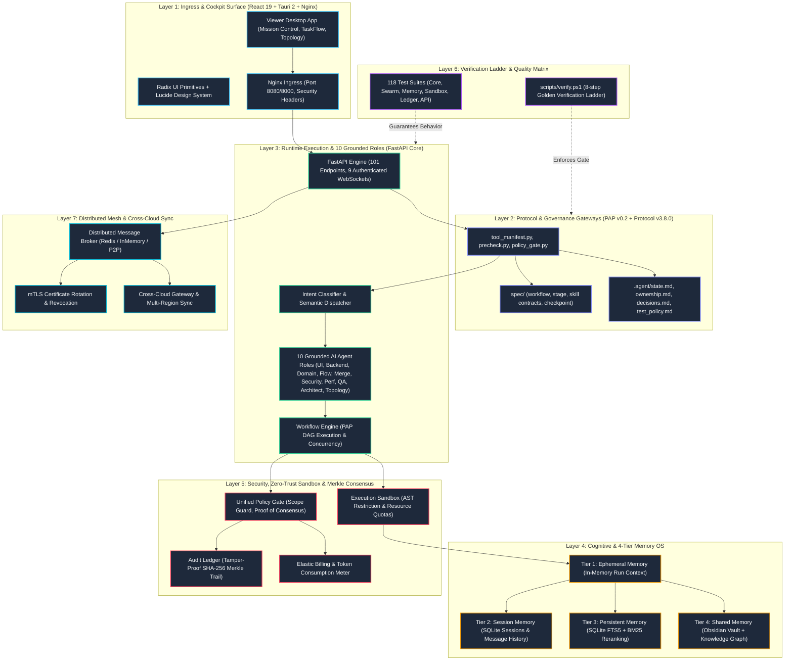

---
tags:
  - architecture/topology
  - system/7-layers
  - control-plane
type: system_architecture
layer: control-plane-topology
sync_status: verified
---

# 7-Layer System Architecture & Control Plane Topology (10)

> **Parent Index**: [[00 LLM-Agent-System Index]]
> **Strategic Compass**: [[01 Agent Strategy Integration & TaskEnvironment Architecture]]
> **Related Architecture**: [[20 Feature DAG & Feature-Based Ownership Topology]], [[30 Concurrency Lifecycle & Swarm State Machine]], [[40 4-Tier Memory OS & SQLite FTS5 Persistence Topology]]
> **Scale**: 516+ tracked files, 96,000+ LOC, 101 REST endpoints, 9 WebSockets, 10 Grounded Roles

---

## 1. 7-Layer Topological Hierarchy

The system enforces a strict unidirectional Directed Acyclic Graph (DAG) across seven distinct architectural layers:

---

## 2. Primary Source Directory Mapping

- **Layer 1 (Presentation)**:
  - `viewer/src/components/`: MissionControlView, TaskFlowView, TopologyView, Sidebar.
  - `viewer/src/components/ui/primitives.tsx`: Radix UI accessible button, card, dialog, badge primitives.
- **Layer 2 (Protocol Boundary)**:
  - `.agent/state.md`, `ownership.md`, `decisions.md`, `test_policy.md`, `versions.md`.
  - `spec/`: JSON Schema specifications (`workflow.schema.json`, etc.).
- **Layer 3 (Runtime Engine)**:
  - `agent_workspace/core/agent_crew.py`: Grounded agent registry, 10 roles, skill bindings.
  - `agent_workspace/core/engine.py`: Agent execution engine.
  - `agent_workspace/core/workflow_engine.py`: DAG execution, task state transitions.
  - `agent_workspace/core/router.py`: Adaptive task router.
- **Layer 4 (Memory OS)**:
  - `agent_workspace/core/memory.py`: 4-tier storage abstraction, SQLite FTS5 index.
- **Layer 5 (Security & Consensus)**:
  - `agent_workspace/core/policy_gate.py`: Scope validation, consensus proof verification.
  - `agent_workspace/core/audit_ledger.py`: Merkle tree cryptographic receipt trail.
  - `agent_workspace/core/sandbox.py`: Isolated process & filesystem transaction execution.
