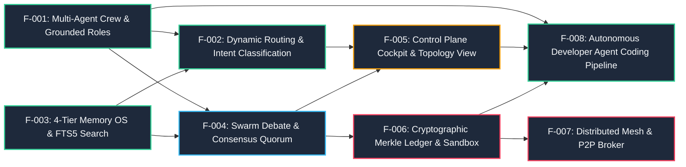

---
tags:
  - architecture/ownership
  - feature-dag
  - static-domain-ownership
type: ownership_topology
layer: L2-Protocol-and-Contract-Gateways
sync_status: verified
---

# Feature DAG & Feature-Based Ownership Topology (20)

> **Parent Index**: [[00 LLM-Agent-System Index]]
> **Related Notes**: [[05 Task Status & Multi-Agent Execution DAG]], [[70 Multi-Agent Protocol v3.8.0 & 10 Grounded Roles Matrix]]
> **Coordination Model**: Feature-Based Vertical Slicing (一人一功能全棧負責制)

---

## 1. Feature Breakdown & Dependency Graph

Features in LAS are structured as vertical slices spanning database persistence, runtime controller logic, API gateways, and UI presentation:

---

## 2. Feature-Based Ownership Matrix

| Feature Code | Feature Name | Primary Owner | Designated Agent Role | Mutable Repository Boundary |
|---|---|---|---|---|
| **F-001** | Multi-Agent Crew & Grounded Roles | Luke (PO) | `DOMAIN_LOGIC_AGENT` | `agent_workspace/core/agent_crew.py`, `.agent/agents/` |
| **F-002** | Dynamic Routing & Intent Classification | Ethan | `BACKEND_INFRA_AGENT` | `agent_workspace/core/router.py`, `agent_workspace/core/engine.py` |
| **F-003** | 4-Tier Memory OS & FTS5 Search | Ethan | `BACKEND_INFRA_AGENT` | `agent_workspace/core/memory.py`, `.agent/memory/` |
| **F-004** | Swarm Debate & Consensus Quorum | Eason | `APPLICATION_FLOW_AGENT` | `agent_workspace/core/discussion_room.py`, `workflow_engine.py` |
| **F-005** | Control Plane Cockpit & Topology View | Joe | `UI_UX_AGENT` | `viewer/src/components/`, `viewer/src/index.css` |
| **F-006** | Cryptographic Merkle Ledger & Sandbox | Luke | `SECURITY_AUDIT_AGENT` | `agent_workspace/core/audit_ledger.py`, `sandbox.py` |
| **F-007** | Distributed Mesh & P2P Broker | Ethan | `BACKEND_INFRA_AGENT` | `agent_workspace/core/broker.py`, `p2p_router.py` |
| **F-008** | Autonomous Developer Agent Coding Pipeline | Luke / Ethan / Joe | `DOMAIN_LOGIC_AGENT` / `BACKEND_INFRA_AGENT` / `UI_UX_AGENT` | `agent_workspace/core/pipeline/`, `core/{repository,git_worktree,task_environment,agent_executor,runtime_events}.py`, `routes/pipeline.py`, `viewer/src/components/CodingPipelineView.tsx` |

---

## 3. Mutable Scope Boundary Rules

1. **Strict Non-Interference**: Developers and Agents assigned to `F-005` (`UI_UX_AGENT`) must never edit backend schemas or Python files.
2. **Framework-Agnostic Domain Core**: `F-001` and pure business logic must never import UI libraries or concrete database drivers directly.
3. **Evidence Required Before Ownership Transfer**: Passing tests and signed receipts in `handoff.md` are mandatory before merging feature branches.
