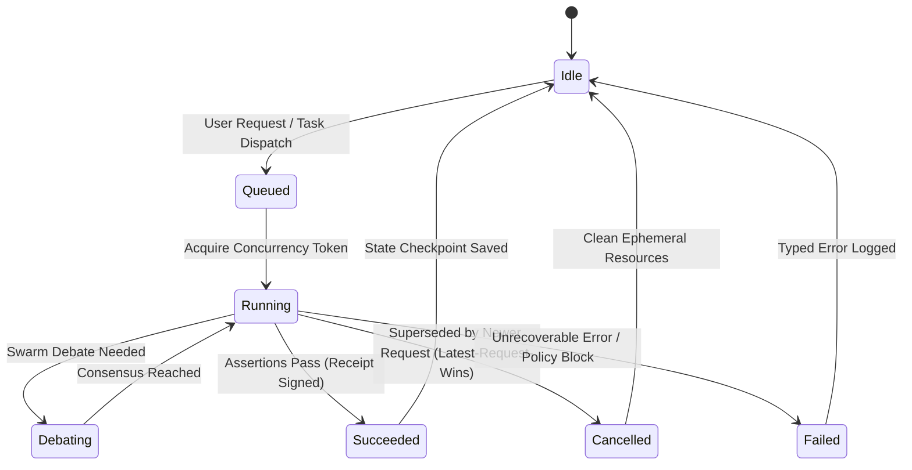

---
tags:
  - concurrency/lifecycle
  - swarm/state-machine
  - raft/consensus
type: state_machine
layer: L3-Runtime-Execution-and-Swarm
sync_status: verified
---

# Concurrency Lifecycle & Swarm State Machine (30)

> **Parent Index**: [[00 LLM-Agent-System Index]]
> **Related Notes**: [[10 7-Layer System Architecture & Control Plane Topology]], [[20 Feature DAG & Feature-Based Ownership Topology]]
> **Core Principle**: Anti-Corruption #3 (Concurrency & Race Elimination)

---

## 1. Concurrency Model: Latest-Request-Wins

To eliminate race conditions in real-time multi-agent execution and user interaction:
1. **Monotonic Epoch Stamp**: Every dispatch request generates an incrementing `epoch_id` and unique `request_id`.
2. **Atomic In-Flight Cancellation**: When a new request arrives for a session or node, any active background task with a lower epoch is signaled via `asyncio.Task.cancel()`.
3. **Stale Result Rejection**: Responses returning with `epoch < active_epoch` are atomically discarded at the event loop boundary and never write to memory or UI state.

---

## 2. Swarm State Machine Lifecycle

- **PENDING**: Registered in `CrewRegistry`, awaiting execution slot or parent task completion.
- **RUNNING**: Actively executing in sandbox, streaming intermediate logs over WebSocket.
- **DEBATING**: Multiple specialist roles participating in round-robin consensus voting.
- **COMPLETED**: Validation assertions satisfied, Merkle audit receipt recorded.
- **BLOCKED**: Missing external credentials or policy violation detected by `policy_gate.py`.
- **CANCELLED**: Terminated safely without side-effects.

---

## 3. WebSocket Real-Time Synchronization

- **Channel Types**: Session updates, Swarm debate events, Topology live streams, Token metering.
- **Heartbeat & Backoff**: Ping/pong interval every 15s; automatic reconnection with exponential jitter backoff (1s ~ 16s).
