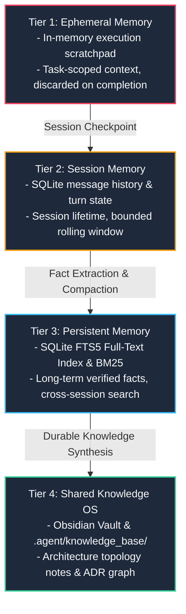

---
tags:
  - memory/crdt
  - persistence/sqlite
  - fts5/search
type: memory_os
layer: L4-Cognitive-and-Memory-OS
sync_status: verified
---

# 4-Tier Memory OS & SQLite FTS5 Persistence Topology (40)

> **Parent Index**: [[00 LLM-Agent-System Index]]
> **Related Architecture**: [[10 7-Layer System Architecture & Control Plane Topology]]
> **Primary Source Files**: `agent_workspace/core/memory.py`, `.agent/memory/`

---

## 1. 4-Tier Memory Hierarchy

LAS implements an enterprise-grade, bounded-context Memory OS to eliminate memory leaks and context explosion:

---

## 2. Tier Details & Storage Backends

| Tier | Name | Backend | Retention Policy | Primary Source |
|---|---|---|---|---|
| **1** | Ephemeral | In-Memory (`dict` / `list`) | Discarded on turn end | `agent_workspace/core/engine.py` |
| **2** | Session | SQLite (`sessions.db`) | Retained per session | `agent_workspace/core/memory.py` |
| **3** | Persistent | SQLite FTS5 (`fts5_memory.db`) | Durable, indexed with BM25 | `agent_workspace/core/memory.py` |
| **4** | Shared | Markdown Files + Obsidian Vault | Durable Git & Local Vault | `.agent/knowledge_base/`, `docs/obsidian/` |

---

## 3. Context Budget Preflight & Compaction

- **Token Budgeting**: Prompts check available token budget before LLM dispatch (`context_budget_preflight.py`).
- **Bounded Compaction**: Long conversation histories are automatically compacted into structured episodic summaries (`log_compactor.py`), preventing context overflow while preserving essential facts.
