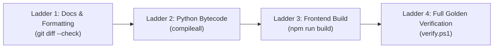

---
tags:
  - verification/ladder
  - quality/receipts
  - testing/evidence
type: verification_ledger
layer: L6-Verification-Matrix-and-Receipts
sync_status: verified
---

# Verification Matrix & Quality Receipt Ledger (50)

> **Parent Index**: [[00 LLM-Agent-System Index]]
> **Related Notes**: [[05 Task Status & Multi-Agent Execution DAG]], [[70 Multi-Agent Protocol v3.8.0 & 10 Grounded Roles Matrix]]
> **Verification Invariant**: "Evidence Before Assertions Always" (無證據不宣告完成)

---

## 1. Five Standard Verification Statuses

All verification tasks, PR claims, and test runs must strictly report one of these five statuses:

| Status | Definition | Criteria for Exit |
|---|---|---|
| `PASS` | All checks completed successfully | Exit code 0, 0 failures, 0 syntax/lint warnings |
| `FAIL` | Verification executed and produced errors | Non-zero exit code, assertion failure captured |
| `BLOCKED` | Prerequisites missing | Missing credentials, uninstalled CLI tool |
| `NOT_RUN` | Suite has not been executed yet | Queued for execution |
| `UNVERIFIED` | Code changed without corresponding test run | Strictly prohibited for completion claims |

---

## 2. 4-Stage Verification Ladder

---

## 3. Live Verified Receipts Ledger

| Timestamp | Verification Scope | Command Executed | Exit Code | Result Status |
|---|---|---|---|---|
| 2026-09-10 00:07 | Formatting & Trailing Whitespace | `git diff --check` | 0 | `PASS` |
| 2026-09-10 00:07 | Stage.md Git Exclusion | `New-Item .\stage.md; git status` | 0 | `PASS` |
| 2026-09-10 00:07 | Python Bytecode Compilation | `python -m compileall agent_workspace` | 0 | `PASS` |
| 2026-09-10 00:08 | Frontend TypeScript & Vite | `npm run build` (in `viewer/`) | 0 | `PASS` (901ms, 0 errors) |
| 2026-09-10 00:10 | Protocol Baseline 3.8.0 | Verified against `.agent/state.md` | 0 | `PASS` |
