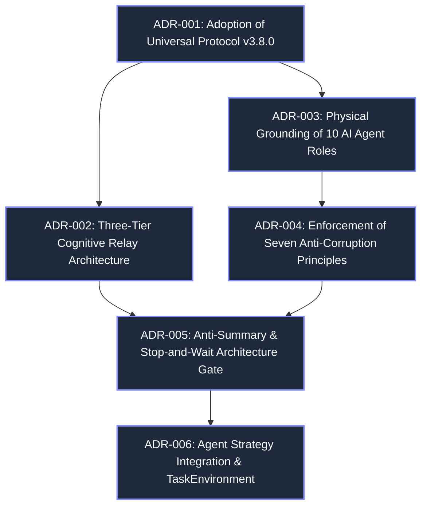

---
tags:
  - architecture/adr
  - decision-records
  - governance
type: adr_graph
layer: L2-Protocol-and-Contract-Gateways
sync_status: verified
---

# Architectural Decision Records (ADR) Graph (60)

> **Parent Index**: [[00 LLM-Agent-System Index]]
> **Source Registry**: `.agent/decisions.md`
> **Protocol Baseline**: `3.8.0`

---

## 1. Architectural Decisions Topology

---

## 2. Accepted Architectural Decisions

### ADR-001: Adoption of Universal Coding Agent Development Protocol v3.8.0
- **Context**: LAS required enterprise-grade multi-agent governance across human developers and multiple autonomous agents.
- **Decision**: Elevate protocol baseline to v3.8.0, lock baseline in `.agent/state.md`, declare coordination mode as `STATIC_DOMAIN_OWNERSHIP`.
- **Linked Files**: `.agent/state.md`, `AGENTS.md`, `.agent/agent.md`.

### ADR-002: Implementation of Three-Tier Cognitive Relay
- **Context**: Complex sessions suffered from context explosion and hallucinated memories.
- **Decision**: Partition cognitive state into Tier 1 (`stage.md`, gitignored), Tier 2 (`handoff.md` + Git), and Tier 3 (`docs/obsidian/` + Vault).
- **Linked Files**: `.gitignore`, `handoff.md`, `docs/DEVELOPMENT_WORKFLOW_GUIDE.md`.

### ADR-003: Physical Grounding of 10 AI Agent Roles & Universal Baseline
- **Context**: Agents hallucinated capabilities when given generic titles without concrete tool mounting.
- **Decision**: Ground 10 roles in Antigravity/Codex skills; mount `obsidian-vault` and `obsidian-research-notes` across all 10 roles as baseline memory.
- **Linked Files**: `agent_workspace/core/agent_crew.py`, `.agent/agents/`.

### ADR-004: Strict Enforcement of Seven Anti-Corruption Invariants
- **Context**: Code rot, bare excepts, and async race conditions risked technical debt accumulation.
- **Decision**: Mandate zero dead code, extreme single responsibility, `latest-request-wins`, typed failures only, spec-first, idempotence, and zero magic numbers.
- **Linked Files**: `agent_workspace/core/precheck.py`, `policy_gate.py`.

### ADR-005: Anti-Summary Invariant and Stop-and-Wait Architecture Gate
- **Context**: Premature code editing without primary source research led to regressions.
- **Decision**: Enforce bottom-up primary source inspection and stop-and-wait approval gates before invoking file-editing tools.
- **Linked Files**: `agent_workspace/core/precheck.py`, `AGENTS.md`.

### ADR-006: Agent Strategy Integration & Task Environment Architecture
- **Context**: LAS required absorbing the proven philosophies of Antigravity (Abundance), Claude (Containment), and Codex (Harness) into a unified developer control plane without vendor lock-in.
- **Decision**: Optimize for `Verified Engineering Throughput`. Formally elevate `ContextPack` to `TaskEnvironment` (minimum sufficient engineering environment). Enforce containment-first execution path and physical ScopeGuard.
- **Linked Files**: `.agent/decisions.md`, `agent_workspace/core/pipeline/models.py`, `agent_workspace/core/repository.py`, `agent_workspace/core/git_worktree.py`.
