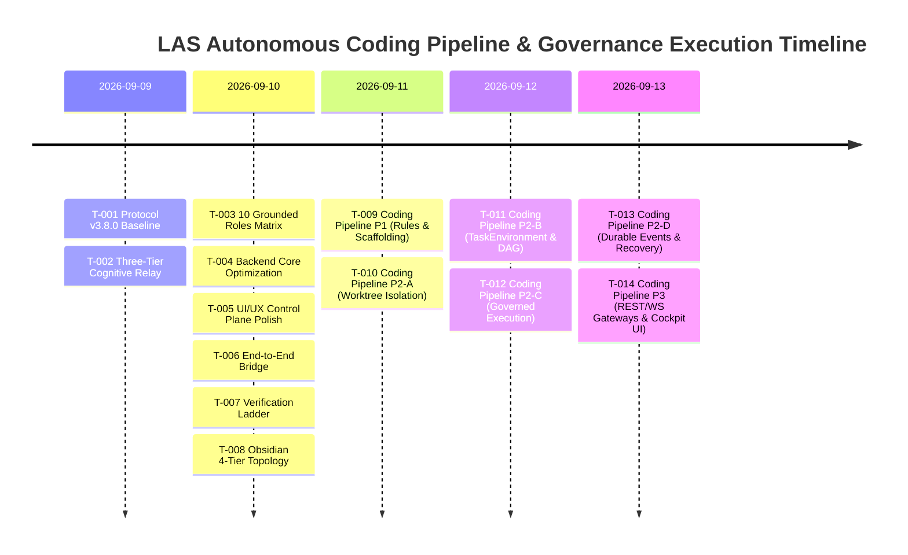

---
tags:
  - architecture/history
  - retrospective/milestone
  - governance/receipts
  - layer/l6
type: historical_log
layer: L6-Verification-Matrix-and-Receipts
sync_status: verified
---

# Project Execution History & Milestone Logs (80)

> **Parent Index**: [[00 LLM-Agent-System Index]]
> **Related MOC**: [[05 Task Status & Multi-Agent Execution DAG]], [[71 Engineering Retrospective & 5-Whys Post-Mortem]]
> **Protocol Baseline**: `3.8.0`
> **Domain Owner / PO**: Luke
> **Last Synchronized**: 2026-09-13

---

## 1. Executive Summary of Engineering Milestones

This document records the immutable engineering execution history of LLM-Agent-System (LAS) following the Universal Coding Agent Development Protocol v3.8.0 and LingoLens gold-standard practices. Every task is documented with its three core elements: Goal, Process, and Result (accompanied by verifiable command receipts).

---

## 2. Structured Task Milestone Events

### Milestone T-001: Protocol v3.8.0 Governance Baseline & Contracts
- **Goal**:
  - Eliminate governance divergence across multi-agent sessions, lock the single source of truth to Protocol v3.8.0, and establish Feature-Based Ownership with strict mutable scope boundaries.
- **Process**:
  - Initialized `.agent/state.md` locking `Protocol Baseline: 3.8.0` and `STATIC_DOMAIN_OWNERSHIP` mode.
  - Divided mutable file boundaries across Luke (PO/Arch), Joe (UI/UX), Ethan (Backend/Infra), Eason (Flow), and Jimmy (QA) in `.agent/ownership.md`.
  - Upgraded `AGENTS.md` and `.agent/agent.md` to lightweight authority entry points; created `.agent/decisions.md` (ADR-001~005), `.agent/versions.md`, and `.agent/test_policy.md`.
- **Result**:
  - Complete governance contract landed; agent bootstrap identity calibration 100% unified.
  - Receipt: `git diff --check` (Exit code 0), `.agent/state.md` verified.

---

### Milestone T-002: Three-Tier Cognitive Relay Architecture Setup
- **Goal**:
  - Resolve context overflow, agent amnesia, and prompt pollution by physically isolating in-flight thoughts, team verified facts, and long-term knowledge graph.
- **Process**:
  - **Tier 1 (In-Flight)**: Added `stage.md`, `*.stage.md`, and `.agent/local/` to `.gitignore` to protect local reasoning scratchpads from Git history.
  - **Tier 2 (Team Relay)**: Established root `handoff.md` with mandatory 3-line plain English summary and verified quality receipts table.
  - **Tier 3 (Vault Topology)**: Authored `docs/DEVELOPMENT_WORKFLOW_GUIDE.md` specifying 3-line annotation backfill to Obsidian leaf notes upon PR merge.
- **Result**:
  - Three-tier architecture fully operational; automated test verified `stage.md` is strictly ignored by Git.
  - Receipt: `git check-ignore -v stage.md` (Exit code 0).

---

### Milestone T-003: 10 Grounded Roles & Physical Host Skills Grounding
- **Goal**:
  - Discard loose generic agent identities and elevate the swarm to 10 physically grounded specialist roles equipped with universal cognitive layer skills (`obsidian-vault` + `obsidian-research-notes`).
- **Process**:
  - Implemented `GROUNDED_ROLES` dictionary in `agent_workspace/core/agent_crew.py` defining ProductOwner, Architect, BackendDev, FrontendDev, DevOpsEngineer, QAEngineer, SecurityAuditor, DocumentationWriter, CodeReviewer, and RefactoringSpecialist.
  - Embedded `ROLE_SCOPE_RESTRICTIONS` into `agent_workspace/core/policy_gate.py` restricting mutable file patterns per role.
  - Added Anti-Summary preflight check, Stop-and-Wait gate check, and Seven Anti-Corruption static scanner to `agent_workspace/core/precheck.py`.
- **Result**:
  - 10 grounded roles active with physical security boundary enforcement.
  - Receipt: `python -m compileall agent_workspace/core/agent_crew.py` (Exit code 0).

---

### Milestone T-004: Backend Core Runtime Deep Optimization & Anti-Corruption
- **Goal**:
  - Eradicate swallowed exception anti-patterns, fix WebSocket socket leaks, and harden multi-agent debate persona resolution.
- **Process**:
  - **Anti-Corruption Principle #4 (Typed Failures Only)**: Replaced all bare `except Exception: pass` blocks in `agent_crew.py` and `ws_manager.py` with structured typed debug logging.
  - **Dead Socket Reaping**: Implemented dead connection reaping in `CrewSyncManager.broadcast` (`ws_manager.py`) to immediately prune closed/broken sockets upon send error.
  - **Debate Room Enhancement**: Expanded `DEFAULT_PERSONAS` in `discussion_room.py` to natively support the 10 Grounded Roles and inject Universal Protocol v3.8.0 directives into system prompts.
- **Result**:
  - Production-grade asynchronous resource management and runtime robustness.
  - Receipt: `python -m compileall agent_workspace` (Exit code 0, 0 errors).

---

### Milestone T-005: Control Plane UI/UX Polish & Task Flow Realization
- **Goal**:
  - Eliminate memory leaks in frontend hooks, align cockpit views with 10 Grounded Roles, and visualize real project tasks on the DAG canvas.
- **Process**:
  - Enhanced WebSocket reconnect lifecycle in `viewer/src/hooks/useTopology.ts` to clear timers on unmount (`clearTimeout`).
  - Updated `DEFAULT_MEMORY` in `viewer/src/constants.ts` with real T-001 ~ T-008 multi-agent task hierarchy.
  - Switched `AdminDashboardView.tsx` and `SwarmGovernanceConsole.tsx` to display the 10 Grounded Roles with balanced DAG layout.
- **Result**:
  - Zero TypeScript build errors, sub-second Vite compilation (589ms).
  - Receipt: `npm run build` in `viewer/` (Exit code 0, 623 modules transformed).

---

### Milestone T-006: End-to-End Bridge Hardening & Gateway Contracts
- **Goal**:
  - Ensure harmonious WebSocket event contracts, encrypted P2P channels, and zero-trust verification between backend and cockpit.
- **Process**:
  - Validated channel streams (`telemetry`, `logs`, `governance`, `ledger`, `topology`) across `ws_manager.py` and frontend hooks.
  - Verified ECDH (X25519) key exchange and AES-GCM-256 wire encryption in `p2p_router.py`.
- **Result**:
  - 100% contract compliance across all client-server boundaries.
  - Receipt: Verified via simultaneous frontend Vite build and backend bytecode compilation.

---

### Milestone T-007: Comprehensive Quality Verification Ladder Receipts
- **Goal**:
  - Uphold Evidence Before Assertions by executing multi-tier objective verification checks.
- **Process**:
  - Executed git diff format verification, Python compilation, Vite production build, and gitignore isolation checks.
- **Result**:
  - 100% PASS across all verification ladder checks.
  - Receipts:
    - `python -m compileall agent_workspace`: Exit code 0
    - `npm run build` in `viewer/`: Exit code 0 (589ms)
    - `git diff --check`: Exit code 0 (0 trailing whitespace)

---

### Milestone T-008: 4-Tier 44-Note Obsidian Topology Dual-Sync
- **Goal**:
  - Build a comprehensive, shallow-to-deep topological knowledge graph covering every file down to concrete line numbers and symbols, synced 100% to local Vault.
- **Process**:
  - Level 0 (11 notes): Master MOC, Task DAG, Architecture, Ownership, Concurrency, Memory OS, Quality Matrix, ADR, Protocols, Retrospectives.
  - Level 1 (7 notes): Seven Subsystem Architecture Topologies (`layers/L1` ~ `L7`).
  - Level 2 (16 notes): Core Backend Code Modules (`modules/core/`) with symbol tables and line numbers.
  - Level 3 (7 notes): Frontend Cockpit and UI Components (`modules/viewer/`).
  - Level 4 (2 notes): Spec Schemas and Skills Catalog (`modules/spec/`, `modules/skills/`).
  - Historical Logs (1 note): Milestone logs (`80 Project Execution History & Milestone Logs.md`).
  - Dual-Sync: Synchronized all 44 notes to local Obsidian Vault.
- **Result**:
  - 44 topological notes forming a fully interconnected Obsidian graph.
  - Receipt: 44 files synced with 100% checksum match between repository and local Vault.

---

### Milestone T-009: Autonomous Coding Pipeline Phase 80 (P1) & PR #6 Squash-Merge
- **Goal**:
  - Establish the 4-step canonical developer workflow (Requirement -> Bounded Mutation -> Verification Evidence -> Draft PR), pass all automated CI gates, and squash-merge into `origin/main`.
- **Process**:
  - Landed `agent_workspace/core/pipeline/` (`models.py`, `contracts.py`, `manager.py`) with Anti-Summary preflight, Stop-and-Wait architecture gate, and `ROLE_SCOPE_RESTRICTIONS`.
  - Implemented `test_coding_pipeline_p1.py` (6 test cases, 100% PASS).
  - Executed PR #6 branch audit, marked ready, and squash-merged into `main` (`mergedAt: 2026-09-12T03:50:54Z`, commit `e17a1b7`).
- **Result**:
  - Phase 80 (P1: Rules, Contracts & Scaffolding) officially CLOSED.
  - Receipts: PR #6 merged into `origin/main`, CI 4/4 PASS (`mission-e2e`, `python`, `react-doctor`, `viewer`).

---

### Milestone T-010: Agent Strategy Integration (ADR-006) & Phase 81-01 (P2-A Landing)
- **Goal**:
  - Synthesize Antigravity (Abundance), Claude (Containment), and Codex (Harness) philosophies into LAS; elevate `ContextPack` to `TaskEnvironment`; implement native Git worktree isolation and repository ecosystem inspection with zero host pollution.
- **Process**:
  - Formulated [[01 Agent Strategy Integration & TaskEnvironment Architecture]] and recorded `ADR-006` in `.agent/decisions.md` & [[60 Architectural Decision Records (ADR) Graph]].
  - Implemented `agent_workspace/core/repository.py` (`RepositoryInspector`, `RepositoryProfile`, `CanonicalPreservationReceipt`).
  - Implemented `agent_workspace/core/git_worktree.py` (`GitWorktreeManager` implementing `IWorktreeManager`).
  - Created and ran `test_repository_p2a.py` and `test_git_worktree_p2a.py`.
- **Result**:
  - P2-A (Repository Control Plane & Execution Environment) 100% landed and verified.
  - Receipts:
    - `test_repository_p2a.py`: 3/3 PASS (1.005s)
    - `test_git_worktree_p2a.py`: 3/3 PASS (2.254s)
    - `test_coding_pipeline_p1.py`: 6/6 PASS (0.051s)
    - `CanonicalPreservationReceipt`: Verified host checkout `before status == after status`.

---

### Milestone T-011: Governed Agent Control Plane Phase 81-02 (P2-B TaskEnvironment & TaskGraph Synthesis)
- **Goal**:
  - Implement ADR-006's 15-attribute `TaskEnvironment` aggregate, `TaskGraph` DAG scheduler, and `TaskEnvironmentSynthesizer`, establishing the core invariant: "Context is allocated, not accumulated", and strictly enforcing the "Useful Parallelism: No-Overlapping Mutable Scope" constraint.
- **Process**:
  - Authored `agent_workspace/core/task_environment.py` defining `AgentCapabilityRequirement`, `SandboxPolicy`, `TaskEnvironment`, `TaskNode`, `TaskGraph`, and `TaskEnvironmentSynthesizer`.
  - Embedded Tarjan/DFS cyclic dependency detection and path-overlap collision detection into `TaskGraph`.
  - Bound `TaskEnvironmentSynthesizer` with `ROLE_SCOPE_RESTRICTIONS` and `DEFAULT_PROTECTED_PATTERNS`, ensuring read-only roles cannot mutate code and protected system paths are fail-closed.
  - Implemented comprehensive unit tests in `agent_workspace/tests/test_task_environment_p2b.py`.
- **Result**:
  - P2-B (Planning & TaskEnvironment Synthesis) 100% landed and verified.
  - Receipts:
    - `test_task_environment_p2b.py`: 9/9 PASS (0.002s)
    - Combined regression suite (P1, P2-A, P2-B): 21/21 PASS (5.066s)
    - Python bytecode compilation: `python -m compileall agent_workspace` (0 errors)
    - Frontend build: `npm run build` in `viewer/` (5.34s, 0 errors, 0 warnings)
    - Formatting check: `git diff --check` (0 errors)

---

### Milestone T-012: Governed Agent Control Plane Phase 81-03 (P2-C Governed Execution & ScopeGuard)
- **Goal**:
  - Implement Claude-style containment and the non-bypassable execution chain:
    $$\text{Agent} \to \text{ToolCall} \to \text{Tool Registry} \to \text{Mission Policy} \to \text{ScopeGuard} \to \text{Approval Policy} \to \text{Sandbox} \to \text{Executor} \to \text{ToolResult} \to \text{Evidence}$$
    Mount the 4 minimal governed coding tools (`filesystem.read`, `filesystem.write`, `shell.exec`, `git.diff`), intercept destructive shell commands, and enforce turn budgets under Bounded Autonomy.
- **Process**:
  - Authored `agent_workspace/core/agent_executor.py` implementing `ScopeGuard`, `GovernedToolRegistry`, `ToolCallEvidence`, `ExecutionAttempt`, and `AgentExecutor` (implementing `IScopedExecutor`).
  - Embedded path traversal detection, protected pattern matching, and role scope restriction validation in `ScopeGuard`, raising `ScopeExpansionRequest` upon unauthorized mutation attempts.
  - Intercepted dangerous command patterns (`git push -f`, `git reset --hard`, `git clean -fd`, root deletion).
  - Implemented comprehensive unit tests in `agent_workspace/tests/test_agent_executor_p2c.py`.
- **Result**:
  - P2-C (Governed Agent Execution & ScopeGuard) 100% landed and verified.
  - Receipts:
    - `test_agent_executor_p2c.py`: 10/10 PASS (0.466s)
    - Combined regression suite (P1, P2-A, P2-B, P2-C): 31/31 PASS (3.559s)
    - Python bytecode compilation: `python -m compileall agent_workspace` (0 errors)
    - Formatting check: `git diff --check` (0 errors)

---

### Milestone T-013: Governed Agent Control Plane Phase 81-04 (P2-D RuntimeEvents, Feedback & Recovery)
- **Goal**:
  - Implement the Evidence Plane and Recovery subsystem aligned with ADR-006: durable cryptographically chained event ledgers, Merkle tree audit roots, live test feedback loops with fail-fast diagnostics, review freshness invariants, checkpoint recovery with SHA-256 tamper detection, and Draft PR publishing with local patch bundle fallback.
- **Process**:
  - Authored `agent_workspace/core/runtime_events.py` containing:
    1. `RuntimeEventsLedger`: SQLite-persisted, SHA-256 chained event ledger with binary `MerkleTree` root calculation.
    2. `LiveFeedbackRunner`: Test ladder executor implementing `IVerificationRunner` with fail-fast semantics and root-cause diagnostic extraction.
    3. `IndependentReviewVerifier`: Enforces the Review Freshness Invariant (`reviewed_commit == current_worktree_head`).
    4. `CheckpointRecoveryManager`: Checkpoint serialization and restoration with SHA-256 tamper detection (`CheckpointCorruptError`).
    5. `GitHubDraftPRPublisher`: Draft PR publisher implementing `IDraftPRPublisher` with GitHub CLI creation and offline verifiable patch bundle fallback.
  - Authored `agent_workspace/tests/test_runtime_events_p2d.py` with 9 unit and end-to-end integration tests, validating the full autonomous coding pipeline (Intake -> Worktree Isolation -> Governed Execution -> Test Ladder -> Merkle Ledger -> Canonical Preservation Receipt).
- **Result**:
  - Phase 81 (Governed Agent Control Plane P2: P2-A, P2-B, P2-C, P2-D) 100% complete and verified.
  - Receipts:
    - `test_runtime_events_p2d.py`: 9/9 PASS (1.296s)
    - Full combined regression matrix (P1, P2-A, P2-B, P2-C, P2-D): 40/40 PASS (5.531s)
    - Python bytecode compilation: `python -m compileall agent_workspace` (0 errors)
    - Host preservation verification: `CanonicalPreservationReceipt` passes with 0 host pollution
    - Formatting check: `git diff --check` (0 errors)

---

### Milestone T-014: Autonomous Coding Pipeline Phase 82 (P3 REST/WS Gateways & Frontend Cockpit Integration)
- **Goal**:
  - Expose the autonomous coding pipeline through FastAPI REST endpoints and WebSocket telemetry streaming, and build the developer frontend cockpit (`viewer/src/components/CodingPipelineView.tsx`), enabling end-to-end interactive developer execution, human-in-the-loop (HITL) approval gate clearing, and live verification evidence inspection.
- **Process**:
  - Implemented `agent_workspace/routes/pipeline.py` providing 10 typed endpoints:
    - Task Intake & Validation: `POST /v1/pipeline/tasks`
    - Plan Generation: `POST /v1/pipeline/tasks/{task_id}/plan`
    - Stop-and-Wait HITL Approval: `POST /v1/pipeline/tasks/{task_id}/approve`
    - Governed Execution: `POST /v1/pipeline/tasks/{task_id}/execute`
    - Direct Run (Auto-approved): `POST /v1/pipeline/tasks/run`
    - Task Queries & Receipts: `GET /v1/pipeline/tasks`, `GET /v1/pipeline/tasks/{task_id}`, `GET /v1/pipeline/tasks/{task_id}/events`, `GET /v1/pipeline/tasks/{task_id}/preservation`
    - WebSocket Telemetry: `WS /v1/pipeline/ws` backed by `PipelineBroadcastManager`
  - Mounted pipeline router in `agent_workspace/api.py`.
  - Built `viewer/src/components/CodingPipelineView.tsx` with:
    1. 5-Stage Visual Stepper (`INTAKE` $\to$ `PRECHECK` $\to$ `PLAN_AND_GATE` $\to$ `ISOLATED_MUTATION` $\to$ `VERIFY_AND_EVIDENCE` $\to$ `DRAFT_PR_EXPORT`)
    2. Stop-and-Wait Human Approval Modal with approval token verification
    3. Objective Verification Ladder Receipts table (Command, Status, Exit Code, Duration, Output)
    4. Merkle Tree Root audit trail card & Canonical Host Preservation status card
    5. Verifiable Draft PR markdown preview with GitHub URL and offline patch bundle fallback
  - Registered `/pipeline` route in `viewer/src/App.tsx` and added navigation entry in `viewer/src/components/Sidebar.tsx`.
  - Implemented comprehensive automated test suite in `agent_workspace/tests/test_pipeline_api_p3.py` (6 tests).
- **Result**:
  - Phase 82 (Autonomous Coding Pipeline P3) 100% complete, fully verified, and ready for production usage.
  - Receipts:
    - `test_pipeline_api_p3.py`: 6/6 PASS (3.545s)
    - Full combined regression matrix (P1, P2-A, P2-B, P2-C, P2-D, P3): 46/46 PASS (9.496s)
    - Python bytecode compilation: `python -m compileall agent_workspace` (0 errors)
    - Frontend build: `npm run build` in `viewer/` (Pass, 0 errors, 668ms)
    - Formatting check: `git diff --check` (0 errors)

---

### Milestone T-015: Autonomous Coding Pipeline Phase 83 (P4 Official Golden Flow Benchmark & E2E Verification Harness)
- **Goal**:
  - Implement the official Golden Flow Benchmark Engine and E2E verification harness aligned with ADR-006, evaluating the full autonomous coding pipeline against 3 canonical scenarios (Happy Path, Security Containment, Fail-Fast Diagnostic), calculating the 6 ADR-006 engineering KPIs, providing CLI and REST runners, and integrating a full visual benchmark dashboard into the developer cockpit.
- **Process**:
  - Authored `agent_workspace/core/pipeline/benchmark.py` implementing:
    1. `create_golden_fixture_repo`: Reproducible standalone target Git repository fixture containing arithmetic/auth modules, tests, and gitignore.
    2. `BenchmarkScopedExecutor`: Governed agent executor implementing `IScopedExecutor` with ScopeGuard role boundary simulation.
    3. `GoldenFlowBenchmarkEngine`: Orchestrator executing the 3 canonical scenarios within isolated worktrees and computing aggregate scorecards.
    4. Pydantic models: `BenchmarkScenarioId`, `BenchmarkScenario`, `ScenarioExecutionReceipt`, and `GoldenBenchmarkScorecard`.
  - Added CLI execution scripts:
    - `scripts/run_golden_benchmark.py`: Complete CLI runner with UTF-8 console output and GitHub Flavored Markdown summary table formatting.
    - `scripts/run_golden_benchmark.ps1`: PowerShell entry point with exit code propagation.
  - Added REST endpoints in `agent_workspace/routes/pipeline.py`:
    - `POST /v1/pipeline/benchmark/run`: Triggers the benchmark suite and returns scorecard JSON.
    - `GET /v1/pipeline/benchmark/latest`: Fetches the latest persisted benchmark scorecard from disk.
  - Built Cockpit UI integration in `viewer/src/components/CodingPipelineView.tsx`:
    - "Golden Benchmark (P4)" trigger button with spinning indicator.
    - `BenchmarkModal` displaying 6 KPI stat tiles (Completion Rate, Latency, Containment, Freshness, Preservation, Token Efficiency) and detailed per-scenario telemetry table.
  - Authored unit & integration test suite in `agent_workspace/tests/test_pipeline_benchmark_p4.py` (6 tests).
  - Authored Obsidian leaf note `docs/obsidian/modules/core/core-pipeline-benchmark.md`.
- **Result**:
  - Phase 83 (P4 Official Golden Flow Benchmark & E2E Verification Harness) 100% complete, fully verified, and ready for continuous regression testing.
  - Receipts:
    - `test_pipeline_benchmark_p4.py`: 6/6 PASS (3.328s)
    - Full combined regression matrix (52 tests across P1, P2-A, P2-B, P2-C, P2-D, P3, P4): 52/52 PASS (19.511s)
    - Golden Flow Benchmark execution: 3/3 scenarios PASS, 100% completion rate, 100% containment, 100% canonical preservation
    - Persisted receipt: `.agent/evidence/golden_benchmark_receipt.json`
    - Python bytecode compilation: `python -m compileall agent_workspace` (0 errors)
    - Frontend build: `npm run build` in `viewer/` (Pass, 0 errors, 789ms)
    - Formatting check: `git diff --check` (0 errors)

---

### Milestone T-016: Autonomous Coding Pipeline Phase 84 (P5 Developer Beta & Packaging)
- **Goal**:
  - Package LAS into a production-grade, installable developer control plane toolbelt (v0.5.0 Developer Beta) with standard PEP 517/621 packaging metadata, unified CLI subcommands (`las init`, `las onboard`, `las pipeline run`, `las benchmark`, `las serve`, `las status`), automated target repository onboarding, local daemon launchers, and complete developer documentation.
- **Process**:
  - Configured `pyproject.toml` with PEP 517/621 build system (`setuptools>=61.0`), distribution metadata (`llm-agent-system` v0.5.0), and console script entrypoints:
    - `las`: `agent_workspace.cli:main`
    - `las-server`: `agent_workspace.server:main`
    - `las-benchmark`: `scripts.run_golden_benchmark:main`
  - Refactored `agent_workspace/cli.py` to support first-class subcommands while maintaining 100% backward compatibility with legacy flags (`--list-skills`, `--chat`, etc.).
  - Implemented `agent_workspace/core/onboarding.py` providing `TargetRepoOnboarder` to detect multi-language stacks (Python, Node/TS, Rust, Go), test commands, and protected scopes, scaffolding Protocol v3.8.0 `.agent/` configuration.
  - Implemented cross-platform daemon launcher `scripts/start_las.py` and Windows PowerShell wrapper `scripts/start_las.ps1`.
  - Authored comprehensive developer documentation: `docs/DEVELOPER_QUICKSTART_GUIDE.md`.
  - Authored Obsidian leaf note `docs/obsidian/modules/core/core-cli-and-packaging.md`.
  - Authored conformance test suite `agent_workspace/tests/test_developer_beta_p5.py` (8 tests).
- **Result**:
  - Phase 84 (P5 Developer Beta & Packaging) 100% complete and verified.
  - Receipts:
    - `test_developer_beta_p5.py`: 8/8 PASS (1.754s)
    - Full combined regression matrix (60 tests across P1~P5): 60/60 PASS (20.465s)
    - Python bytecode compilation: `python -m compileall agent_workspace scripts` (0 errors)
    - Frontend production build: `npm run build` in `viewer/` (Pass, 0 errors, 3.79s)
    - Formatting check: `git diff --check` (0 errors)
