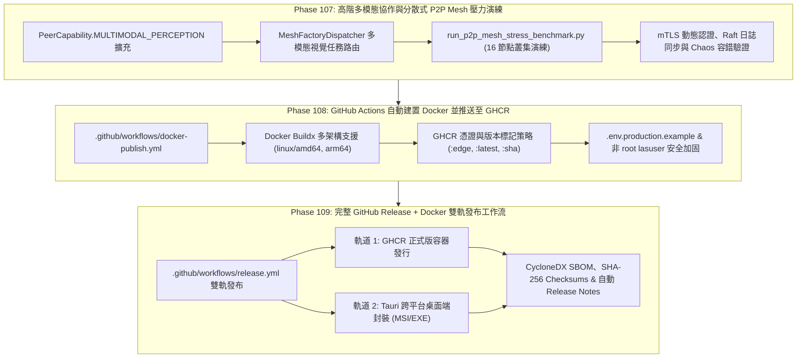

---
tags:
  - architecture/workflow
  - deployment/production
  - swarm/p2p-mesh
  - cicd/ghcr
  - protocol/v3-8-0
type: production_workflow
layer: L7-Distributed-Mesh-and-P2P
sync_status: verified
---

# Production Delivery & Swarm Mesh Drill Workflow (90)

> **Parent Index**: [[00 LLM-Agent-System Index]]
> **Related Architecture**: [[L7-Distributed-Mesh-and-P2P]], [[50 Verification Matrix & Quality Receipt Ledger]], [[80 Project Execution History & Milestone Logs]]
> **Required Protocol Version**: `3.8.0`
> **Domain Owner / PO**: Luke
> **Date**: 2026-10-02

---

## 1. 綜覽與工作流架構 (Architecture Overview)

本拓樸文件定義 LLM-Agent-System (LAS) 從「多模態分散式蜂群壓力驗證」到「生產環境自動化容器交付與桌面發行」的三階完整金字塔工作流：



---

## 2. 階段一：高階多模態協作與分散式 P2P Mesh 壓力演練 (Phase 107)

### 2.1 多模態能力定義與酬載規範
* **節點能力枚舉**：在 `PeerCapability` 擴充 `MULTIMODAL_PERCEPTION = "MULTIMODAL_PERCEPTION"`，代表具備視覺處理、程式碼圖譜繪製或 UI 截圖檢驗之邊緣或核心節點。
* **輕量 Merkle 雜湊上鏈**：大容量二進制媒體檔案不直接塞入 Raft 狀態機，而是以 `SHA-256 Merkle Root` 紀錄於日誌中，二進制資料透過 P2P 區塊流或本機暫存池拉取。
* **調度器拓樸路由**：`MeshFactoryDispatcher` 解析任務需求，若包含視覺審查或架構圖解譯，自動導流至具備 `MULTIMODAL_PERCEPTION` 的節點。

### 2.2 16 節點壓力基準測試維度
* **並行節點**：16 異質節點（`COCKPIT_LEADER` x 1, `REASONING_ENGINE` x 3, `SANDBOX_MUTATION` x 4, `TEST_RUNNER` x 4, `MULTIMODAL_PERCEPTION` x 4）。
* **壓力情境**：
  1. 動態節點加入與 X.509 憑證 Attestation Challenge-Response 認證。
  2. 混合交易流（Raft 日誌複製、多模態酬載傳遞、向量經驗檢索）。
  3. 混沌故障注入（網路封包丟棄、節點斷線離網、動態選主重組）。
* **合格標準**：錯誤率 = `0.00%`，Raft 狀態機一致，透過 PRAGMA integrity 檢查。

---

## 3. 階段二：GitHub Actions 自動建置 Docker 並推送至 GHCR (Phase 108)

### 3.1 容器註冊表架構
* **Registry**：GitHub Container Registry (`ghcr.io/opluke11-abula/llm-agent-system`)。
* **認證方式**：原生 `GITHUB_TOKEN`，配合 `permissions: packages: write`。
* **多架構支持**：利用 `docker/setup-qemu-action` 與 `docker/setup-buildx-action` 支援 `linux/amd64` 與 `linux/arm64`。

### 3.2 映像檔標籤 (Tag) 策略
| 觸發事件 | 標籤 (Tags) | 用途 |
|---|---|---|
| `push` to `main` | `ghcr.io/...:edge`, `ghcr.io/...:sha-<commit>` | 快速驗證最新主幹產物 |
| `push` tag `v*.*.*` | `ghcr.io/...:latest`, `ghcr.io/...:v0.6.0`, `ghcr.io/...:0.6.0` | 正式生產版本發布 |
| `pull_request` | 不推送 (僅執行 `load: true` 或靜態掃描) | 防止 PR 污染遠端 Registry |

### 3.3 安全性與非 root 規範
* 容器內部強制以 `lasuser:lasgroup` (UID 1001) 運行，具備 `/v1/health` 自動探針。
* 提供 `.env.production.example`，預設關閉危險除錯介面與硬編碼連線。

---

## 4. 階段三：完整 GitHub Release + Docker 雙軌發布工作流 (Phase 109)

### 4.1 雙軌發行矩陣
1. **容器軌道 (Container Track)**：
   * 產出通過安全加固的 Multi-Arch Docker 映像檔。
   * 自動生成 CycloneDX SBOM 軟體物料清單。
2. **桌面端軌道 (Desktop Tauri Track)**：
   * 執行 Tauri 跨平台構建流程，產生 Windows `.msi` 與獨立執行檔。
   * 生成所有 binary 產物的 `SHA256SUMS.txt` 校驗檔。

### 4.2 發布前檢核階梯 (Release Readiness Gate)
* **三軌版本一致性**：`pyproject.toml`、`viewer/package.json` 與 `viewer/src-tauri/tauri.conf.json` / `Cargo.toml` 版本號必須 100% 同態對齊（目前為 `v0.6.0`）。
* **專屬單元測試套件**：執行 `agent_workspace/tests/test_release_pipeline_p109.py` 確保 `release.yml` 語法、權限與 Desktop 打包邏輯完全綠燈 (5/5 PASS)。
* **品質收據**：本地單元測試 100% 通過 (75/75 PASS)、React Doctor 0 告警、Git 工作目錄純淨。
* **標準發行流程**：
  ```powershell
  # 1. 執行發布預檢
  uv run python scripts/verify_release_readiness.py

  # 2. 標記版本 Git Tag
  git tag -a v0.6.0 -m "Release v0.6.0: Swarm Mesh, GHCR Docker and Desktop Release"
  git push origin v0.6.0
  ```

---

## 5. 知識拓樸雙向同步指引

每次工作流執行完畢，均應更新本文件之驗證收據，並透過標準同步腳本同步至外部 Obsidian Vault：
```powershell
powershell -NoProfile -ExecutionPolicy Bypass -File .\.agent\knowledge_base\tools\start_agent_preflight.ps1 -Query "Release Workflow"
```
