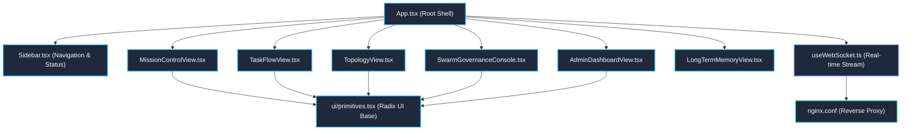

---
tags:
  - layer/l1
  - ingress/cockpit
  - frontend/surface
type: layer_topology
layer: L1-Ingress-and-Cockpit-Surface
sync_status: verified
---

# L1: Ingress & Cockpit Surface Subsystem Topology

> **Parent Index**: [[00 LLM-Agent-System Index]]
> **Layer ID**: Layer 1 (Presentation & Desktop Cockpit)
> **Physical Boundary**: `viewer/`, `nginx.conf`
> **Assigned Role**: `UI_UX_AGENT` (Joe)

---

## 1. Subsystem Architecture Map

---

## 2. Leaf Notes Index (Component Level)

- [[viewer-app]]: Application root container, theme provider, and global layout (`viewer/src/App.tsx`).
- [[viewer-mission-control]]: Cockpit dashboard, system health meters, activity feed (`viewer/src/components/MissionControlView.tsx`).
- [[viewer-task-flow]]: Directed graph workflow execution and interactive node debugger (`viewer/src/components/TaskFlowView.tsx`).
- [[viewer-topology-view]]: Dynamic multi-agent topology visualizer with real-time edges (`viewer/src/components/TopologyView.tsx`).
- [[viewer-swarm-governance]]: Multi-agent debate, consensus voting quorum, and replay timeline (`viewer/src/components/SwarmGovernanceConsole.tsx`).
- [[viewer-admin-dashboard]]: Multi-tenant management, cryptographic audit verification, token billing (`viewer/src/components/AdminDashboardView.tsx`).
- [[viewer-primitives]]: Radix UI primitive hierarchy, button, card, dialog, badge components (`viewer/src/components/ui/primitives.tsx`).
