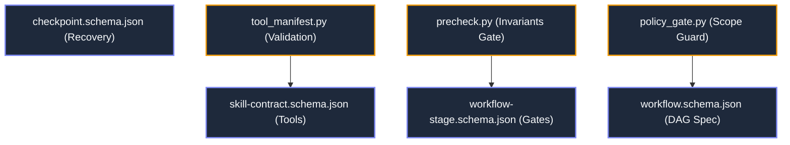

---
tags:
  - layer/l2
  - protocol/contracts
  - gateways/policy
type: layer_topology
layer: L2-Protocol-and-Contract-Gateways
sync_status: verified
---

# L2: Protocol & Contract Gateways Subsystem Topology

> **Parent Index**: [[00 LLM-Agent-System Index]]
> **Layer ID**: Layer 2 (Protocol Specifications & Gateways)
> **Physical Boundary**: `spec/`, `.agent/`, `agent_workspace/core/precheck.py`
> **Assigned Role**: `ARCHITECT_PLANNER_AGENT` / `DOMAIN_LOGIC_AGENT` (Luke)

---

## 1. Subsystem Architecture Map

---

## 2. Leaf Notes Index (Contract & Schema Level)

- [[01 Agent Strategy Integration & TaskEnvironment Architecture]]: Strategic vision, upgraded PDAD, and TaskEnvironment minimum sufficient engineering environment.
- [[spec-schemas-and-contracts]]: Formal JSON Schemas for workflows, stages, skills, and checkpoints (`spec/`).
- [[skills-inventory-and-tools]]: Tool inventory, YAML frontmatter contracts, and role-scoped permissions.
- [[core-pipeline]]: Autonomous coding pipeline lifecycle, Stop-and-Wait Gate, Draft PR generation (`agent_workspace/core/pipeline/`).
- [[core-precheck]]: Anti-Summary Invariant, Stop-and-Wait Gate, and Seven Anti-Corruption static validator (`agent_workspace/core/precheck.py`).
- [[core-policy-gate]]: Fail-closed runtime policy gate enforcing scope boundaries and consensus proofs (`agent_workspace/core/policy_gate.py`).
