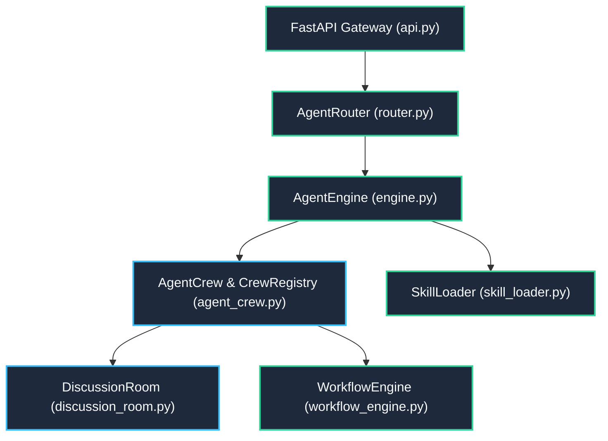

---
tags:
  - layer/l3
  - runtime/swarm
  - execution/dag
type: layer_topology
layer: L3-Runtime-Execution-and-Swarm
sync_status: verified
---

# L3: Runtime Execution & Swarm Subsystem Topology

> **Parent Index**: [[00 LLM-Agent-System Index]]
> **Layer ID**: Layer 3 (Runtime Engine & Swarm Dispatch)
> **Physical Boundary**: `agent_workspace/core/`, `agent_workspace/api.py`
> **Assigned Role**: `BACKEND_INFRA_AGENT` (Ethan) / `APPLICATION_FLOW_AGENT` (Eason)

---

## 1. Subsystem Architecture Map

---

## 2. Leaf Notes Index (Core Runtime Level)

- [[core-engine]]: Dual-parser runtime executing Jinja2 prompt rendering and reflected tool calls (`agent_workspace/core/engine.py`).
- [[core-workflow-engine]]: Asynchronous step-by-step DAG execution engine with dynamic payload piping and checkpoint resumes (`agent_workspace/core/workflow_engine.py`).
- [[core-router]]: Intent classifier, active route latency tracking, and semantic dispatcher (`agent_workspace/core/router.py`).
- [[core-agent-crew]]: 10 Grounded Roles dispatching, CrewRegistry thread-safe topology tracking, and host skill bindings (`agent_workspace/core/agent_crew.py`).
- [[core-discussion-room]]: Swarm multi-agent debate, proposal synthesis, and Byzantine quorum voting (`agent_workspace/core/discussion_room.py`).
