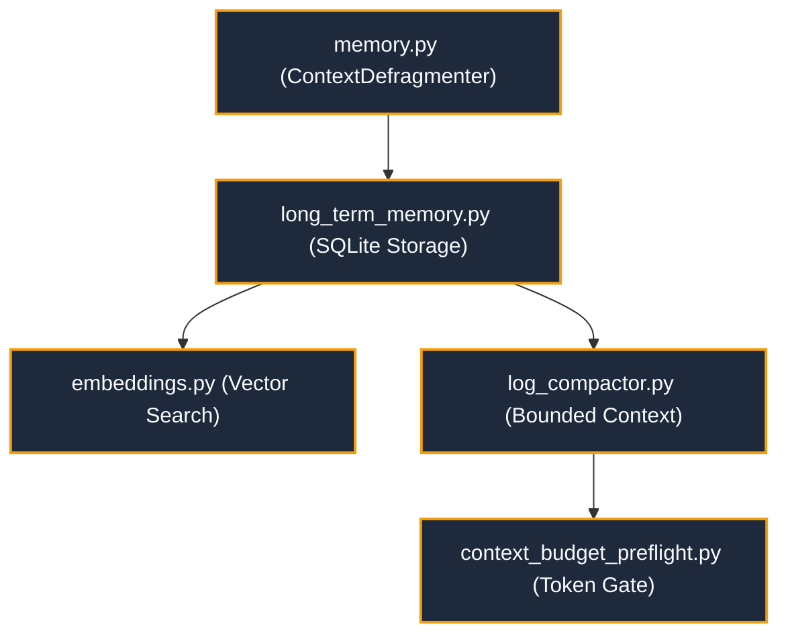

---
tags:
  - layer/l4
  - memory/crdt
  - cognitive/context
type: layer_topology
layer: L4-Cognitive-and-Memory-OS
sync_status: verified
---

# L4: Cognitive & Memory OS Subsystem Topology

> **Parent Index**: [[00 LLM-Agent-System Index]]
> **Layer ID**: Layer 4 (Cognitive & Layered Storage)
> **Physical Boundary**: `agent_workspace/core/memory.py`, `.agent/memory/`
> **Assigned Role**: `BACKEND_INFRA_AGENT` (Ethan)

---

## 1. Subsystem Architecture Map

---

## 2. Leaf Notes Index (Memory & Storage Level)

- [[40 4-Tier Memory OS & SQLite FTS5 Persistence Topology]]: Comprehensive 4-tier memory OS architecture, SQLite FTS5 indexing, and BM25 reranking.
- [[core-memory]]: Context defragmentation, episodic handoff sorting, and federated graph reconciliation (`agent_workspace/core/memory.py`).
- [[core-vector-memory]]: Federated vector memory, semantic cosine similarity search, deterministic Merkle delta sync, and committee debate RAG (`agent_workspace/core/vector_memory.py`).
