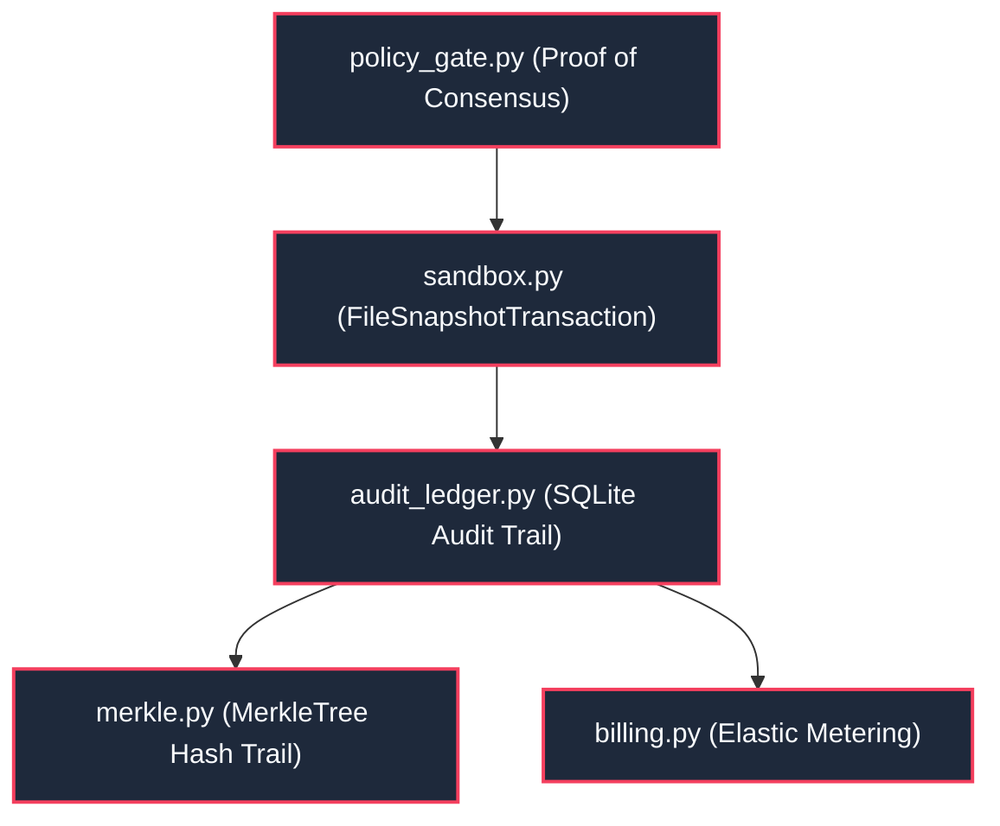

---
tags:
  - layer/l5
  - security/sandbox
  - merkle/audit
type: layer_topology
layer: L5-Security-Sandbox-and-Merkle
sync_status: verified
---

# L5: Security, Sandbox & Merkle Subsystem Topology

> **Parent Index**: [[00 LLM-Agent-System Index]]
> **Layer ID**: Layer 5 (Zero-Trust Sandbox & Cryptographic Audit)
> **Physical Boundary**: `agent_workspace/core/audit_ledger.py`, `sandbox.py`, `merkle.py`
> **Assigned Role**: `SECURITY_AUDIT_AGENT` (Shared) / `DOMAIN_LOGIC_AGENT` (Luke)

---

## 1. Subsystem Architecture Map

---

## 2. Leaf Notes Index (Security & Audit Level)

- [[core-sandbox]]: FileSnapshotTransaction filesystem isolation and automatic transaction rollback on failure (`agent_workspace/core/sandbox.py`).
- [[core-audit-ledger]]: Immutable SQLite-based audit trail with tamper-proof SHA-256 hash chaining (`agent_workspace/core/audit_ledger.py`).
- [[core-merkle]]: Cryptographic Merkle tree implementation supporting tamper detection and inclusion proofs (`agent_workspace/core/merkle.py`).
- [[core-billing]]: Tenant credit verification, token consumption metering, and downscaling enforcement (`agent_workspace/core/billing.py`).
