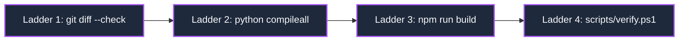

---
tags:
  - layer/l6
  - verification/ladder
  - quality/receipts
type: layer_topology
layer: L6-Verification-Matrix-and-Receipts
sync_status: verified
---

# L6: Verification Matrix & Receipts Subsystem Topology

> **Parent Index**: [[00 LLM-Agent-System Index]]
> **Layer ID**: Layer 6 (Verification Ladder & Quality Gating)
> **Physical Boundary**: `agent_workspace/tests/`, `scripts/`
> **Assigned Role**: `QA_TEST_AGENT` (Jimmy / Shared)

---

## 1. Subsystem Architecture Map

---

## 2. Verification Index & Test Suites

- [[50 Verification Matrix & Quality Receipt Ledger]]: Master ledger for verification statuses, 4-stage verification ladder, and verified execution receipts.
- **AgentCrew Test Suite** (`agent_workspace/tests/test_agent_crew.py`): Unit and integration tests for AgentCrew dispatches, schema validations, and sandbox restrictions.
- **Policy Gate Test Suite** (`agent_workspace/tests/test_policy_gate.py`): Scope validation, consensus certificate verification, and role boundary testing.
- **P2-A Repository & Worktree Suites** (`agent_workspace/tests/test_repository_p2a.py`, `agent_workspace/tests/test_git_worktree_p2a.py`): Repository environment profiling, branch creation, and isolated worktree lifecycle verification.
- **Golden Verification Script** (`scripts/verify.ps1`): Golden automation script executing git hygiene, python compilation, and test ladder.
