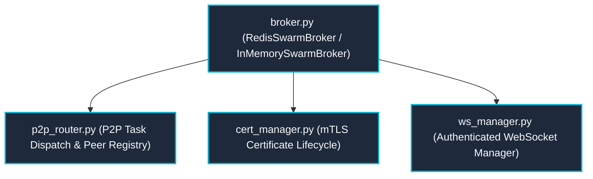

---
tags:
  - layer/l7
  - p2p/mesh
  - distributed/webrtc
type: layer_topology
layer: L7-Distributed-Mesh-and-P2P
sync_status: verified
---

# L7: Distributed Mesh & P2P Subsystem Topology

> **Parent Index**: [[00 LLM-Agent-System Index]]
> **Layer ID**: Layer 7 (Cross-Cloud Mesh & P2P Broker)
> **Physical Boundary**: `agent_workspace/core/broker.py`, `p2p_router.py`, `cert_manager.py`
> **Assigned Role**: `BACKEND_INFRA_AGENT` (Ethan)

---

## 1. Subsystem Architecture Map

---

## 2. Leaf Notes Index (Mesh & Transport Level)

- [[core-broker]]: Distributed Redis pub/sub broker with automatic in-memory fallback (`agent_workspace/core/broker.py`).
- [[core-p2p-router]]: Peer-to-peer task dispatching and ECDH encrypted communication channel (`agent_workspace/core/p2p_router.py`).
- [[core-cert-manager]]: Automated mTLS certificate generation, validation, and emergency revocation (`agent_workspace/core/cert_manager.py`).
- [[core-ws-manager]]: High-throughput WebSocket connection management and token-based authentication (`agent_workspace/core/ws_manager.py`).
