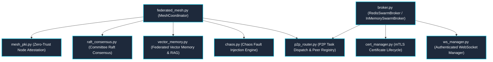

---
tags:
  - layer/l7
  - p2p/mesh
  - distributed/webrtc
type: layer_topology
layer: L7-Distributed-Mesh-and-P2P
sync_status: verified
---

# L7: Distributed Mesh & P2P Subsystem Topology

> **Parent Index**: [[00 LLM-Agent-System Index]]
> **Layer ID**: Layer 7 (Cross-Cloud Mesh & P2P Broker)
> **Physical Boundary**: `agent_workspace/core/broker.py`, `p2p_router.py`, `cert_manager.py`, `federated_mesh.py`, `mesh_pki.py`, `raft_consensus.py`, `vector_memory.py`, `chaos.py`
> **Assigned Role**: `BACKEND_INFRA_AGENT` (Ethan)

---

## 1. Subsystem Architecture Map

---

## 2. Leaf Notes Index (Mesh & Transport Level)

- [[core-federated-mesh]]: Distributed P2P mesh coordinator, peer capabilities, Merkle patch bundles, and remote task delegation (`agent_workspace/core/federated_mesh.py`).
- [[core-mesh-pki]]: Zero-Trust dynamic node attestation, ephemeral X.509 PKI, single-use nonce challenges, and signed stage delegations (`agent_workspace/core/mesh_pki.py`).
- [[core-raft-consensus]]: Distributed Committee Raft Consensus engine, term elections, replicated debate state machine, and quorum commits (`agent_workspace/core/raft_consensus.py`).
- [[core-vector-memory]]: Federated vector memory, semantic cosine similarity search, deterministic Merkle delta sync, and committee debate RAG (`agent_workspace/core/vector_memory.py`).
- [[core-chaos-and-self-healing]]: Chaos fault injection engine, autonomous self-healing loop with vector memory RAG, and multi-worker cluster demo (`agent_workspace/core/chaos.py`, `pipeline/self_healing.py`, `cluster_demo.py`).
- [[core-broker]]: Distributed Redis pub/sub broker with automatic in-memory fallback (`agent_workspace/core/broker.py`).
- [[core-p2p-router]]: Peer-to-peer task dispatching and ECDH encrypted communication channel (`agent_workspace/core/p2p_router.py`).
- [[core-cert-manager]]: Automated mTLS certificate generation, validation, and emergency revocation (`agent_workspace/core/cert_manager.py`).
- [[core-ws-manager]]: High-throughput WebSocket connection management and token-based authentication (`agent_workspace/core/ws_manager.py`).
