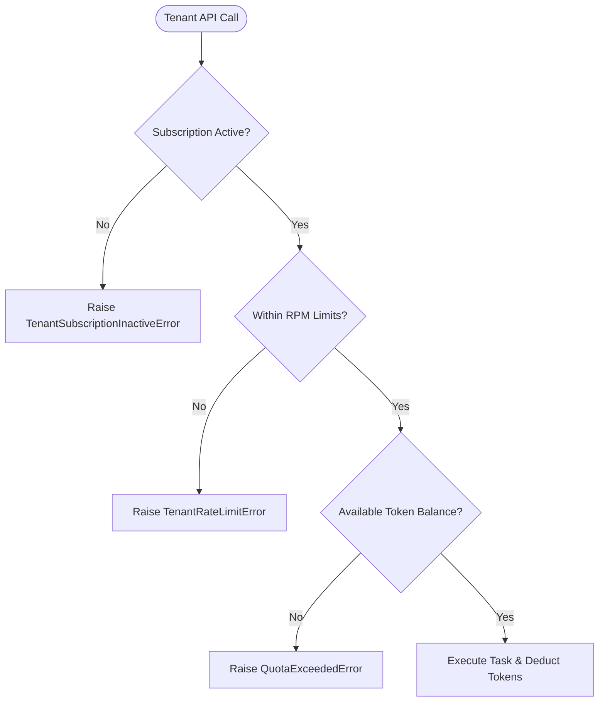

---
tags:
  - architecture/leaf
  - billing/saas
  - quota/ratelimit
  - layer/l6
type: module_leaf
layer: L6-Verification-Matrix-and-Receipts
module: agent_workspace.core.billing
file_path: agent_workspace/core/billing.py
sync_status: verified
---

# Module: SaaSBillingTracker & TenantStatusManager (Usage Billing & Quotas)

## 1. Three-Line Architectural Annotation
- **Responsibility**: Tracks tenant token consumption, enforces tier-based rate limits and subscription status, and aggregates metered SaaS billing invoices.
- **Invariant**: Exhausted quota or delinquent subscription state immediately halts mutating agent execution with typed `QuotaExceededError`.
- **Data Flow**: Records token usage events from `BaseLLMProvider`, checks tenancy limits via `TenantRateLimiter`, and provides invoice breakdowns to `AdminDashboardView`.

---

## 2. Source Code & Symbol Mapping

**Source Location**: [`billing.py`](file:///d:/GitHub/LLM-Agent-System/agent_workspace/core/billing.py) (228 lines)

### Symbol Table

| Symbol | Kind | Line Range | Description |
| :--- | :--- | :--- | :--- |
| `TenantRateLimitError` | `class` | L11-L13 | Raised when tenant requests exceed per-minute rate allowances. |
| `TenantSubscriptionInactiveError`| `class` | L16-L18 | Raised when tenant subscription is canceled or past due. |
| `QuotaExceededError` | `class` | L21-L23 | Raised when monthly token credit budget is fully exhausted. |
| `SaaSBillingTracker` | `class` | L30-L89 | Aggregates token consumption across models and computes metered cost line items. |
| `get_saas_invoice` | `def` | L39-L89 | Generates comprehensive invoice itemizing input/output tokens and cost breakdowns. |
| `TenantStatusManager` | `class` | L92-L186 | Manages multi-tenant subscription tiers, Stripe customer bindings, and status states. |
| `update_tenant_status` | `def` | L97-L144 | Updates tenant plan (`free`, `pro`, `enterprise`) and credit allowances. |
| `TenantRateLimiter` | `class` | L189-L228 | Sliding window token bucket rate limiter per tenant ID. |

---

## 3. Tenancy & Billing Enforcement Flow

---

## 4. Operational Invariants & Anti-Corruption Guardrails
1. **Atomic Credit Deductions**: Token debits are applied within database transactions to eliminate double-spend race conditions.
2. **Graceful Degraded Tier**: Expired subscriptions fall back to read-only mode rather than hard deleting tenant artifacts.

---

## 5. Verification & Test Evidence
- **Test Suites**:
  - [`test_elastic_billing.py`](file:///d:/GitHub/LLM-Agent-System/agent_workspace/tests/test_elastic_billing.py)
  - [`test_subscription_lifecycle.py`](file:///d:/GitHub/LLM-Agent-System/agent_workspace/tests/test_subscription_lifecycle.py)
- **Execution Receipt**: Bytecode validated via `compileall` exit code 0.

---

## 6. Topological Linkage
- **Upstream Layer**: [[L6-Verification-Matrix-and-Receipts]]
- **Collaborating Modules**:
  - [[core-providers]]
  - [[viewer-admin-dashboard]]
