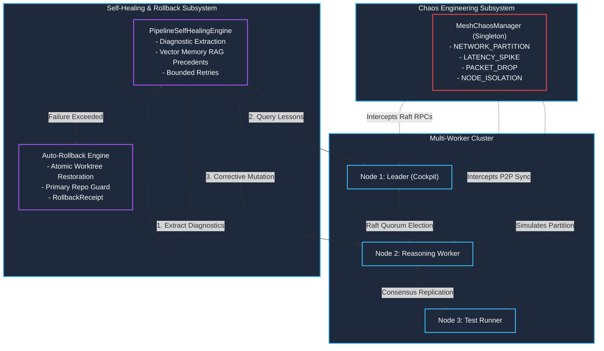

---
tags:
  - architecture/core
  - module/mesh/chaos-engineering
  - module/pipeline/self-healing
  - module/cluster/distributed-worker
  - layer/l2
  - layer/l3
  - protocol/v3-8-0
type: core_module
layer: L3-Autonomous-Workflow-and-Verification
sync_status: verified
---

# Core Module: Chaos Fault Injection, Autonomous Self-Healing & Cluster Demo (`core-chaos-and-self-healing`)

> **Parent Layer**: [[L2-Protocol-and-Contract-Gateways]], [[L3-Autonomous-Workflow-and-Verification]], [[core-federated-mesh]], [[core-raft-consensus]], [[core-vector-memory]], [[core-pipeline]]
> **Source Directory**: `agent_workspace/core/`, `agent_workspace/core/pipeline/`, `agent_workspace/routes/`
> **Primary Source Files**:
> - [`chaos.py`](file:///d:/GitHub/LLM-Agent-System/agent_workspace/core/chaos.py) (`MeshChaosManager`, `ChaosFaultRule`, `ChaosFaultType`, `evaluate_traffic`, `create_partition`, `isolate_node`)
> - [`pipeline/self_healing.py`](file:///d:/GitHub/LLM-Agent-System/agent_workspace/core/pipeline/self_healing.py) (`PipelineSelfHealingEngine`, `attempt_self_healing`, `execute_auto_rollback`, `PRIMARY_REPO_PROTECTED` safety guard)
> - [`cluster_demo.py`](file:///d:/GitHub/LLM-Agent-System/agent_workspace/core/cluster_demo.py) (`MultiWorkerCluster`, `ClusterNode`, `run_full_demo`, 7-stage reproducible orchestration)
> - [`pipeline/models.py`](file:///d:/GitHub/LLM-Agent-System/agent_workspace/core/pipeline/models.py) (`SelfHealingAttemptReceipt`, `RollbackReceipt`, `PipelineStage.SELF_HEALING`, `CodingPipelineResult`)
> - [`pipeline/manager.py`](file:///d:/GitHub/LLM-Agent-System/agent_workspace/core/pipeline/manager.py) (`run_task_pipeline` stage `SELF_HEALING` integration, bounded retry loop, atomic rollback on exhaustion)
> - [`federated_mesh.py`](file:///d:/GitHub/LLM-Agent-System/agent_workspace/core/federated_mesh.py) (Peer message send intercepted by `MeshChaosManager.evaluate_traffic`)
> - [`raft_consensus.py`](file:///d:/GitHub/LLM-Agent-System/agent_workspace/core/raft_consensus.py) (`RequestVote` and `AppendEntries` intercepted by `MeshChaosManager.evaluate_traffic`)
> - [`vector_memory.py`](file:///d:/GitHub/LLM-Agent-System/agent_workspace/core/vector_memory.py) (Memory synchronization packet drop and latency injection)
> - [`routes/mesh.py`](file:///d:/GitHub/LLM-Agent-System/agent_workspace/routes/mesh.py) (REST `/v1/mesh/chaos/faults`, `/v1/mesh/chaos/inject`, `/v1/mesh/chaos/clear`, `/v1/mesh/cluster/demo`)
> - [`cli.py`](file:///d:/GitHub/LLM-Agent-System/agent_workspace/cli.py) (`las chaos list|inject|partition|isolate|clear`, `las cluster demo`, `las pipeline run --self-healing`)
> - [`viewer/src/components/FederatedMeshView.tsx`](file:///d:/GitHub/LLM-Agent-System/viewer/src/components/FederatedMeshView.tsx) (Chaos Fault Injection Bento Card, Multi-Worker Cluster Demo Bento Card)
> - [`viewer/src/components/CodingPipelineView.tsx`](file:///d:/GitHub/LLM-Agent-System/viewer/src/components/CodingPipelineView.tsx) (Self-Healing Stage Badge, Self-Healing & Auto-Rollback Status Card)
> **Associated Tests**:
> - [`test_chaos_selfhealing_p91.py`](file:///d:/GitHub/LLM-Agent-System/agent_workspace/tests/test_chaos_selfhealing_p91.py) (Phase 91 test suite: 10/10 PASS)
> **ADR Reference**: [[60 Architectural Decision Records (ADR) Graph#ADR-005|ADR-005: Stop-and-Wait Gate]], [[60 Architectural Decision Records (ADR) Graph#ADR-006|ADR-006: Autonomous Strategy Integration]], [[60 Architectural Decision Records (ADR) Graph#ADR-007|ADR-007: Chaos Engineering and Resiliency]]

---

## 1. Module Overview & Problem Statement

`core/chaos.py`, `core/pipeline/self_healing.py`, and `core/cluster_demo.py` implement **Phase 91: Chaos Fault Injection, Autonomous Self-Healing Loop, and Multi-Worker Cluster Demo (混沌故障注入、自主自我修復迴圈與多節點叢集演示)**.

Prior to Phase 91, the distributed federated mesh, Raft consensus committee, and vector memory had been verified only under nominal conditions. Real-world edge network environments encounter packet loss, transient network partitions, Byzantine corruptions, and reasoning worker task failures. When test ladders failed, the pipeline immediately halted and required human intervention, without attempting precedent-informed self-correction or providing verifiable atomic rollback guarantees.

Phase 91 delivers a complete resilience triad:
1. **Federated Chaos Fault Injection Engine (`MeshChaosManager`)**:
   - Simulates five distinct network faults: `NETWORK_PARTITION`, `LATENCY_SPIKE`, `PACKET_DROP`, `NODE_ISOLATION`, and `BYZANTINE_TAMPER`.
   - Intercepts all cross-node RPC calls in real-time (Raft consensus `RequestVote`, `AppendEntries`, P2P vector memory sync, and general mesh messaging).
   - Provides TTL expiration, probability-based drops, bidirectional partition helpers, and node isolation primitives.
2. **Autonomous Self-Healing Loop & Auto-Rollback Engine (`PipelineSelfHealingEngine`)**:
   - Integrates a first-class `PipelineStage.SELF_HEALING` into the canonical coding pipeline.
   - Extracts structured diagnostic evidence from failed verification receipts (e.g. `AssertionError`, `SyntaxError`, stack traces).
   - Performs RAG precedent queries against federated vector memory to retrieve past architectural lessons, error fixes, or patterns.
   - Dispatches corrective mutations within the isolated git worktree for a bounded number of attempts ($N \le 3$).
   - If healing passes, proceeds immediately to PR payload generation; if healing exhausts, executes atomic rollback (`git reset --hard` + `git clean -fd`) and emits a cryptographically signed `RollbackReceipt`.
   - **Primary Workspace Inviolability**: Hardcoded safety guard prevents destructive rollback operations on the host working directory, ensuring zero workspace pollution.
3. **Production E2E Multi-Worker Cluster Demo (`MultiWorkerCluster`)**:
   - Orchestrates a 3-node in-process cluster demonstration: Node 1 (Leader / Cockpit), Node 2 (Reasoning Worker), Node 3 (Test Runner).
   - Executes 7 chronological stages in < 1 second: PKI zero-trust handshake, Raft consensus election, vector memory sync, chaos partition injection, partition heal & re-election, pipeline task self-healing, and atomic rollback verification.



---

## 2. Architectural Invariants & Safety Guarantees

1. **Host Repository Inviolability Guard**:
   `PipelineSelfHealingEngine.execute_auto_rollback` strictly checks whether the target worktree path points to the primary repository root (`.git` exists directly in path without `worktrees` or `tmp` path markers). If detected, it immediately returns `PRIMARY_REPO_PROTECTED` and refuses to run destructive git commands.
2. **Deterministic Chaos Interception**:
   `MeshChaosManager.evaluate_traffic(src, dst)` executes in $O(K)$ time where $K$ is active rules, pruning expired rules via high-resolution monotonic timestamps.
3. **Bounded Self-Healing Budget**:
   Self-healing attempts are strictly bounded by `max_healing_attempts` (default: 2, maximum: 5). Infinite self-healing loops are structurally impossible.
4. **Auditability & Traceability**:
   Every self-healing attempt emits a `SelfHealingAttemptReceipt` detailing diagnostic evidence, vector memory precedents retrieved, corrective mutations applied, and ladder re-test results. Failed pipelines emit a `RollbackReceipt` proving clean worktree restoration.

---

## 3. Integration & Usage

### CLI Commands
```powershell
# List active chaos rules
las chaos list

# Inject split-brain partition between node-1 and node-2/node-3
las chaos partition --group-a node-1 --group-b node-2,node-3 --duration 60

# Isolate a single node from all cluster traffic
las chaos isolate --node-id node-1 --duration 30

# Clear all chaos rules
las chaos clear

# Run multi-worker cluster demo
las cluster demo

# Run coding pipeline with autonomous self-healing enabled
las pipeline run --prompt "Refactor auth middleware" --self-healing --max-healing-attempts 3
```

### REST API Endpoints
- `GET /v1/mesh/chaos/faults`: Retrieve all active chaos fault rules.
- `POST /v1/mesh/chaos/inject`: Inject a custom chaos fault rule.
- `POST /v1/mesh/chaos/clear`: Clear all active chaos fault rules.
- `POST /v1/mesh/cluster/demo`: Trigger full 7-stage multi-worker cluster demo.

---

## 4. Verification Evidence & Test Coverage

- **Suite**: `agent_workspace/tests/test_chaos_selfhealing_p91.py`
- **Results**: 10 passed in 1.92s (Exit code 0, 100% pass)
  1. `test_chaos_manager_rule_lifecycle`: PASS
  2. `test_chaos_traffic_evaluation`: PASS
  3. `test_chaos_partition_and_isolation_helpers`: PASS
  4. `test_raft_rpc_chaos_interception`: PASS
  5. `test_raft_split_brain_election_and_partition_heal`: PASS
  6. `test_self_healing_diagnostic_extraction`: PASS
  7. `test_auto_rollback_in_isolated_temp_worktree`: PASS
  8. `test_auto_rollback_primary_repo_safety_guard`: PASS
  9. `test_multi_worker_cluster_full_demo`: PASS (7/7 stages in 648ms)
  10. `test_mesh_routes_chaos_and_cluster`: PASS
