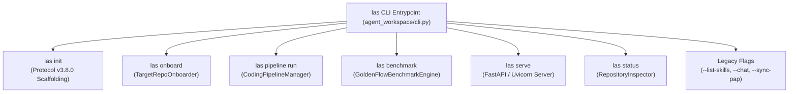

---
tags:
  - architecture/core
  - module/cli
  - packaging/beta
  - layer/l1
  - layer/l2
  - protocol/v3-8-0
type: core_module
layer: L1-Ingress-and-Cockpit-Surface
sync_status: verified
---

# Core Module: Unified Developer CLI Toolbelt & Packaging (`core-cli-and-packaging`)

> **Parent Layer**: [[L1-Ingress-and-Cockpit-Surface]], [[L2-Protocol-and-Contract-Gateways]]
> **Source Directory**: `agent_workspace/` & `scripts/`
> **Primary Source Files**:
> - [`cli.py`](file:///d:/GitHub/LLM-Agent-System/agent_workspace/cli.py) (First-class CLI subcommands and legacy flag dispatcher)
> - [`onboarding.py`](file:///d:/GitHub/LLM-Agent-System/agent_workspace/core/onboarding.py) (Target repository sensing & TaskEnvironment generator)
> - [`pyproject.toml`](file:///d:/GitHub/LLM-Agent-System/pyproject.toml) (PEP 517/621 packaging metadata and script entrypoints)
> - [`start_las.py`](file:///d:/GitHub/LLM-Agent-System/scripts/start_las.py) (Cross-platform daemon & browser launcher)
> - [`start_las.ps1`](file:///d:/GitHub/LLM-Agent-System/scripts/start_las.ps1) (PowerShell automation entrypoint)
> - [`DEVELOPER_QUICKSTART_GUIDE.md`](file:///d:/GitHub/LLM-Agent-System/docs/DEVELOPER_QUICKSTART_GUIDE.md) (Developer onboarding manual)
> **Associated Tests**:
> - [`test_developer_beta_p5.py`](file:///d:/GitHub/LLM-Agent-System/agent_workspace/tests/test_developer_beta_p5.py) (P5 CLI, onboarding & packaging conformance tests)
> **ADR Reference**: [[60 Architectural Decision Records (ADR) Graph#ADR-006|ADR-006: Agent Strategy Integration & Task Environment Architecture]]

---

## 1. Module Overview & Operational Contracts

`core-cli-and-packaging` transforms LAS from an internal research prototype into a **fully installable and executable developer toolbelt** (v0.5.0 Developer Beta).

It provides a unified command-line entrypoint (`las`) that wraps:
1. **Target Repository Onboarding** (`las onboard`): Automated sensing of external codebases, language detection, test discovery, and `TaskEnvironment` synthesis.
2. **Autonomous Coding Task Execution** (`las pipeline run`): End-to-end task execution inside isolated Git worktrees governed by Anti-Summary preflight and Stop-and-Wait approval gates.
3. **Official Benchmark Suite** (`las benchmark`): Deterministic execution of the 3 canonical scenarios computing the 6 ADR-006 KPIs.
4. **Daemon & Control Plane Serving** (`las serve`): Launching the FastAPI REST gateway and WebSocket telemetry stream.
5. **System Health & Inspection** (`las status`): Real-time inspection of Git worktrees, protocol identity, and verification receipts.

---

## 2. Key Symbols and Line Ranges

| Symbol | Type | Source File & Lines | Description |
|---|---|---|---|
| `main()` | `Function` | [`cli.py:L692-L865`](file:///d:/GitHub/LLM-Agent-System/agent_workspace/cli.py#L692-L865) | Main CLI entrypoint routing subcommands (`init`, `onboard`, `benchmark`, `pipeline`, `serve`, `status`) and legacy flags. |
| `handle_onboard()` | `Function` | [`cli.py:L172-L215`](file:///d:/GitHub/LLM-Agent-System/agent_workspace/cli.py#L172-L215) | Dispatches repository ecosystem analysis and prints formatted profile or outputs JSON. |
| `handle_benchmark()` | `Function` | [`cli.py:L217-L265`](file:///d:/GitHub/LLM-Agent-System/agent_workspace/cli.py#L217-L265) | Executes `GoldenFlowBenchmarkEngine` and renders summary table. |
| `handle_pipeline_run()` | `Function` | [`cli.py:L267-L330`](file:///d:/GitHub/LLM-Agent-System/agent_workspace/cli.py#L267-L330) | Invokes `CodingPipelineManager` with Anti-Summary preflight and Stop-and-Wait gate handling. |
| `handle_serve()` | `Function` | [`cli.py:L332-L338`](file:///d:/GitHub/LLM-Agent-System/agent_workspace/cli.py#L332-L338) | Launches Uvicorn server on specified host/port. |
| `handle_status()` | `Function` | [`cli.py:L340-L375`](file:///d:/GitHub/LLM-Agent-System/agent_workspace/cli.py#L340-L375) | Inspects git checkout, active branch, protocol version, and latest benchmark receipts. |
| `TargetRepoOnboarder` | `Class` | [`onboarding.py:L45-L200`](file:///d:/GitHub/LLM-Agent-System/agent_workspace/core/onboarding.py#L45-L200) | Multi-language scanner detecting test suites, protected paths, and generating `.agent/` configuration. |
| `OnboardingRecommendation` | `BaseModel` | [`onboarding.py:L22-L35`](file:///d:/GitHub/LLM-Agent-System/agent_workspace/core/onboarding.py#L22-L35) | Synthesized profile containing primary ecosystem, test commands, mutable scopes, and protected scopes. |
| `OnboardingResult` | `BaseModel` | [`onboarding.py:L37-L49`](file:///d:/GitHub/LLM-Agent-System/agent_workspace/core/onboarding.py#L37-L49) | Full result payload returned by `onboard()` in JSON or text formats. |

---

## 3. Packaging Architecture (`pyproject.toml`)

LAS conforms to standard PEP 517 and PEP 621 packaging specifications:
- **Build Backend**: `setuptools.build_meta` (`requires = ["setuptools>=61.0"]`).
- **Distribution Name**: `llm-agent-system` (`v0.5.0`).
- **Python Compatibility**: `>=3.10`.
- **Exposed Scripts**:
  - `las`: Maps to `agent_workspace.cli:main`.
  - `las-server`: Maps to `agent_workspace.server:main`.
  - `las-benchmark`: Maps to `scripts.run_golden_benchmark:main`.

---

## 4. Invariants & Governance

1. **Strict Backward Compatibility**:
   - Legacy flag-based commands (`--list-skills`, `--chat`, `--validate`, `--lint`, `--sync-pap`) remain 100% functional without breaking changes.
2. **Cross-Platform UTF-8 Output**:
   - Both `cli.py` and `start_las.py` automatically reconfigure standard stdout and stderr streams to UTF-8 on Windows environments, preventing encoding exceptions.
3. **Safe Dry-Run Guarantee**:
   - Both `las init --dry-run` and `las onboard --no-scaffold` allow inspecting proposed actions without touching target repository disk state.

---

## 5. Topological Linkage

- **Parent Layer**: [[L1-Ingress-and-Cockpit-Surface]], [[L2-Protocol-and-Contract-Gateways]]
- **Control Plane**: [[core-pipeline]], [[core-pipeline-benchmark]]
- **Documentation**: [[DEVELOPER_QUICKSTART_GUIDE]]
- **ADR Reference**: [[60 Architectural Decision Records (ADR) Graph#ADR-006|ADR-006: Agent Strategy Integration]]
