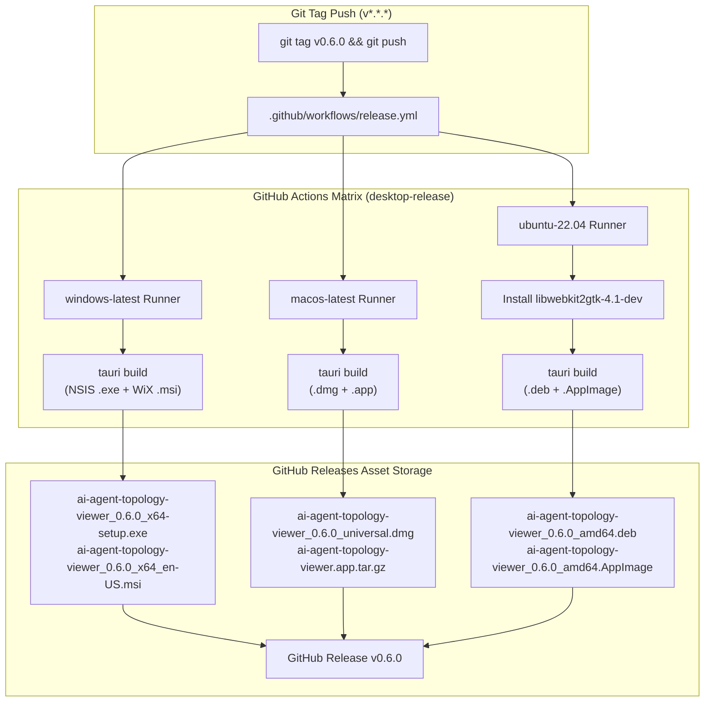

---
tags:
  - architecture/core
  - module/desktop
  - packaging/matrix
  - platform/multi-os
  - layer/l1
  - protocol/v3-8-0
type: core_module
layer: L1-Ingress-and-Cockpit-Surface
sync_status: verified
---

# Core Module: Multi-Platform Desktop Packaging & Release Matrix (`core-desktop-matrix`)

> **Parent Layer**: [[L1-Ingress-and-Cockpit-Surface]]
> **Source Directory**: `viewer/src-tauri/` & `.github/workflows/`
> **Primary Source Files**:
> - [`tauri.conf.json`](file:///d:/GitHub/LLM-Agent-System/viewer/src-tauri/tauri.conf.json) (Tauri 2.0 multi-platform bundle configurations: NSIS, WiX, DMG, DEB, AppImage)
> - [`Cargo.toml`](file:///d:/GitHub/LLM-Agent-System/viewer/src-tauri/Cargo.toml) (Rust backend crate manifest, v0.6.0 version parity)
> - [`.github/workflows/release.yml`](file:///d:/GitHub/LLM-Agent-System/.github/workflows/release.yml) (Multi-OS GitHub Actions runner matrix: Windows, macOS, Linux)
> - [`scripts/verify_desktop_matrix.py`](file:///d:/GitHub/LLM-Agent-System/scripts/verify_desktop_matrix.py) (Pre-flight audit and receipt generator)
> **Associated Tests**:
> - [`test_desktop_packaging_p113.py`](file:///d:/GitHub/LLM-Agent-System/agent_workspace/tests/test_desktop_packaging_p113.py) (4/4 tests PASS)
> - [`test_release_pipeline_p109.py`](file:///d:/GitHub/LLM-Agent-System/agent_workspace/tests/test_release_pipeline_p109.py) (5/5 tests PASS)
> **Evidence Receipt**:
> - [`.agent/evidence/desktop_matrix_receipt.json`](file:///d:/GitHub/LLM-Agent-System/.agent/evidence/desktop_matrix_receipt.json)

---

## 1. Module Overview & Operational Contracts

`core-desktop-matrix` completes the native distribution topology for the LLM-Agent-System Desktop Cockpit (Milestone T-040 / Phase 113).

It expands the single-OS packaging workflow into an enterprise multi-platform matrix:
1. **Windows Distribution**:
   - **NSIS (`.exe`)**: Single-user zero-privilege installer for developer workstations (installs into user local app data).
   - **WiX (`.msi`)**: Enterprise Group Policy / Active Directory batch deployment package.
2. **macOS Distribution**:
   - **DMG (`.dmg`)**: Drag-and-drop installer disk image with `minimumSystemVersion: "10.13"` backward compatibility.
   - **App Bundle (`.app`)**: Standalone application bundle.
3. **Linux Distribution**:
   - **Debian (`.deb`)**: Package with automated dependency resolution for `libwebkit2gtk-4.1-0` and `libxdo3`.
   - **AppImage (`.AppImage`)**: Self-contained universal executable for modern Linux distributions.



---

## 2. Key Symbols & Specifications

| Platform | Target Formats | Engine / Tool | System Requirements & Dependencies |
|---|---|---|---|
| **Windows** | `.exe` (NSIS), `.msi` (WiX) | Tauri 2.0 + WiX Toolset | Windows 10/11 x64, WebView2 runtime (pre-installed) |
| **macOS** | `.dmg`, `.app` | Tauri 2.0 + Apple Clang | macOS 10.13 High Sierra or later (Intel & Apple Silicon) |
| **Linux** | `.deb`, `.AppImage` | Tauri 2.0 + WebKitGTK | `libwebkit2gtk-4.1-0`, `libxdo3`, `libayatana-appindicator3-1` |

---

## 3. Four-Way Version Parity Verification

The module enforces strict 4-way bitwise semantic version consistency across all project manifests:
- `pyproject.toml`: `version = "0.6.0"`
- `viewer/package.json`: `"version": "0.6.0"`
- `viewer/src-tauri/tauri.conf.json`: `"version": "0.6.0"`
- `viewer/src-tauri/Cargo.toml`: `version = "0.6.0"`

---

## 4. Verification Evidence & Receipts

- **Automated Tests**:
  - `agent_workspace/tests/test_desktop_packaging_p113.py`: 4/4 PASS (0.11s).
  - `agent_workspace/tests/test_release_pipeline_p109.py`: 5/5 PASS (0.08s).
- **Pre-flight Receipt**: `.agent/evidence/desktop_matrix_receipt.json`:
  ```json
  {
    "status": "PASS",
    "milestone": "T-040 (Phase 113)",
    "protocol_version": "3.8.0",
    "app_version": "0.6.0",
    "desktop_platforms": [
      {"os": "Windows", "runner": "windows-latest", "bundle_formats": ["msi (WiX)", "exe (NSIS)"]},
      {"os": "macOS", "runner": "macos-latest", "bundle_formats": ["dmg", "app"]},
      {"os": "Linux", "runner": "ubuntu-22.04", "bundle_formats": ["deb", "appimage"]}
    ]
  }
  ```
