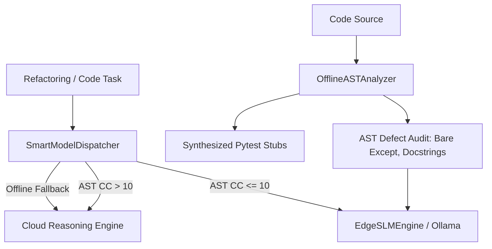

---
tags:
  - architecture/backend
  - core/slm
  - edge/optimization
  - protocol/v3.8.0
  - layer/l3
type: module_leaf
layer: L3-Runtime-Execution-and-Swarm
sync_status: verified
---

# Core Edge SLM & Local Coding Model Subsystem (`agent_workspace/core/slm/`)

> **Parent Layer**: [[L3-Runtime-Execution-and-Swarm]]
> **Related Modules**: [[core-federated-mesh]], [[core-pipeline]], [[core-reasoning-router]]
> **Protocol Baseline**: `3.8.0`
> **Domain Owner**: Ethan (Backend / Infra) & Luke (PO / Arch)

---

## 1. 3-Line Concise Summary
1. 提供本地輕量模型（Edge SLM，如 Qwen 2.5 Coder 7B / DeepSeek-R1-8B via Ollama / vLLM）推論引擎，具備密封式離線測試（Mock）與零資料外洩保證。
2. 實作純本機 AST 靜態分析器 `OfflineASTAnalyzer`，能零雲端 Token 檢測 Bare Except 等違反 Anti-Corruption 原則之靜態缺陷並合成 pytest 單元測試樁（Stubs）。
3. 實作複雜度感知模型調度器 `SmartModelDispatcher`，依循圈複雜度（$CC \le 10$）自動分流至本地 Edge SLM，超標（$CC > 10$）或離線時無縫優雅降級回雲端推論引擎。

---

## 2. Core Architecture & Components

### Components
- `EdgeSLMEngine` (`agent_workspace/core/slm/engine.py`):
  - 封裝 Ollama / vLLM REST 端點與本地推論超時控制。
  - 支援 `mock_handler` 以支援 Hermetic 測試與離線 CI/CD 無 GPU 確定性執行。
- `OfflineASTAnalyzer` (`agent_workspace/core/slm/offline_analyzer.py`):
  - 依據 Python 內建 `ast` 模組進行語法走查。
  - 檢測 Anti-Corruption #4（Typed Failures）之 Bare `except:` 錯誤與缺少 docstring 之公用函式。
  - 自動生成結構化 pytest 測試程式碼樁，驗證語法正確性。
- `SmartModelDispatcher` (`agent_workspace/core/slm/dispatcher.py`):
  - 與 `CodeComplexityAnalyzer` 整合，以 AST 圈複雜度 $CC \le 10$ 為臨界門檻。
  - 當本地模型無回應時，啟動 `cloud_fallback_enabled` 自動降級至雲端。
  - 記錄估計節省之雲端 Token 與推論延遲。

---

## 3. Verification & Evidence
- **Dedicated Test Suite**: `agent_workspace/tests/test_edge_slm_p110.py` (14/14 tests PASS).
- **Benchmark Receipt**: `.agent/evidence/edge_slm_benchmark_receipt.json` (`PASS`, 100% air-gap verified, 0 cloud tokens).
