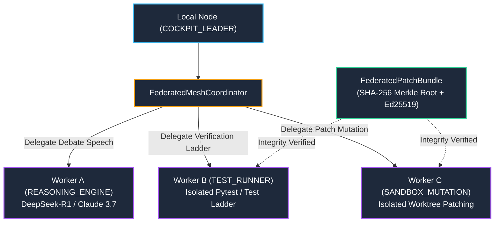

---
tags:
  - architecture/core
  - module/mesh/federated
  - layer/l2
  - layer/l3
  - protocol/v3-8-0
type: core_module
layer: L3-Autonomous-Workflow-and-Verification
sync_status: verified
---

# Core Module: Distributed P2P Mesh & Federated Worktree Clustering (`core-federated-mesh`)

> **Parent Layer**: [[L2-Protocol-and-Contract-Gateways]], [[L3-Autonomous-Workflow-and-Verification]], [[core-pipeline-manager]], [[core-pipeline-debate-protocol]], [[core-reasoning-router]]
> **Source Directory**: `agent_workspace/core/`
> **Primary Source Files**:
> - [`federated_mesh.py`](file:///d:/GitHub/LLM-Agent-System/agent_workspace/core/federated_mesh.py) (`FederatedMeshCoordinator`, `PeerCapability`, `FederatedPeerProfile`, `FederatedPatchBundle`, `FederatedDelegationRequest`, `FederatedDelegationResponse`)
> - [`debate_protocol.py`](file:///d:/GitHub/LLM-Agent-System/agent_workspace/core/pipeline/debate_protocol.py) (Offloading committee speech turns to `REASONING_ENGINE` peer nodes)
> - [`manager.py`](file:///d:/GitHub/LLM-Agent-System/agent_workspace/core/pipeline/manager.py) (Wiring `mesh_coordinator` through pipeline execution stages)
> - [`routes/mesh.py`](file:///d:/GitHub/LLM-Agent-System/agent_workspace/routes/mesh.py) (REST peering, join seed, turn/ladder delegation endpoints)
> - [`viewer/src/components/FederatedMeshView.tsx`](file:///d:/GitHub/LLM-Agent-System/viewer/src/components/FederatedMeshView.tsx) (Decentralized Cluster Peering Cockpit UI)
> **Associated Tests**:
> - [`test_federated_mesh_p87.py`](file:///d:/GitHub/LLM-Agent-System/agent_workspace/tests/test_federated_mesh_p87.py) (Phase 87 test suite: 8/8 PASS)
> **ADR Reference**: [[60 Architectural Decision Records (ADR) Graph#ADR-005|ADR-005: Stop-and-Wait Gate]], [[60 Architectural Decision Records (ADR) Graph#ADR-006|ADR-006: Autonomous Strategy Integration]]

---

## 1. Module Overview & Decentralized Clustering Topology

`core/federated_mesh.py` implements **Phase 87: Distributed P2P Mesh & Federated Worktree Clustering (聯邦工作樹協作群集)**.

In multi-agent collaborative software engineering, high-tier cognitive tasks (deep chain-of-thought architectural debates, AST mutation sandboxing, heavy test suites) saturate single-node host resources. The federated mesh forms a lightweight, zero-dependency, peer-to-peer cluster that offloads discrete pipeline stages across peer nodes while guaranteeing cryptographic patch integrity and zero host pollution.



---

## 2. Peer Capabilities & Load-Score Balancing

Peers declare specialized hardware or execution capabilities via `PeerCapability`:

| Capability | Role | Typical Hardware / Engine |
|---|---|---|
| `REASONING_ENGINE` | Committee deliberation speech turns & deep reasoning | High-VRAM GPU / DeepSeek-R1 / Claude 3.7 |
| `SANDBOX_MUTATION` | Isolated git worktree patch application & AST mutations | Fast NVMe / Git CLI / Sandboxed Python |
| `TEST_RUNNER` | Verification ladders, unit & integration test execution | Multi-core CPU CI node / Pytest runner |
| `COCKPIT_LEADER` | Orchestrates pipeline tasks, presents Cockpit UI | Developer laptop / Primary agent station |

### Peer Scoring Metric
When dispatching a delegation request, `select_best_peer` evaluates:
$$\text{Peer Score} = (\text{load\_score} \times 0.6) + \left(\frac{\text{latency\_ms}}{100.0} \times 0.4\right)$$
The coordinator selects the candidate minimizing the composite score, ensuring traffic naturally routes away from congested or high-latency nodes.

---

## 3. Cryptographic Integrity: FederatedPatchBundle & Merkle Verification

To prevent unauthorized, corrupted, or tampered code mutations across the mesh:
1. **Unified Diff & File List Hashing**: `FederatedPatchBundle` computes a SHA-256 hash over the unified diff and lexicographically sorted filenames:
   $$\text{Merkle Root} = \text{SHA256}(\text{patch\_content} + \sum_{f \in \text{sorted(files)}} f)$$
2. **Deterministic Integrity Verification**: Remote workers execute `.verify_integrity()` prior to checkout or testing. Any tampered diff or mismatched file manifest is immediately rejected with a zero-trust alert.
3. **Zero Host Pollution Fallback**: If network partitions or peer timeouts occur, the coordinator gracefully degrades to local execution without aborting the pipeline run.

---

## 4. REST & CLI Gateway

### REST Routes (`/v1/mesh/*`)
- `GET /v1/mesh/status`: Peering overview, connected peer count, cluster health.
- `GET /v1/mesh/peers`: Full capability and latency ledger of registered nodes.
- `POST /v1/mesh/join`: Establish peering with a remote seed node (`host:port`).
- `POST /v1/mesh/delegate/turn`: Execute remote committee speech turn.
- `POST /v1/mesh/delegate/verify`: Execute verification ladder on test runner peer.
- `POST /v1/mesh/sync/patch`: Validate and stage a remote `FederatedPatchBundle`.

### CLI Toolbelt
```powershell
# Inspect federated cluster state
las mesh status

# Join an active mesh cluster seed
las mesh join 192.168.1.188:8000 --role worker

# Execute coding pipeline with mesh offloading enabled
las pipeline run --task-id TASK-101 --requirement "Add P2P heartbeat" --mesh
```

---

## 5. Verification & Test Evidence

- **Phase 87 Test Suite**: `agent_workspace/tests/test_federated_mesh_p87.py` (8/8 PASS in 0.29s).
- **Full Combined Regression Matrix**: 63/63 PASS (18.60s across all 10 test suites).
- **Frontend Cockpit**: `viewer/src/components/FederatedMeshView.tsx` compiled cleanly in Vite production build (787ms).
