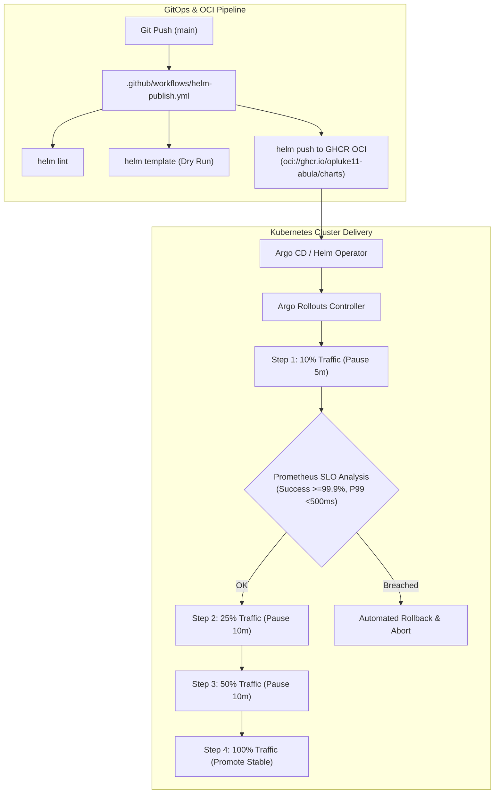
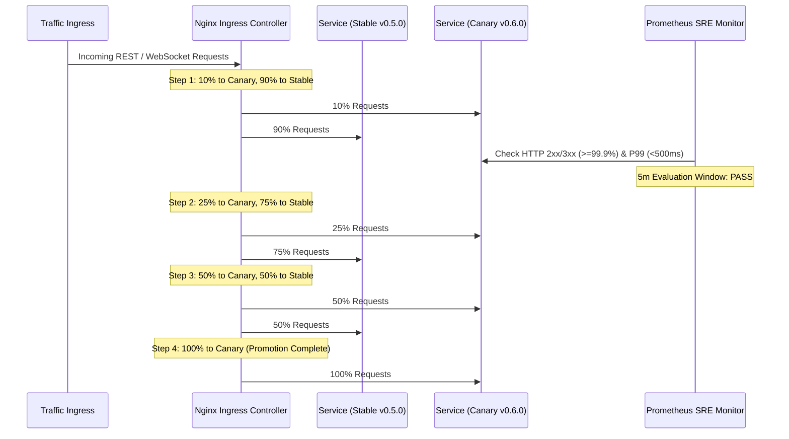

---
tags:
  - architecture/core
  - module/helm
  - module/canary
  - deployment/k8s
  - layer/l3
  - protocol/v3-8-0
type: core_module
layer: L3-Runtime-Execution-and-Swarm
sync_status: verified
---

# Core Module: Cloud-Native Kubernetes Helm & Argo Rollouts Canary (`core-helm-and-canary`)

> **Parent Layer**: [[L3-Runtime-Execution-and-Swarm]]
> **Source Directory**: `deploy/helm/llm-agent-system/` & `deploy/canary/`
> **Primary Source Files**:
> - [`Chart.yaml`](file:///d:/GitHub/LLM-Agent-System/deploy/helm/llm-agent-system/Chart.yaml) (Helm v2 Chart metadata and v0.6.0 version parity)
> - [`values.yaml`](file:///d:/GitHub/LLM-Agent-System/deploy/helm/llm-agent-system/values.yaml) (Production enterprise configuration, non-root UID 1001, HPA, and probes)
> - [`templates/deployment.yaml`](file:///d:/GitHub/LLM-Agent-System/deploy/helm/llm-agent-system/templates/deployment.yaml) (Kubernetes Deployment manifest with rolling update)
> - [`templates/service.yaml`](file:///d:/GitHub/LLM-Agent-System/deploy/helm/llm-agent-system/templates/service.yaml) (ClusterIP service exposing port 8000)
> - [`templates/ingress.yaml`](file:///d:/GitHub/LLM-Agent-System/deploy/helm/llm-agent-system/templates/ingress.yaml) (Nginx Ingress with TLS termination)
> - [`templates/hpa.yaml`](file:///d:/GitHub/LLM-Agent-System/deploy/helm/llm-agent-system/templates/hpa.yaml) (HorizontalPodAutoscaler v2 for CPU/Memory scaling)
> - [`deploy/canary/rollout.yaml`](file:///d:/GitHub/LLM-Agent-System/deploy/canary/rollout.yaml) (Argo Rollouts CRD with 10% -> 25% -> 50% -> 100% steps)
> - [`deploy/canary/analysis-template.yaml`](file:///d:/GitHub/LLM-Agent-System/deploy/canary/analysis-template.yaml) (Prometheus metric thresholds: >=99.9% success, <500ms P99)
> - [`deploy/canary/services-canary.yaml`](file:///d:/GitHub/LLM-Agent-System/deploy/canary/services-canary.yaml) (Dual stable/canary services)
> - [`.github/workflows/helm-publish.yml`](file:///d:/GitHub/LLM-Agent-System/.github/workflows/helm-publish.yml) (OCI GHCR chart release pipeline)
> - [`scripts/verify_helm_readiness.py`](file:///d:/GitHub/LLM-Agent-System/scripts/verify_helm_readiness.py) (Pre-flight audit and receipt generator)
> **Associated Tests**:
> - [`test_helm_canary_p112.py`](file:///d:/GitHub/LLM-Agent-System/agent_workspace/tests/test_helm_canary_p112.py) (7/7 tests PASS)
> **Evidence Receipt**:
> - [`.agent/evidence/helm_canary_receipt.json`](file:///d:/GitHub/LLM-Agent-System/.agent/evidence/helm_canary_receipt.json)

---

## 1. Module Overview & Operational Contracts

`core-helm-and-canary` provides enterprise-grade, cloud-native packaging and automated progressive delivery for the LLM-Agent-System distributed control plane (Milestone T-039 / Phase 112).

It bridges containerized execution into production Kubernetes clusters with:
1. **Cloud-Native Helm Chart (`llm-agent-system`)**: Parameterized Go templates for Deployment, Service, Ingress, HPA, ConfigMap, Secret, ServiceAccount, and PersistentVolumeClaim.
2. **Hardened Security Context**: Enforces rootless execution (`runAsUser: 1001`, `runAsGroup: 1001`, `runAsNonRoot: true`, `capabilities.drop: ["ALL"]`).
3. **Argo Rollouts Canary Progressive Delivery**: Four-stage canary traffic shifting (10% -> 25% -> 50% -> 100%) with automated Prometheus metric analysis and instant rollback protection.
4. **OCI Registry Distribution**: Publishes signed Helm charts directly to GitHub Packages Container Registry (`oci://ghcr.io/opluke11-abula/charts`).



---

## 2. Key Symbols & Specifications

| Component | Target File | Kind / Standard | Operational Role |
|---|---|---|---|
| Helm Chart Spec | `Chart.yaml` | `apiVersion: v2` | Chart metadata, keywords, v0.6.0 version parity |
| Production Values | `values.yaml` | YAML Schema | Replica HA (3+), non-root UID 1001, HPA CPU/Mem, Probes |
| Canary Rollout | `rollout.yaml` | `argoproj.io/v1alpha1 Rollout` | 4-step canary traffic stepping with Nginx Ingress routing |
| Metric SLO Analysis | `analysis-template.yaml` | `argoproj.io/v1alpha1 AnalysisTemplate` | Prometheus success-rate, P99 latency, error-rate verification |
| Canary Routing Dual Svc | `services-canary.yaml` | `v1 Service` (Dual) | Decoupled `llm-agent-system-stable` & `llm-agent-system-canary` |
| OCI Publish Workflow | `helm-publish.yml` | GitHub Actions | Linting, dry-run template render, and OCI GHCR push |
| Pre-flight Verifier | `verify_helm_readiness.py` | Python Script | End-to-end receipt generator producing `helm_canary_receipt.json` |

---

## 3. Argo Rollouts Canary Traffic Stepping & Prometheus SLOs

The progressive delivery strategy enforces strict automated safety gates:



---

## 4. Verification Evidence & Receipts

- **Automated Tests**: `agent_workspace/tests/test_helm_canary_p112.py` (7/7 tests PASS in 0.08s).
- **Audit Receipt**: `.agent/evidence/helm_canary_receipt.json`:
  ```json
  {
    "status": "PASS",
    "milestone": "T-039 (Phase 112)",
    "protocol_version": "3.8.0",
    "chart_name": "llm-agent-system",
    "chart_version": "0.6.0",
    "canary_steps_weight": [10, 25, 50, 100],
    "analysis_slo_metrics": ["success-rate", "p99-latency", "error-rate"],
    "rootless_user_uid": 1001,
    "ghcr_oci_target": "oci://ghcr.io/opluke11-abula/charts"
  }
  ```
