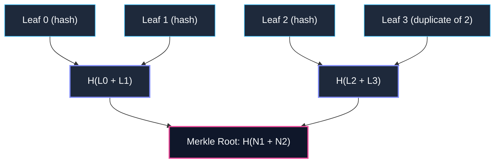

---
tags:
  - architecture/leaf
  - security/crypto
  - merkle/tree
  - layer/l5
type: module_leaf
layer: L5-Security-Sandbox-and-Merkle
module: agent_workspace.core.merkle
file_path: agent_workspace/core/merkle.py
sync_status: verified
---

# Module: Merkle (Cryptographic Merkle Tree & Audit Verification)

## 1. Three-Line Architectural Annotation
- **Responsibility**: Provides a deterministic binary Merkle Tree data structure used by [[core-audit-ledger]] to compute cryptographic state roots and verify audit record inclusion.
- **Invariant**: Pre-hashes every leaf with SHA-256 before tree construction to prevent second-preimage attacks; duplicate odd leaf nodes to maintain a balanced binary reduction tree.
- **Data Flow**: Consumes serialized event hashes from [[core-audit-ledger]], generates deterministic root hashes, and enables inclusion proof generation.

---

## 2. Source Code & Symbol Mapping

**Source Location**: [merkle.py](file:///d:/GitHub/LLM-Agent-System/agent_workspace/core/merkle.py) (35 lines)

### Symbol Table

| Symbol | Kind | Line Range | Description |
| :--- | :--- | :--- | :--- |
| `MerkleTree` | class | L4-L35 | Deterministic binary Merkle Tree implementation for state verification. |
| `__init__` | def | L9-L14 | Initializes tree with raw leaf hashes and calculates deterministic root hash. |
| `_build_tree` | def | L16-L34 | Computes binary reduction tree using SHA-256, duplicating odd leaves at each level. |

---

## 3. Tree Construction Logic

---

## 4. Operational Invariants & Anti-Corruption Guardrails
1. **Empty Set Safety**: If `leaves` is empty, `_build_tree` safely returns `"0" * 64` without raising exceptions.
2. **Second-Preimage Resistance**: Raw leaf hashes are re-hashed (`sha256(leaf.encode("utf-8"))`) at level 0 to prevent leaf-node vs internal-node collision attacks.
3. **Deterministic Reduction**: Left and right nodes are concatenated directly as `left + right` before hashing, ensuring 100% reproducible root calculations across different OS architectures.

---

## 5. Subsystem Links
- **Parent Layer**: [[layers/L5-Security-Sandbox-and-Merkle|L5: Security, Sandbox & Merkle]]
- **Consuming Subsystem**: [[core-audit-ledger]]
- **Global Index**: [[00 LLM-Agent-System Index]]
