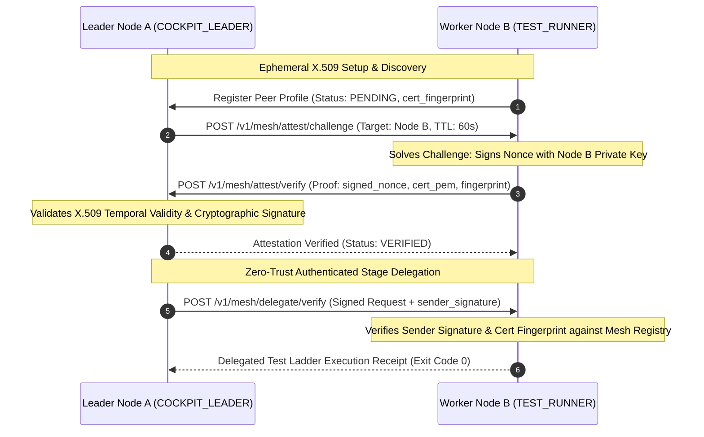

---
tags:
  - architecture/core
  - module/mesh/pki
  - module/security/mtls
  - layer/l2
  - layer/l3
  - protocol/v3-8-0
type: core_module
layer: L3-Autonomous-Workflow-and-Verification
sync_status: verified
---

# Core Module: Zero-Trust mTLS Dynamic Node Attestation & PKI Mesh (`core-mesh-pki`)

> **Parent Layer**: [[L2-Protocol-and-Contract-Gateways]], [[L3-Autonomous-Workflow-and-Verification]], [[core-federated-mesh]], [[core-pipeline-manager]]
> **Source Directory**: `agent_workspace/core/`, `agent_workspace/routes/`
> **Primary Source Files**:
> - [`cert_manager.py`](file:///d:/GitHub/LLM-Agent-System/agent_workspace/core/cert_manager.py) (`SwarmCertManager`, `CertValidationResult`, X.509 ephemeral cert generation, RSA signature signing & verification, expiration calculation)
> - [`federated_mesh.py`](file:///d:/GitHub/LLM-Agent-System/agent_workspace/core/federated_mesh.py) (`AttestationChallenge`, `AttestationProof`, `AttestationStatus`, `rotate_cert`, `check_and_auto_rotate_cert`, `generate_attestation_challenge`, `create_attestation_proof`, `verify_attestation_proof`, `sign_delegation_request`, `verify_delegation_request`)
> - [`routes/mesh.py`](file:///d:/GitHub/LLM-Agent-System/agent_workspace/routes/mesh.py) (REST `/v1/mesh/pki/cert`, `/v1/mesh/pki/rotate`, `/v1/mesh/attest/challenge`, `/v1/mesh/attest/verify`)
> - [`cli.py`](file:///d:/GitHub/LLM-Agent-System/agent_workspace/cli.py) (`las mesh pki`, `las mesh rotate --validity <sec>`, `las mesh attest <seed>`)
> - [`viewer/src/components/FederatedMeshView.tsx`](file:///d:/GitHub/LLM-Agent-System/viewer/src/components/FederatedMeshView.tsx) (Zero-Trust PKI Bento status card, mTLS rotation banner, and peer attestation shield badge)
> **Associated Tests**:
> - [`test_mesh_pki_p88.py`](file:///d:/GitHub/LLM-Agent-System/agent_workspace/tests/test_mesh_pki_p88.py) (Phase 88 test suite: 9/9 PASS)
> **ADR Reference**: [[60 Architectural Decision Records (ADR) Graph#ADR-005|ADR-005: Stop-and-Wait Gate]], [[60 Architectural Decision Records (ADR) Graph#ADR-006|ADR-006: Autonomous Strategy Integration]]

---

## 1. Module Overview & Zero-Trust Threat Model

`core/cert_manager.py` and `core/federated_mesh.py` implement **Phase 88: Zero-Trust mTLS Dynamic Node Attestation & Mutual TLS PKI Mesh (零信任動態節點證明與雙向 TLS 網格協作)**.

In distributed federated agent architectures, remote peer nodes delegate critical pipeline actions (such as high-budget reasoning debates, AST mutations, and isolated verification test ladders). Without mutual cryptographic attestation, a compromised or spoofed worker node could inject malicious patches or tamper with test execution receipts.

Phase 88 establishes a **Zero-Trust PKI Mesh** with ephemeral self-signed X.509 certificates and challenge-response attestation:
1. **Dynamic Ephemeral PKI**: Every LAS node generates an ephemeral RSA-2048 private key and self-signed X.509 certificate upon startup.
2. **Lifecycle Auto-Rotation**: Certificates include configurable TTLs (default 3600s) and background rotation when approaching expiry (`threshold_seconds=300`).
3. **Mutual Challenge-Response Attestation**: Nodes exchange single-use nonces to prove private key ownership without sharing secrets.
4. **Replay Protection**: Nonce challenges are immediately popped and invalidated upon first verification attempt.
5. **Signed Delegation Payloads**: Stage delegations (`committee_turn`, `test_verification`) are cryptographically signed and verified with full payload integrity checks.

---

## 2. Key Architecture Components & Invariants

### 2.1 SwarmCertManager (`core/cert_manager.py`)
- `generate_self_signed_cert(common_name, validity_seconds)`: Produces ephemeral RSA-2048 keypair, X.509 cert with Subject/Issuer `CN=node.<node_id>.mesh`, and UTC expiry timestamp.
- `get_cert_fingerprint(cert_pem)`: Computes authoritative SHA-256 fingerprint for identity pinning.
- `sign_payload(private_key_pem, payload)` / `verify_signature(cert_pem, sig_hex, payload)`: Uses PKCS#1 v1.5 padding and SHA-256.
- `is_cert_valid(cert_pem)`: Returns `CertValidationResult` with explicit temporal and structure validity.
- `should_rotate_cert(cert_pem, threshold_seconds)`: Evaluates whether remaining TTL is less than rotation threshold.

### 2.2 FederatedMeshCoordinator PKI Extensions (`core/federated_mesh.py`)
- `rotate_cert(validity_seconds)`: Atomically updates private key, public certificate, fingerprint, and expiration.
- `generate_attestation_challenge(target_node_id, ttl_seconds)`: Generates a high-entropy 32-hex character nonce challenge with single-use TTL.
- `create_attestation_proof(challenge, nonce)`: Signs challenge nonce using local private key and bundles with cert PEM and fingerprint.
- `verify_attestation_proof(proof)`: Consumes challenge immediately (`self.active_challenges.pop(proof.challenge_id)`), verifying temporal validity, certificate structure, fingerprint match, and signature correctness. Upon success, promotes peer to `AttestationStatus.VERIFIED`.
- `sign_delegation_request(req)` / `verify_delegation_request(req)`: Encodes canonical sorted JSON payload and signs with private key, enforcing Zero-Trust verification against known peer certificates.

### 2.3 Strict vs Lenient Attestation Enforcement
- In `strict_attestation=False` (default for local single-node development), standalone requests proceed seamlessly while signed requests are verified for cryptographic tamper resistance.
- In `strict_attestation=True` (production federated cluster), any request from an unverified peer, missing a signature, or bearing an invalid fingerprint is immediately rejected with HTTP 403.

---

## 3. REST API & CLI Toolbelt

### REST Endpoints (`routes/mesh.py`)
- `GET /v1/mesh/pki/cert`: Returns active node ID, X.509 PEM, SHA256 fingerprint, expires_at, and status (`ACTIVE`, `EXPIRING_SOON`, `EXPIRED`).
- `POST /v1/mesh/pki/rotate`: Forces immediate certificate rotation with custom `validity_seconds`.
- `POST /v1/mesh/attest/challenge`: Issues single-use cryptographic challenge for a target node.
- `POST /v1/mesh/attest/verify`: Verifies signed attestation proof and promotes node status in registry.

### CLI Toolbelt Subcommands (`cli.py`)
- `las mesh pki`: Displays local node's Zero-Trust mTLS identity, SHA256 fingerprint, and live TTL countdown.
- `las mesh rotate --validity <seconds>`: Rotates ephemeral certificate on demand and displays updated fingerprint.
- `las mesh attest <host:port>`: Triggers on-demand mutual attestation handshake with a remote peer.

---

## 4. Cockpit Frontend Integration (`viewer/src/components/FederatedMeshView.tsx`)

1. **mTLS Identity & Attestation Bar**:
   - Displays active node ID, SHA256 fingerprint snippet, certificate TTL badge, and "Rotate Cert Now" action button with live spinner.
2. **Zero-Trust PKI Bento Card**:
   - Displays cluster PKI status, total attested peers count, and active security posture.
3. **Peer Card Shield Badges**:
   - Displays green `ShieldCheck` (`ATTESTED`) for verified nodes and amber `AlertTriangle` (`PENDING`) for unattested nodes.
   - Provides one-click "Attest Peer Now" action triggering immediate challenge-response handshake.

---

## 5. Verification & Test Evidence

- **Dedicated Test Suite**: `agent_workspace/tests/test_mesh_pki_p88.py` (9/9 PASS)
- **Full 11-Suite Regression Matrix**: 72/72 PASS (100% pass rate across P1 through P88)
- **Frontend Build**: Clean Vite production build in 657ms without warnings or errors.
- **Git Hygiene**: `git diff --check` exits with 0 trailing whitespace violations.
