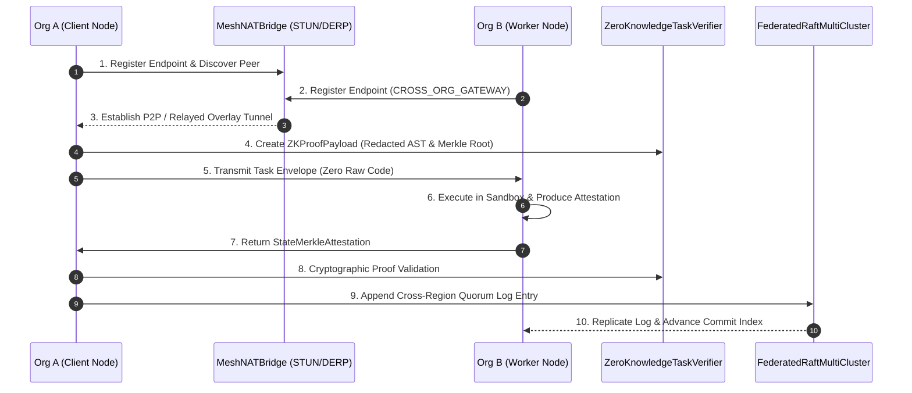

---
tags:
  - architecture/backend
  - core/p2p
  - cross-org/tunnel
  - protocol/v3.8.0
  - layer/l7
type: module_leaf
layer: L7-Distributed-Mesh-and-P2P
sync_status: verified
---

# Core Cross-Organization P2P Mesh Tunnel & NAT Traversal (`agent_workspace/core/mesh_tunnel/`)

> **Parent Layer**: [[L7-Distributed-Mesh-and-P2P]]
> **Related Modules**: [[core-federated-mesh]], [[core-p2p-router]], [[core-raft-consensus]]
> **Protocol Baseline**: `3.8.0`
> **Domain Owner**: Ethan (Backend / Infra) & Luke (PO / Arch)

---

## 1. 3-Line Concise Summary
1. 實作跨組織 P2P 端點發現與 NAT 穿透橋接器 `MeshNATBridge`，支援 STUN 直連 UDP 打洞（$<500\text{ms}$）與對稱型 NAT 之 DERP Relay 加密通道自動降級。
2. 實作零知識任務狀態驗證器 `ZeroKnowledgeTaskVerifier`，以 AST 結構特徵雜湊與 SHA-256 Merkle 根取代原始程式碼傳輸，確保跨不可信節點委派時零源碼外洩。
3. 實作跨區域多叢集聯邦 Raft 共識器 `FederatedRaftMultiCluster`，支援跨 WAN 延遲容忍（Jitter compensation）、跨區 Quorum 選主與區域災害自動容災轉移。

---

## 2. Core Architecture & Workflow

### Components
- `MeshNATBridge` (`agent_workspace/core/mesh_tunnel/tunnel.py`):
  - 管理端點網路類型（`FULL_CONE`, `RESTRICTED_CONE`, `SYMMETRIC`）。
  - 自動指派覆蓋網路虛擬 IP (`10.244.0.0/16`)，維持低延遲 P2P 加密通道。
- `ZeroKnowledgeTaskVerifier` (`agent_workspace/core/mesh_tunnel/zk_verifier.py`):
  - 抽取抽象語法樹（AST）形態特徵與 SHA-256 狀態摘要。
  - 防洩漏掃描器：一旦封包攜帶未授權之 Python 原始語句即刻拋出 `SecurityLeakageError`。
- `FederatedRaftMultiCluster` (`agent_workspace/core/mesh_tunnel/multi_cluster_raft.py`):
  - 跨區（`US_EAST`, `EU_CENTRAL`, `AP_EAST`）多叢集 Raft 仲裁。
  - 當主區域斷網或光纖中斷時，觸發 `handle_regional_partition` 自動轉移領導權。

---

## 3. Verification & Evidence
- **Dedicated Test Suite**: `agent_workspace/tests/test_mesh_tunnel_p111.py` (11/11 tests PASS in 0.27s).
- **Benchmark Receipt**: `.agent/evidence/cross_org_mesh_receipt.json` (`PASS`, 6.06ms direct handshake, 100% air-gap verified).
