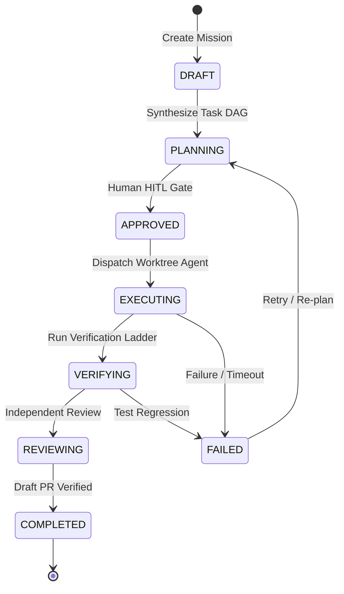

---
tags:
  - architecture/core
  - module/mission
  - spec/phase-81-02
  - layer/l2
  - layer/l3
  - protocol/v3-8-0
type: core_module_spec
layer: L2-Protocol-and-Contract-Gateways
sync_status: target_spec
---

# Core Module: Mission Management & Control Plane API (`core-mission`)

> **Status**: `TARGET ARCHITECTURE SPECIFICATION` (Scheduled for Phase 81-02 / P2-B implementation)
> **Parent Layer**: [[layers/L1-Ingress-and-Cockpit-Surface|L1 Ingress]], [[layers/L2-Protocol-and-Contract-Gateways|L2 Protocol Gateways]]
> **Active Precursor**: [[core-pipeline]] (`agent_workspace/core/pipeline/`)
> **Planned Target Files**:
> - `agent_workspace/core/mission_model.py` (Mission aggregate model)
> - `agent_workspace/core/mission_contracts.py` (Contracts & validation)
> - `agent_workspace/core/mission_state_machine.py` (State machine transitions)
> - `agent_workspace/core/mission_store.py` (Durable SQLite persistence)
> - `agent_workspace/core/mission_api_contracts.py` (REST schemas)
> - `agent_workspace/routes/missions.py` (FastAPI router)
> **Planned Test Suites**:
> - `agent_workspace/tests/test_mission_contracts.py`
> - `agent_workspace/tests/test_mission_api.py`
> - `agent_workspace/tests/test_mission_integrity.py`
> **ADR Reference**: [[60 Architectural Decision Records (ADR) Graph#ADR-006|ADR-006: Agent Strategy Integration]]

---

## 1. Module Overview & Domain Hierarchy

`core-mission` was established in Phase 80 / PR #6 (`feat(p1): establish developer agent control plane foundation`) to serve as the top-level engineering unit of LAS:
$$\text{Mission} \gt \text{Task} \gt \text{ExecutionAttempt} \gt \text{AgentSession} \gt \text{Turn}$$

A Mission represents a concrete software engineering initiative (e.g. "Implement Auth Token Refresh") comprising a Task DAG, repository profiles, approval policies, execution attempts, and verified evidence receipts.

---

## 2. Target Aggregate Models & Components (Phase 81-02 Spec)

| Symbol | Type | Target Module | Description |
|---|---|---|---|
| `Mission` | `BaseModel` | `agent_workspace.core.mission_model` | Top-level domain aggregate containing tasks, profile, and status history. |
| `MissionState` | `Enum` | `agent_workspace.core.mission_contracts` | Lifecycle states (`DRAFT`, `PLANNING`, `APPROVED`, `EXECUTING`, `VERIFYING`, `REVIEWING`, `COMPLETED`, `CANCELLED`, `FAILED`). |
| `MissionStateMachine` | `Class` | `agent_workspace.core.mission_state_machine` | Validates legal transitions, enforces approval gates, and handles retries. |
| `MissionStore` | `Class` | `agent_workspace.core.mission_store` | Thread-safe SQLite database storing missions, events, and execution attempts. |
| `MissionRouter` | `APIRouter` | `agent_workspace.routes.missions` | REST API endpoints for Mission CRUD, approval signing, and streaming updates. |

---

## 3. Invariants & Guarantees

1. **Dual State System**:
   - `MissionStore` (REST) is the authoritative snapshot of record.
   - WebSockets and SSE provide real-time UI projections. Polling serves as degraded recovery.
2. **Deterministic Provenance**:
   - Every state transition records triggering actor, timestamp, and optional cryptographic receipt.
3. **No Unapproved Execution**:
   - `MissionStateMachine` strictly prohibits transition to `EXECUTING` without prior `APPROVED` status signed with valid human approval token.
