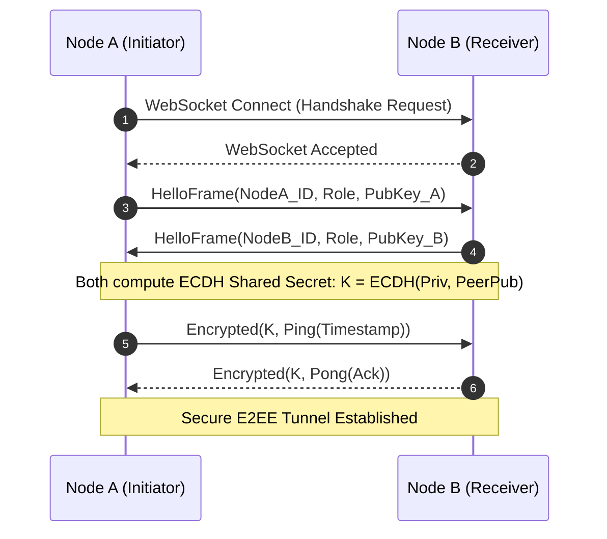

---
tags:
  - architecture/leaf
  - p2p/mesh
  - crypto/ecdh
  - layer/l7
type: module_leaf
layer: L7-Distributed-Mesh-and-P2P
module: agent_workspace.core.p2p_router
file_path: agent_workspace/core/p2p_router.py
sync_status: verified
---

# Module: P2PSwarmRouter (End-to-End Encrypted Swarm Mesh Router)

## 1. Three-Line Architectural Annotation
- **Responsibility**: Establishes peer-to-peer WebSocket meshes between distributed agent nodes, performs ECDH key exchange with AES-GCM-256 encryption, and routes cross-node task execution.
- **Invariant**: All inter-node wire communications must be encrypted using Ephemeral Diffie-Hellman keys; plaintext transmissions trigger immediate connection drop.
- **Data Flow**: Connects to remote peer WebSocket endpoints, exchanges public keys via `SwarmP2PCrypto`, maintains heartbeat gossip loops, and dispatches remote subtasks.

---

## 2. Source Code & Symbol Mapping

**Source Location**: [`p2p_router.py`](file:///d:/GitHub/LLM-Agent-System/agent_workspace/core/p2p_router.py) (467 lines)

### Symbol Table

| Symbol | Kind | Line Range | Description |
| :--- | :--- | :--- | :--- |
| `SwarmP2PCrypto` | `class` | L16-L75 | Cryptographic engine handling ECDH (X25519) key generation, shared secret derivation, and AES-GCM encryption. |
| `compute_shared_key` | `def` | L36-L51 | Derives shared 256-bit symmetric key using local private key and peer public key. |
| `encrypt_message` | `def` | L54-L65 | Encrypts payload with AES-GCM-256 using 12-byte random IV. |
| `decrypt_message` | `def` | L68-L75 | Decrypts ciphertext and authenticates MAC tag. |
| `P2PSwarmRouter` | `class` | L78-L462 | Peer mesh routing node managing connection pools, gossip protocol, and remote task dispatch. |
| `add_peer` | `def` | L122-L147 | Registers a remote peer node endpoint with role and host metadata. |
| `connect_to_peer` | `def` | L180-L240 | Initiates secure outbound WebSocket handshake and executes key exchange. |
| `_process_ws_message` | `def` | L271-L337 | Decrypts incoming frames, verifies signatures, and routes to local handlers. |
| `_run_task_locally` | `def` | L339-L379 | Executes tasks received from remote peers within local execution boundaries. |
| `_gossip_loop` | `def` | L401-L415 | Background routine periodically exchanging peer availability tables. |
| `dispatch_task` | `def` | L417-L462 | Forwards subtask payload to targeted peer node with timeout and failover. |

---

## 3. P2P Handshake & Encrypted Wire Protocol

---

## 4. Operational Invariants & Anti-Corruption Guardrails
1. **P2P Forward Secrecy**: Ephemeral keys are regenerated per session; historical traffic cannot be decrypted if long-term node credentials are compromised.
2. **Auto-Failover on Disconnect**: If a peer becomes unresponsive during task dispatch, the router retries locally or elects an alternate peer within 5 seconds.

---

## 5. Verification & Test Evidence
- **Test Suites**:
  - [`test_p2p_swarm.py`](file:///d:/GitHub/LLM-Agent-System/agent_workspace/tests/test_p2p_swarm.py)
  - [`test_p2p_encryption.py`](file:///d:/GitHub/LLM-Agent-System/agent_workspace/tests/test_p2p_encryption.py)
- **Execution Receipt**: Bytecode validated via `compileall` exit code 0.

---

## 6. Topological Linkage
- **Upstream Layer**: [[L7-Distributed-Mesh-and-P2P]]
- **Control Plane**: [[10 7-Layer System Architecture & Control Plane Topology]]
- **Collaborating Modules**:
  - [[core-broker]]
  - [[core-cert-manager]]
  - [[core-agent-crew]]
