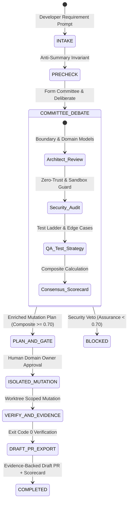

---
tags:
  - architecture/core
  - module/pipeline/committee
  - layer/l2
  - layer/l3
  - protocol/v3-8-0
type: core_module
layer: L2-Protocol-and-Contract-Gateways
sync_status: verified
---

# Core Module: Pipeline Multi-Agent Committee Deliberation (`core-pipeline-committee`)

> **Parent Layer**: [[L2-Protocol-and-Contract-Gateways]], [[L3-Runtime-Execution-and-Swarm]], [[core-pipeline]]
> **Source Directory**: `agent_workspace/core/pipeline/`
> **Primary Source Files**:
> - [`committee.py`](file:///d:/GitHub/LLM-Agent-System/agent_workspace/core/pipeline/committee.py) (`CommitteeCoordinator`: Risk evaluation & role auto-selection)
> - [`debate_protocol.py`](file:///d:/GitHub/LLM-Agent-System/agent_workspace/core/pipeline/debate_protocol.py) (`PipelineDebateProtocol`: Deliberation rounds, scoring & plan synthesis)
> - [`models.py`](file:///d:/GitHub/LLM-Agent-System/agent_workspace/core/pipeline/models.py) (`DebateSpeechTurn`, `DebateRoundRecord`, `CommitteeConsensusScorecard`, `CommitteeDebateRecord`)
> - [`manager.py`](file:///d:/GitHub/LLM-Agent-System/agent_workspace/core/pipeline/manager.py) (`run_committee_debate()`, `COMMITTEE_DEBATE` stage machine transition)
> - [`pipeline.py`](file:///d:/GitHub/LLM-Agent-System/agent_workspace/routes/pipeline.py) (`POST /v1/pipeline/tasks/{task_id}/debate` & real-time WebSocket broadcast)
> - [`CodingPipelineView.tsx`](file:///d:/GitHub/LLM-Agent-System/viewer/src/components/CodingPipelineView.tsx) (Consensus gauge, speeches stream & debate controls)
> **Associated Tests**:
> - [`test_pipeline_committee_p85.py`](file:///d:/GitHub/LLM-Agent-System/agent_workspace/tests/test_pipeline_committee_p85.py) (Phase 85 test suite: 6/6 PASS)
> **ADR Reference**: [[60 Architectural Decision Records (ADR) Graph#ADR-005|ADR-005: Stop-and-Wait Gate]], [[60 Architectural Decision Records (ADR) Graph#ADR-006|ADR-006: Autonomous Strategy Integration]]

---

## 1. Module Overview & Multi-Agent Deliberation

`core/pipeline/committee.py` and `debate_protocol.py` implement Phase 85 of the LAS Autonomous Coding Pipeline: **Multi-Agent Consensus Deliberation & Committee Protocol**.

Before code changes enter the Stop-and-Wait Architecture Gate (Rule 0.2), a dynamic specialist committee (Principal System Architect, Zero-Trust Security Auditor, and Strict QA Engineer) deliberates on the incoming requirement, evaluates the proposed blast radius, and issues a multi-dimensional consensus scorecard.

---

## 2. Dynamic Committee Auto-Selection Matrix

The `CommitteeCoordinator` evaluates target files, requirement keywords, and blast radius:

| Target Surface / Trigger | Enforced Persona | Role Responsibility |
|---|---|---|
| Security keywords (`auth`, `token`, `secret`, `crypto`, `sandbox`) | `securityauditor` | Zero-Trust compliance, constant-time checks, AST sandbox validation. |
| Core architecture (`core/`, `models.py`, `contracts.py`, `3+ files`) | `architect` | Module boundary adherence, Extreme Single Responsibility. |
| Any actionable code mutation | `qaengineer` | Multi-tier test ladder design, failure-injection edge cases. |
| Frontend paths (`viewer/`, `.tsx`, `.css`) | `frontenddev` | Cockpit aesthetics, Radix headless accessibility, token design. |

---

## 3. Multi-Dimensional Consensus Scorecard

The committee generates a weighted composite score $\in [0.0, 1.0]$:

$$\text{Composite Score} = 0.35 \times S_{\text{arch}} + 0.40 \times S_{\text{sec}} + 0.25 \times S_{\text{qa}}$$

- **Pass Criteria**: `Composite Score >= 0.70` AND `Security Assurance >= 0.70` $\to$ **`CONSENSUS_APPROVED`**.
- **Veto Condition**: `Security Assurance < 0.70` $\to$ **`REJECTED_NEEDS_REVISION`** (blocks pipeline progression until security blind spots are remediated).

---

## 4. Key Symbols and Line Index

| Symbol | Type | Primary File | Description |
|---|---|---|---|
| `CommitteeCoordinator` | `Class` | [`committee.py:L48-L150`](file:///d:/GitHub/LLM-Agent-System/agent_workspace/core/pipeline/committee.py#L48-L150) | Evaluates task risk and dynamically assembles reviewing committee members. |
| `PipelineDebateProtocol` | `Class` | [`debate_protocol.py:L31-L240`](file:///d:/GitHub/LLM-Agent-System/agent_workspace/core/pipeline/debate_protocol.py#L31-L240) | Deliberation rounds loop, critique extraction, scorecard synthesis, and plan enrichment. |
| `CommitteeConsensusScorecard` | `Model` | [`models.py:L166-L177`](file:///d:/GitHub/LLM-Agent-System/agent_workspace/core/pipeline/models.py#L166-L177) | Pydantic model for multi-dimensional consensus decision and metrics. |
| `run_committee_debate()` | `Method` | [`manager.py:L161-L202`](file:///d:/GitHub/LLM-Agent-System/agent_workspace/core/pipeline/manager.py#L161-L202) | Orchestrates Stage 2 deliberation within `CodingPipelineManager`. |
| `trigger_committee_debate()` | `Route` | [`pipeline.py:L300-L385`](file:///d:/GitHub/LLM-Agent-System/agent_workspace/routes/pipeline.py#L300-L385) | REST endpoint `POST /v1/pipeline/tasks/{task_id}/debate` with WebSocket streaming. |
