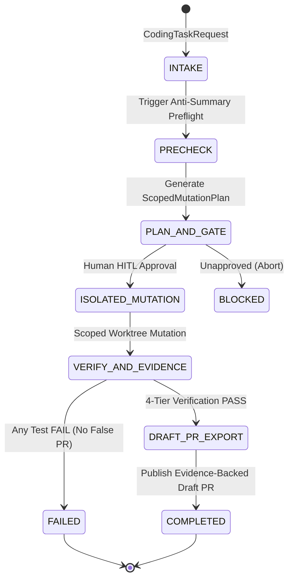

---
tags:
  - architecture/core
  - module/pipeline
  - layer/l2
  - layer/l3
  - protocol/v3-8-0
type: core_module
layer: L2-Protocol-and-Contract-Gateways
sync_status: verified
---

# Core Module: Pipeline Lifecycle & Product Contract (`core-pipeline`)

> **Parent Layer**: [[L2-Protocol-and-Contract-Gateways]], [[L3-Runtime-Execution-and-Swarm]]
> **Source Directory**: `agent_workspace/core/pipeline/`
> **Primary Source Files**:
> - [`models.py`](file:///d:/GitHub/LLM-Agent-System/agent_workspace/core/pipeline/models.py) (Data models & schemas)
> - [`contracts.py`](file:///d:/GitHub/LLM-Agent-System/agent_workspace/core/pipeline/contracts.py) (Interface abstractions)
> - [`committee.py`](file:///d:/GitHub/LLM-Agent-System/agent_workspace/core/pipeline/committee.py) ([[core-pipeline-committee|Committee coordinator & dynamic selection]])
> - [`debate_protocol.py`](file:///d:/GitHub/LLM-Agent-System/agent_workspace/core/pipeline/debate_protocol.py) ([[core-pipeline-committee|Multi-agent consensus debate protocol]])
> - [`manager.py`](file:///d:/GitHub/LLM-Agent-System/agent_workspace/core/pipeline/manager.py) (State machine controller)
> - [`repository.py`](file:///d:/GitHub/LLM-Agent-System/agent_workspace/core/repository.py) (Repository inspector & profile)
> - [`git_worktree.py`](file:///d:/GitHub/LLM-Agent-System/agent_workspace/core/git_worktree.py) (Git worktree isolation & preservation)
> - [`task_environment.py`](file:///d:/GitHub/LLM-Agent-System/agent_workspace/core/task_environment.py) (15-attribute TaskEnvironment & DAG scheduler)
> - [`agent_executor.py`](file:///d:/GitHub/LLM-Agent-System/agent_workspace/core/agent_executor.py) (Governed AgentExecutor & ScopeGuard)
> - [`runtime_events.py`](file:///d:/GitHub/LLM-Agent-System/agent_workspace/core/runtime_events.py) (Merkle audit ledger, feedback runner & recovery)
> - [`pipeline.py`](file:///d:/GitHub/LLM-Agent-System/agent_workspace/routes/pipeline.py) (FastAPI REST router & WebSocket broadcast)
> - [`CodingPipelineView.tsx`](file:///d:/GitHub/LLM-Agent-System/viewer/src/components/CodingPipelineView.tsx) (Frontend Cockpit)
> **Associated Tests**:
> - [`test_coding_pipeline_p1.py`](file:///d:/GitHub/LLM-Agent-System/agent_workspace/tests/test_coding_pipeline_p1.py) (P1 Pipeline tests)
> - [`test_repository_p2a.py`](file:///d:/GitHub/LLM-Agent-System/agent_workspace/tests/test_repository_p2a.py) (P2-A Repository tests)
> - [`test_git_worktree_p2a.py`](file:///d:/GitHub/LLM-Agent-System/agent_workspace/tests/test_git_worktree_p2a.py) (P2-A Worktree tests)
> - [`test_task_environment_p2b.py`](file:///d:/GitHub/LLM-Agent-System/agent_workspace/tests/test_task_environment_p2b.py) (P2-B TaskEnvironment tests)
> - [`test_agent_executor_p2c.py`](file:///d:/GitHub/LLM-Agent-System/agent_workspace/tests/test_agent_executor_p2c.py) (P2-C Governed execution tests)
> - [`test_runtime_events_p2d.py`](file:///d:/GitHub/LLM-Agent-System/agent_workspace/tests/test_runtime_events_p2d.py) (P2-D Runtime events tests)
> - [`test_pipeline_api_p3.py`](file:///d:/GitHub/LLM-Agent-System/agent_workspace/tests/test_pipeline_api_p3.py) (P3 REST/WS API tests)
> **ADR Reference**: [[60 Architectural Decision Records (ADR) Graph#ADR-005|ADR-005: Stop-and-Wait Gate]], [[60 Architectural Decision Records (ADR) Graph#ADR-006|ADR-006: Agent Strategy Integration]]

---

## 1. Module Overview & Product Loop

`core/pipeline/` implements the canonical 4-step autonomous coding workflow of LAS:
$$\text{Developer Requirement} \to \text{Bounded Mutation} \to \text{Verification Evidence} \to \text{Draft PR}$$

It transforms raw developer requests into an auditable, strictly scoped execution process governed by the Stop-and-Wait Architecture Gate and Anti-Corruption Invariants.

---

## 2. Key Symbols and Line Ranges

| Symbol | Type | Source File & Lines | Description |
|---|---|---|---|
| `PipelineStage` | `Enum` | [`models.py:L15-L26`](file:///d:/GitHub/LLM-Agent-System/agent_workspace/core/pipeline/models.py#L15-L26) | Unidirectional lifecycle stages (`INTAKE` $\to$ `COMPLETED`). |
| `VerificationStatus` | `Enum` | [`models.py:L28-L35`](file:///d:/GitHub/LLM-Agent-System/agent_workspace/core/pipeline/models.py#L28-L35) | Protocol v3.8.0 5 objective statuses (`PASS`, `FAIL`, `BLOCKED`, `NOT_RUN`, `UNVERIFIED`). |
| `CodingTaskRequest` | `BaseModel` | [`models.py:L37-L67`](file:///d:/GitHub/LLM-Agent-System/agent_workspace/core/pipeline/models.py#L37-L67) | Strict input contract with `inspected_files`, `target_files`, `allowed_roles`, `max_turns`. |
| `ScopedMutationPlan` | `BaseModel` | [`models.py:L81-L95`](file:///d:/GitHub/LLM-Agent-System/agent_workspace/core/pipeline/models.py#L81-L95) | Structured diff preview, edge cases, test strategy, and human approval signature. |
| `VerificationReceipt` | `BaseModel` | [`models.py:L97-L110`](file:///d:/GitHub/LLM-Agent-System/agent_workspace/core/pipeline/models.py#L97-L110) | Tamper-evident command receipt with exit code, stdout/stderr, and duration. |
| `DraftPRPayload` | `BaseModel` | [`models.py:L112-L126`](file:///d:/GitHub/LLM-Agent-System/agent_workspace/core/pipeline/models.py#L112-L126) | Conventional Commit title, markdown body with receipt tables, and commit SHA. |
| `IWorktreeManager` | `ABC` | [`contracts.py:L24-L52`](file:///d:/GitHub/LLM-Agent-System/agent_workspace/core/pipeline/contracts.py#L24-L52) | Interface for native Git worktree isolation. |
| `IScopedExecutor` | `ABC` | [`contracts.py:L54-L67`](file:///d:/GitHub/LLM-Agent-System/agent_workspace/core/pipeline/contracts.py#L54-L67) | Interface for role-bounded agent code mutation. |
| `IVerificationRunner` | `ABC` | [`contracts.py:L69-L81`](file:///d:/GitHub/LLM-Agent-System/agent_workspace/core/pipeline/contracts.py#L69-L81) | Interface for verification ladder execution and receipts collection. |
| `IDraftPRPublisher` | `ABC` | [`contracts.py:L83-L92`](file:///d:/GitHub/LLM-Agent-System/agent_workspace/core/pipeline/contracts.py#L83-L92) | Interface for remote Draft PR publication. |
| `CodingPipelineManager` | `Class` | [`manager.py:L20-L240`](file:///d:/GitHub/LLM-Agent-System/agent_workspace/core/pipeline/manager.py#L20-L240) | Orchestrates pipeline stages, gates, role boundary enforcement, and PR generation. |
| `GitWorktreeManager` | `Class` | [`git_worktree.py`](file:///d:/GitHub/LLM-Agent-System/agent_workspace/core/git_worktree.py) | P2-A Worktree lifecycle, branch isolation, and `CanonicalPreservationReceipt`. |
| `RepositoryInspector` | `Class` | [`repository.py`](file:///d:/GitHub/LLM-Agent-System/agent_workspace/core/repository.py) | P2-A Target repo profiling, test command discovery, and branch topology. |
| `TaskEnvironmentSynthesizer` | `Class` | [`task_environment.py`](file:///d:/GitHub/LLM-Agent-System/agent_workspace/core/task_environment.py) | P2-B 15-attribute TaskEnvironment aggregate and `TaskGraph` DAG scheduler. |
| `AgentExecutor` & `ScopeGuard` | `Class` | [`agent_executor.py`](file:///d:/GitHub/LLM-Agent-System/agent_workspace/core/agent_executor.py) | P2-C Governed execution loop under Bounded Autonomy and destructive shell interception. |
| `RuntimeEventsLedger` | `Class` | [`runtime_events.py`](file:///d:/GitHub/LLM-Agent-System/agent_workspace/core/runtime_events.py) | P2-D Durable SQLite cryptographic event chain and Merkle tree root calculator. |
| `LiveFeedbackRunner` | `Class` | [`runtime_events.py`](file:///d:/GitHub/LLM-Agent-System/agent_workspace/core/runtime_events.py) | P2-D Verification ladder runner with fail-fast execution and root-cause diagnostic extraction. |
| `PipelineBroadcastManager` | `Class` | [`pipeline.py`](file:///d:/GitHub/LLM-Agent-System/agent_workspace/routes/pipeline.py) | P3 WebSocket event broadcast manager streaming stage transitions. |

---

## 3. Invariants & Governance

1. **Anti-Summary Preflight Enforced**:
   - Requests with empty `inspected_files` are unconditionally rejected (`status = BLOCKED`).
2. **Stop-and-Wait Gate Enforced**:
   - If `ScopedMutationPlan.human_approved` is `False`, mutation tools cannot be called (`status = BLOCKED`).
3. **Physical Scope Boundaries Enforced**:
   - Integrates `ROLE_SCOPE_RESTRICTIONS` from [`policy_gate.py`](file:///d:/GitHub/LLM-Agent-System/agent_workspace/core/policy_gate.py). UI roles cannot mutate backend files; backend roles cannot mutate presentation files; advisory roles cannot mutate code.
4. **No False PR Guarantee**:
   - If any verification step returns a non-zero exit code, pipeline transitions to `FAILED` and halts; no Draft PR is generated.
5. **Zero Host Mutation Guarantee**:
   - Every execution compares host repository status before and after, verifying `CanonicalPreservationReceipt`.

---

## 4. Topological Linkage
- **Upstream Layer**: [[L2-Protocol-and-Contract-Gateways]], [[L3-Runtime-Execution-and-Swarm]]
- **Control Plane**: [[10 7-Layer System Architecture & Control Plane Topology]]
- **Frontend Cockpit**: [[viewer-coding-pipeline]]
- **ADR Reference**: [[60 Architectural Decision Records (ADR) Graph#ADR-005|ADR-005: Stop-and-Wait Gate]], [[60 Architectural Decision Records (ADR) Graph#ADR-006|ADR-006: Agent Strategy Integration]]
