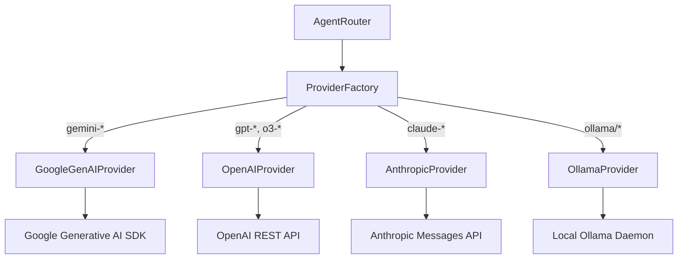

---
tags:
  - architecture/leaf
  - runtime/providers
  - llm/adapters
  - layer/l2
type: module_leaf
layer: L2-Protocol-and-Contract-Gateways
module: agent_workspace.core.providers
file_path: agent_workspace/core/providers.py
sync_status: verified
---

# Module: BaseLLMProvider & ProviderFactory (Multi-Model Adapter Fabric)

## 1. Three-Line Architectural Annotation
- **Responsibility**: Normalizes disparate LLM vendor APIs (Google Gemini, OpenAI, Anthropic Claude, Ollama) into a unified completion and streaming interface with structured tool calling.
- **Invariant**: Provider calls enforce timeout ceilings and retry with exponential backoff on transient HTTP 429/503 errors; raw API keys are NEVER logged.
- **Data Flow**: Accepts standardized `Message` arrays and `ToolSchema` specs from `AgentRouter`, translates to vendor-specific schemas, and returns normalized `ProviderResponse` tuples.

---

## 2. Source Code & Symbol Mapping

**Source Location**: [`providers.py`](file:///d:/GitHub/LLM-Agent-System/agent_workspace/core/providers.py) (880 lines)

### Symbol Table

| Symbol | Kind | Line Range | Description |
| :--- | :--- | :--- | :--- |
| `ProviderResponse` | `class` | L27-L37 | Named tuple containing `(content, tool_calls, usage_metadata)`. |
| `ProviderTransientError` | `class` | L39-L41 | Typed exception indicating retryable network or rate-limiting errors. |
| `BaseLLMProvider` | `class` | L47-L332 | Abstract base class declaring `complete`, `stream_complete`, and tool parser contracts. |
| `openai_tools` / `openai_messages` | `def` | L353-L412 | Format converters bridging internal message structures to OpenAI-compatible format. |
| `GoogleGenAIProvider` | `class` | L414-L595 | Adapter implementing Google Gemini SDK (`gemini-2.5-pro`, `gemini-2.5-flash`) integration. |
| `OpenAIProvider` | `class` | L597-L665 | Adapter implementing OpenAI API (`gpt-4o`, `o3-mini`) integration. |
| `AnthropicProvider` | `class` | L667-L782 | Adapter implementing Anthropic Claude API (`claude-3-7-sonnet`) integration. |
| `OllamaProvider` | `class` | L784-L848 | Adapter implementing local offline LLM inference via Ollama HTTP endpoints. |
| `ProviderFactory` | `class` | L850-L880 | Factory resolving provider instances dynamically based on model identifier strings. |

---

## 3. Multi-Provider Architecture

---

## 4. Operational Invariants & Anti-Corruption Guardrails
1. **Zero Secret Leakage**: `require_env` retrieves keys safely; serialization methods strip authorization headers before logging.
2. **Standardized Tool Output**: All providers emit identical `ToolCall(id, name, arguments)` data classes regardless of vendor format differences.

---

## 5. Verification & Test Evidence
- **Test Suites**:
  - [`test_provider_security.py`](file:///d:/GitHub/LLM-Agent-System/agent_workspace/tests/test_provider_security.py)
  - [`test_provider_lifecycle.py`](file:///d:/GitHub/LLM-Agent-System/agent_workspace/tests/test_provider_lifecycle.py)
- **Execution Receipt**: Bytecode validated via `compileall` exit code 0.

---

## 6. Topological Linkage
- **Upstream Layer**: [[L2-Protocol-and-Contract-Gateways]]
- **Control Plane**: [[10 7-Layer System Architecture & Control Plane Topology]]
- **Collaborating Modules**:
  - [[core-router]]
  - [[core-agent-crew]]
  - [[core-discussion-room]]
