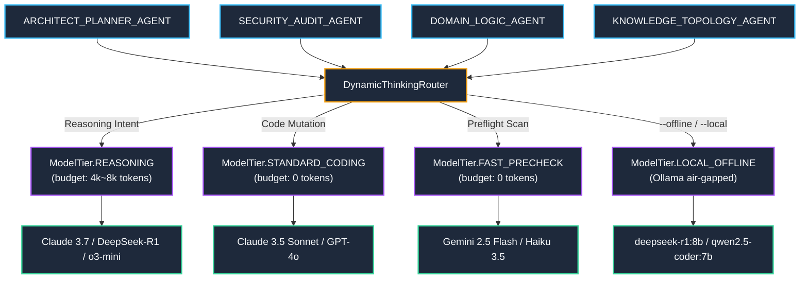

---
tags:
  - architecture/core
  - module/router/reasoning
  - layer/l2
  - layer/l4
  - protocol/v3-8-0
type: core_module
layer: L4-Cognitive-and-Memory-OS
sync_status: verified
---

# Core Module: Heterogeneous Reasoning Adapters & Dynamic Thinking Router (`core-reasoning-router`)

> **Parent Layer**: [[L2-Protocol-and-Contract-Gateways]], [[L4-Cognitive-and-Memory-OS]], [[core-providers]], [[core-router]]
> **Source Directory**: `agent_workspace/core/`
> **Primary Source Files**:
> - [`reasoning_router.py`](file:///d:/GitHub/LLM-Agent-System/agent_workspace/core/reasoning_router.py) (`DynamicThinkingRouter`, `ModelTier`, `ReasoningConfig`, `RoleModelProfile`)
> - [`providers.py`](file:///d:/GitHub/LLM-Agent-System/agent_workspace/core/providers.py) (`ProviderResponse`, `OpenAIProvider`, `AnthropicProvider`, `OllamaProvider`, `GoogleGenAIProvider`)
> - [`committee.py`](file:///d:/GitHub/LLM-Agent-System/agent_workspace/core/pipeline/committee.py) (`CommitteeCoordinator`: attaches `model_tier` & `thinking_budget`)
> - [`debate_protocol.py`](file:///d:/GitHub/LLM-Agent-System/agent_workspace/core/pipeline/debate_protocol.py) (`PipelineDebateProtocol`: collects `reasoning_content` & `total_reasoning_tokens`)
> - [`CodingPipelineView.tsx`](file:///d:/GitHub/LLM-Agent-System/viewer/src/components/CodingPipelineView.tsx) (Collapsible Thinking Process details block & Offline/Budget controls)
> **Associated Tests**:
> - [`test_reasoning_router_p86.py`](file:///d:/GitHub/LLM-Agent-System/agent_workspace/tests/test_reasoning_router_p86.py) (Phase 86 test suite: 7/7 PASS)
> **ADR Reference**: [[60 Architectural Decision Records (ADR) Graph#ADR-005|ADR-005: Stop-and-Wait Gate]], [[60 Architectural Decision Records (ADR) Graph#ADR-006|ADR-006: Autonomous Strategy Integration]]

---

## 1. Module Overview & Cognitive Specialization

`core/reasoning_router.py` and the enhanced `core/providers.py` implement **Phase 86: Heterogeneous Reasoning Model Adapters & Dynamic Thinking Router**.

Assigning a uniform LLM across all agent roles causes acute latency/token inefficiency:
- **Architect & Security Personas** demand extensive chain-of-thought, deductive search, and self-critique budgets (DeepSeek-R1, Claude 3.7 Extended Thinking, OpenAI o3-mini).
- **Domain Logic & UI Personas** require strict AST compliance, low hallucination, and high instruction-following fidelity (Claude 3.5 Sonnet, GPT-4o, Qwen 2.5 Coder).
- **Fast Preflight Scanners** demand sub-second latency and minimal token cost (Gemini 2.5 Flash, Claude 3.5 Haiku).
- **Air-Gapped Enterprise Deployments** mandate zero-cloud data egress via local Ollama models.

---

## 2. Model Tier & Role Allocation Matrix

| Grounded Role | Preferred Tier | Default Cloud Provider / Model | Default Thinking Budget | Offline Ollama Mapping |
|---|---|---|---|---|
| `ARCHITECT_PLANNER_AGENT` | `REASONING` | Anthropic `claude-3-7-sonnet-latest` | 8,192 tokens | `deepseek-r1:8b` (4k tokens) |
| `SECURITY_AUDIT_AGENT` | `REASONING` | OpenAI `o3-mini` / DeepSeek `deepseek-reasoner` | 4,096 tokens | `deepseek-r1:8b` (4k tokens) |
| `CODE_REVIEW_AGENT` | `REASONING` | Anthropic `claude-3-7-sonnet-latest` | 4,096 tokens | `deepseek-r1:8b` (4k tokens) |
| `DOMAIN_LOGIC_AGENT` | `STANDARD_CODING` | Anthropic `claude-3-5-sonnet-latest` | 0 tokens | `qwen2.5-coder:7b` |
| `BACKEND_INFRA_AGENT` | `STANDARD_CODING` | OpenAI `gpt-4o` | 0 tokens | `qwen2.5-coder:7b` |
| `UI_UX_AGENT` | `STANDARD_CODING` | Anthropic `claude-3-5-sonnet-latest` | 0 tokens | `qwen2.5-coder:7b` |
| `QA_TEST_AGENT` | `STANDARD_CODING` | OpenAI `gpt-4o` | 0 tokens | `qwen2.5-coder:7b` |
| `KNOWLEDGE_TOPOLOGY_AGENT` | `FAST_PRECHECK` | Google `gemini-2.5-flash` | 0 tokens | `qwen2.5-coder:7b` |

---

## 3. Provider Thinking Adapters & Tag Sanitization

1. **`ProviderResponse` Extended Tuple**:
   - Maintains exact 2-tuple unpacking (`resp_type, resp_data = resp`) ensuring 100% backward compatibility.
   - Exposes `.reasoning_content` (chain-of-thought text) and `.reasoning_tokens` (integer token count).
2. **`OpenAIProvider`**:
   - Parses `message.get("reasoning_content")` (standardized by DeepSeek-R1).
   - Extracts `usage.completion_tokens_details.reasoning_tokens`.
   - Passes `reasoning_effort` ("low", "medium", "high") for o-series models.
3. **`AnthropicProvider`**:
   - Passes `thinking: {"type": "enabled", "budget_tokens": N}` when `thinking_budget > 0`.
   - Enforces Anthropic protocol invariant: `temperature = 1.0` and `max_tokens > budget_tokens`.
   - Extracts `block["type"] == "thinking"` into `.reasoning_content`.
4. **`OllamaProvider` Local Sanitization**:
   - Uses regex extraction on `<think>(.*?)</think>`.
   - Isolates internal thoughts into `.reasoning_content` while cleanly stripping the `<think>` tags from output text, preventing raw reasoning artifacts from contaminating downstream parsers.

---

## 4. Operational Invariants

- **Token Containment**: Reasoning tokens are tracked explicitly in `CommitteeConsensusScorecard.total_reasoning_tokens` and Prometheus `REASONING_TOKENS_COUNT`.
- **Air-Gapped Local Guarantee**: When `offline_mode=True` or `las pipeline run --offline`, all outbound cloud API calls are strictly intercepted and routed to local Ollama endpoints.
- **Failover Recovery**: If a reasoning provider throws a non-transient error, `DynamicThinkingRouter` automatically falls back to standard coding models.
