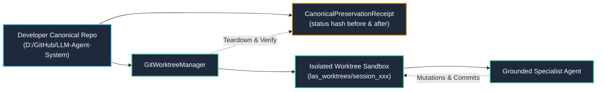

---
tags:
  - architecture/core
  - module/repository
  - module/worktree
  - layer/l3
  - layer/l5
  - protocol/v3-8-0
type: core_module
layer: L3-Runtime-Execution-and-Swarm
sync_status: verified
---

# Core Module: Repository Control Plane & Git Worktree (`core-repository`)

> **Parent Layer**: [[L3-Runtime-Execution-and-Swarm]], [[L5-Security-Sandbox-and-Merkle]]
> **Source Files**:
> - [`agent_workspace/core/repository.py`](file:///d:/GitHub/LLM-Agent-System/agent_workspace/core/repository.py) (`RepositoryInspector`, `RepositoryProfile`, `CanonicalPreservationReceipt`)
> - [`agent_workspace/core/git_worktree.py`](file:///d:/GitHub/LLM-Agent-System/agent_workspace/core/git_worktree.py) (`GitWorktreeManager`)
> **Associated Tests**:
> - [`agent_workspace/tests/test_repository_p2a.py`](file:///d:/GitHub/LLM-Agent-System/agent_workspace/tests/test_repository_p2a.py)
> - [`agent_workspace/tests/test_git_worktree_p2a.py`](file:///d:/GitHub/LLM-Agent-System/agent_workspace/tests/test_git_worktree_p2a.py)
> **ADR Reference**: [[60 Architectural Decision Records (ADR) Graph#ADR-006|ADR-006: Agent Strategy Integration]]

---

## 1. Module Overview & Responsibilities

`core-repository` and `core-git-worktree` represent Phase 2-A of the LAS Developer Control Plane:
1. **Repository Sensing & Contextualization**: Automatically inspects target repository Git state, detects multi-language technology stacks (Python, Node/TS, Rust, Go), discovers existing test/linter commands, and enforces sensitive file protection lists.
2. **Physical Execution Sandbox**: Implements `IWorktreeManager` using native Git commands (`git worktree add -b`, `git worktree remove --force`), providing a 100% isolated directory for agent operations.
3. **Canonical Checkout Preservation Guarantee**: Emits `CanonicalPreservationReceipt` ensuring the developer's canonical checkout is preserved *as found* (`before status/hash == after status/hash`).

---

## 2. Key Symbols and Line Ranges

| Symbol | Type | Source File & Lines | Description |
|---|---|---|---|
| `RepositoryProfile` | `BaseModel` | [`repository.py:L40-L75`](file:///d:/GitHub/LLM-Agent-System/agent_workspace/core/repository.py#L40-L75) | Environmental profile containing branch, commit, clean status, ecosystems, tests, linters, protected paths. |
| `CanonicalPreservationReceipt` | `BaseModel` | [`repository.py:L78-L107`](file:///d:/GitHub/LLM-Agent-System/agent_workspace/core/repository.py#L78-L107) | Cryptographic SHA-256 receipt tracking status hash before and after execution. |
| `RepositoryInspector` | `Class` | [`repository.py:L110-L260`](file:///d:/GitHub/LLM-Agent-System/agent_workspace/core/repository.py#L110-L260) | Probes Git status, discovers language ecosystems, and generates/verifies preservation receipts. |
| `DEFAULT_PROTECTED_PATTERNS` | `Tuple` | [`repository.py:L26-L37`](file:///d:/GitHub/LLM-Agent-System/agent_workspace/core/repository.py#L26-L37) | Sensitive path globs (`.env*`, `.git/`, `.github/workflows/`, secrets). |
| `GitWorktreeManager` | `Class` | [`git_worktree.py:L23-L205`](file:///d:/GitHub/LLM-Agent-System/agent_workspace/core/git_worktree.py#L23-L205) | Manages native `git worktree` lifecycle (`create_worktree`, `cleanup_worktree`, `get_diff`, `commit_changes`). |

---

## 3. Invariants & Guarantees

1. **Zero Host Contamination Guarantee**:
   - Agent mutations only occur inside `session.worktree_path`. The developer's main branch and uncommitted working files are never dirtied or overwritten.
2. **Canonical Preservation Checkpoint**:
   - `verify_preservation` verifies that `final_head == initial_head` and `final_status_hash == initial_status_hash`. Any untracked file or status change on the host marks `is_preserved = False`.
3. **Safe Subprocess Execution**:
   - All Git CLI calls are bound by strict timeouts (`timeout_seconds`), subprocess output captures, and Windows file lock exception handlers.
