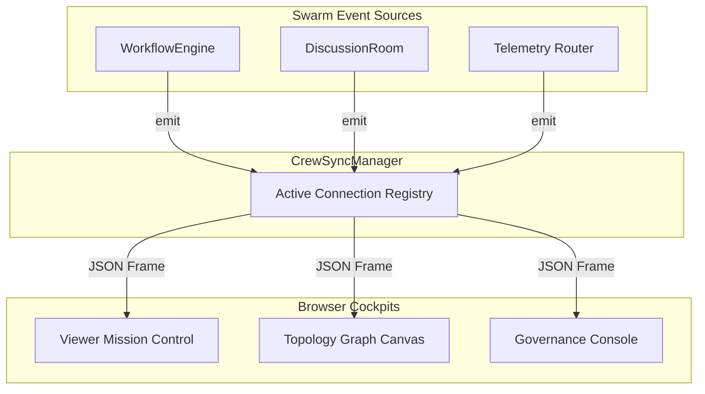

---
tags:
  - architecture/leaf
  - gateway/websocket
  - live/telemetry
  - layer/l1
type: module_leaf
layer: L1-Ingress-and-Cockpit-Surface
module: agent_workspace.core.ws_manager
file_path: agent_workspace/core/ws_manager.py
sync_status: verified
---

# Module: CrewSyncManager (Real-Time WebSocket Ingress & Telemetry Relay)

## 1. Three-Line Architectural Annotation
- **Responsibility**: Manages client WebSocket connections, active session multiplexing, live telemetry broadcasting, and thread-safe event streaming to the frontend viewer.
- **Invariant**: Disconnected or dead client connections must be promptly reaped without throwing unhandled socket exceptions; broadcasting must be non-blocking.
- **Data Flow**: Subscribes to events from `SwarmBroker`, packages payloads into JSON frames, and broadcasts to active browser clients viewing `TopologyView` and `SwarmGovernanceConsole`.

---

## 2. Source Code & Symbol Mapping

**Source Location**: [`ws_manager.py`](file:///d:/GitHub/LLM-Agent-System/agent_workspace/core/ws_manager.py) (58 lines)

### Symbol Table

| Symbol | Kind | Line Range | Description |
| :--- | :--- | :--- | :--- |
| `CrewSyncManager` | `class` | L11-L58 | Primary connection manager tracking active client WebSocket connections. |
| `__init__` | `def` | L13-L15 | Initializes active connections list and lock primitives. |
| `connect` | `def` | L17-L22 | Accepts and registers new incoming WebSocket connection. |
| `disconnect` | `def` | L24-L32 | Safely unregisters and removes client connection upon disconnect. |
| `broadcast` | `def` | L34-L58 | Asynchronously broadcasts message dictionary to all active clients, automatically reaping dead sockets. |

---

## 3. WebSocket Fan-Out Topology

---

## 4. Operational Invariants & Anti-Corruption Guardrails
1. **Non-Blocking Fan-Out**: Broadcast loops utilize asyncio concurrency with exception shielding to prevent a slow client from stalling the swarm.
2. **Dead Socket Pruning**: Sockets raising connection errors are removed from the active set during the broadcast pass.

---

## 5. Verification & Test Evidence
- **Test Suites**:
  - [`test_ws_manager.py`](file:///d:/GitHub/LLM-Agent-System/agent_workspace/tests/test_ws_manager.py)
  - [`test_ws_quota_security.py`](file:///d:/GitHub/LLM-Agent-System/agent_workspace/tests/test_ws_quota_security.py)
- **Execution Receipt**: Bytecode validated via `compileall` exit code 0.

---

## 6. Topological Linkage
- **Upstream Layer**: [[L1-Ingress-and-Cockpit-Surface]]
- **Control Plane**: [[10 7-Layer System Architecture & Control Plane Topology]]
- **Collaborating Modules**:
  - [[core-broker]]
  - [[viewer-app]]
  - [[viewer-topology-view]]
