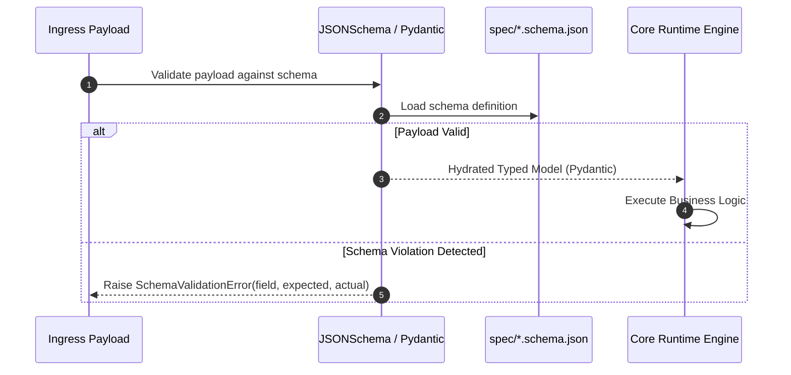

---
tags:
  - architecture/leaf
  - spec/contracts
  - json_schema/validation
  - layer/l2
type: module_leaf
layer: L2-Protocol-and-Contract-Gateways
module: spec
file_path: spec/
sync_status: verified
---

# Module: SpecSchemasAndContracts (Formal JSON Schemas & Protocol Contracts)

## 1. Three-Line Architectural Annotation
- **Responsibility**: Houses formal JSON Schema definitions establishing strict contract validation for agents, workflows, execution checkpoints, memory payloads, and review findings.
- **Invariant**: All inter-agent and runtime payloads must strictly validate against their respective schemas before execution; schema violation triggers immediate `ToolValidationError`.
- **Data Flow**: Schemas are loaded by `AgentRouter` and `WorkflowEngine`, enforced by jsonschema/pydantic validators, and rendered in the frontend cockpit.

---

## 2. Source Code & Schema Inventory

**Source Directory**: [`spec/`](file:///d:/GitHub/LLM-Agent-System/spec/)

### Schema Inventory Table

| Schema File | Kind | Validated Entity | Description |
| :--- | :--- | :--- | :--- |
| `workflow.schema.json` | JSON Schema | Workflow DAG | Validates workflow ID, input parameters, step dependencies, and failure transitions. |
| `workflow-stage.schema.json` | JSON Schema | Workflow Stage | Defines stage boundaries, concurrency ceilings, and gate criteria. |
| `agent-schema.json` | JSON Schema | Agent Definition | Validates agent role, system persona, allowed toolset, and timeout ceilings. |
| `checkpoint.schema.json` | JSON Schema | Execution State | Validates serializable run snapshot, step outputs, HMAC digest, and resume metadata. |
| `memory.schema.json` | JSON Schema | Cognitive Memory | Validates episodic, semantic, and procedural memory record structures. |
| `evidence-memory.schema.json`| JSON Schema | Verification Proof | Validates cryptographic test receipts, terminal exit codes, and coverage metrics. |
| `pap-review-findings.schema.json`| JSON Schema | Code Review | Standardized schema for AI code review findings (file, line range, severity, remediation). |
| `review-findings.schema.json`| JSON Schema | General Audit | Schema for general compliance and security audit issue reports. |
| `skill-contract.schema.json` | JSON Schema | Tool Manifest | Validates dynamic skill parameters, return types, and sandbox permissions. |
| `registry-schema.json` | JSON Schema | Swarm Registry | Validates peer discovery registry, node endpoints, and capability declarations. |

---

## 3. Contract Enforcement Flow

---

## 4. Operational Invariants & Anti-Corruption Guardrails
1. **Zero Undeclared Fields**: Schemas enforce `additionalProperties: false` where applicable to reject unrecognized payload injections.
2. **Strict Semantic Versioning**: Schema changes must increment version tags; breaking changes require backward-compatibility adapters.

---

## 5. Verification & Test Evidence
- **Test Suites**:
  - [`test_pap_conformance.py`](file:///d:/GitHub/LLM-Agent-System/agent_workspace/tests/test_pap_conformance.py)
  - [`test_review_findings_validate.py`](file:///d:/GitHub/LLM-Agent-System/agent_workspace/tests/test_review_findings_validate.py)
  - [`test_skill_contracts.py`](file:///d:/GitHub/LLM-Agent-System/agent_workspace/tests/test_skill_contracts.py)
- **Execution Receipt**: Bytecode validated via `compileall` exit code 0.

---

## 6. Topological Linkage
- **Upstream Layer**: [[L2-Protocol-and-Contract-Gateways]]
- **Control Plane**: [[10 7-Layer System Architecture & Control Plane Topology]]
- **Collaborating Modules**:
  - [[core-router]]
  - [[core-workflow-engine]]
  - [[core-policy-gate]]
