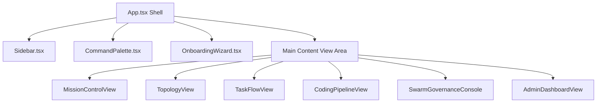

---
tags:
  - architecture/leaf
  - frontend/shell
  - react/router
  - layer/l1
type: module_leaf
layer: L1-Ingress-and-Cockpit-Surface
module: viewer.App
file_path: viewer/src/App.tsx
sync_status: verified
---

# Module: App (Frontend Navigation Shell & Workspace State Container)

## 1. Three-Line Architectural Annotation
- **Responsibility**: Root shell component orchestrating top-level application navigation, multi-session tab switching, global shortcuts (Command Palette), and workspace state synchronization.
- **Invariant**: Navigating between cockpit tabs must never lose in-flight form edits or unmount background WebSocket telemetry listeners.
- **Data Flow**: Consumes reactive state from `useWorkspace` and `useActivityLog`, binds global keyboard shortcuts, and renders subviews (`MissionControlView`, `TopologyView`, `SwarmGovernanceConsole`).

---

## 2. Source Code & Symbol Mapping

**Source Location**: [`App.tsx`](file:///d:/GitHub/LLM-Agent-System/viewer/src/App.tsx) (360 lines)

### Symbol Table

| Symbol | Kind | Line Range | Description |
| :--- | :--- | :--- | :--- |
| `ActiveTab` | `type` | L28-L38 | Union type of top-level navigation routes (`mission-control`, `topology`, `task-flow`, `swarm-governance`, `pipeline`, `admin`, `settings`). |
| `App` | `function` | L40-L360 | Main React root component maintaining active navigation state and modal containers. |
| `handleTabChange` | `def` | L82-L95 | Tab transition handler pushing state to URL hash and triggering view-specific data prefetch. |
| `handleGlobalShortcut` | `def` | L110-L138 | Keyboard listener intercepting `Cmd+K` (Command Palette) and `Cmd+B` (Sidebar toggle). |
| `WorkspaceContext` | `context` | L150-L180 | React context provider distributing current project URI, active branch, and auth tokens. |

---

## 3. Visual Shell Hierarchy & Layout

---

## 4. Operational Invariants & Anti-Corruption Guardrails
1. **Zero UI Blocking**: Long-running telemetry ingestion must execute via non-blocking async buffers without triggering React layout thrashing.
2. **Accessible Keyboard Trap Prevention**: Dialogs and popups trap focus strictly within their container and release focus upon `Esc` press.

---

## 5. Verification & Test Evidence
- **Build Receipt**: Verified via `npm run build` in `viewer/` (Vite production bundle generated clean, exit code 0).

---

## 6. Topological Linkage
- **Upstream Layer**: [[L1-Ingress-and-Cockpit-Surface]]
- **Control Plane**: [[10 7-Layer System Architecture & Control Plane Topology]]
- **Child Views**:
  - [[viewer-mission-control]]
  - [[viewer-topology-view]]
  - [[viewer-task-flow]]
  - [[viewer-coding-pipeline]]
  - [[viewer-swarm-governance]]
  - [[viewer-admin-dashboard]]
