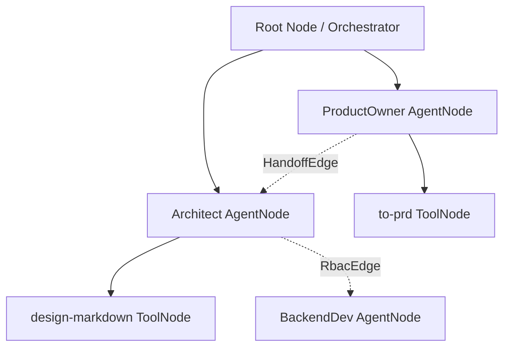

---
tags:
  - architecture/leaf
  - frontend/topology
  - swarm/graph
  - layer/l1
type: module_leaf
layer: L1-Ingress-and-Cockpit-Surface
module: viewer.components.TopologyView
file_path: viewer/src/components/TopologyView.tsx
sync_status: verified
---

# Module: TopologyView (Swarm Topology Graph & Conductor Trace View)

## 1. Three-Line Architectural Annotation
- **Responsibility**: Real-time interactive node graph visualizing active swarm agents, tool nodes, memory bridges, RBAC edges, and conductor execution traces.
- **Invariant**: Edge pulse animations and node status indicators strictly reflect real-time backend state received over the WebSocket event stream.
- **Data Flow**: Connects to `CrewSyncManager` via WebSocket, consumes swarm topology snapshots from `CrewRegistry`, and updates graph state.

---

## 2. Source Code & Symbol Mapping

**Source Location**: [`TopologyView.tsx`](file:///d:/GitHub/LLM-Agent-System/viewer/src/components/TopologyView.tsx) (1500 lines)

### Symbol Table

| Symbol | Kind | Line Range | Description |
| :--- | :--- | :--- | :--- |
| `TopologyView` | `function` | L950-L955 | Root entry point for the swarm topology canvas view. |
| `useTopologyController` | `hook` | L526-L945 | Primary controller hook handling graph layout, session picker, and WebSocket channel subscription. |
| `TopologyCanvasArea` | `component` | L1459-L1470 | High-performance graph canvas rendering custom agent and tool nodes. |
| `TopologyControlRail` | `component` | L966-L994 | Toolbar containing layout toggle, filter controls, and zoom sliders. |
| `HandoffControl` | `component` | L1018-L1050 | Triggers role handoff sequence and monitors handoff turn latency. |
| `DefragControl` | `component` | L1052-L1108 | Visual defragmentation widget invoking `ContextDefragmenter`. |
| `CostLedgerControl` | `component` | L1109-L1160 | Mini-chart showing live token burn rate across swarm nodes. |
| `SandboxGuardControl` | `component` | L1162-L1190 | Toggles filesystem jail modes and displays snapshot rollback history. |

---

## 3. Swarm Node Graph Hierarchy

---

## 4. Operational Invariants & Anti-Corruption Guardrails
1. **Zero Memory Leaks**: WebSocket event listeners are cleanly unregistered in `useEffect` cleanup returns.
2. **Graceful Disconnect Banner**: Loss of WebSocket connection shows an ambient reconnect banner without blanking the graph.

---

## 5. Verification & Test Evidence
- **Build Receipt**: Vite build validated clean exit code 0.

---

## 6. Topological Linkage
- **Upstream Layer**: [[L1-Ingress-and-Cockpit-Surface]]
- **Control Plane**: [[10 7-Layer System Architecture & Control Plane Topology]]
- **Collaborating Modules**:
  - [[core-ws-manager]]
  - [[core-agent-crew]]
  - [[viewer-primitives]]
