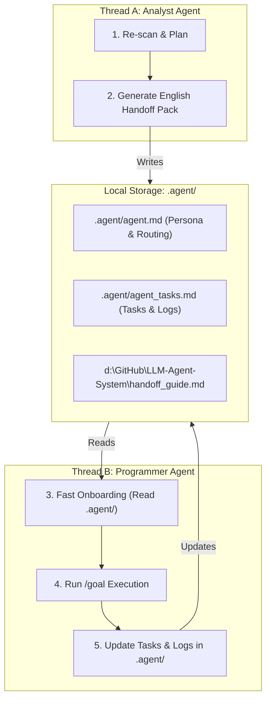

# FindAi Studio — LLM Agent System (LAS) Master Handoff Protocol & Workflow Spec

This document defines the **Multi-Generational Thread Handoff Protocol** and **n8n-like Workflow Architecture Spec** for LAS. It serves as the single source of truth for both humans and AI Agents to manage context-truncation, token conservation, and state synchronization across execution threads.

---

## 1. 🔄 Multi-Generational Thread Handoff Protocol (跨 Thread 載入與交接協定)

To completely eliminate token inflation and context drift in long-running tasks, LAS operates on a **Decoupled Planner-Executor Model** utilizing structured filesystem handoffs.

### 🗣️ The 3 Standard Analyst Command Vocabularies (分析師三大命令規範)

When interacting with the **Analyst Agent**, the developer uses these three standard prompt templates. The Analyst Agent must instantly recognize them and execute the corresponding behaviors:

#### 1. Re-scan & Blueprint (重新瀏覽與計劃)
* **User Prompt Template**:
  > *"我更新很多東西了，重新瀏覽整個project。我打算讓這個專案，[專案新方向/目標]，請重新研究並給我計畫書。"*
* **Analyst Behavior**:
  - Perform a complete recursive sweep of the active workspace.
  - Read recent file edits and Git diffs.
  - Generate a detailed technical **Implementation Plan** (`implementation_plan.md` in English) detailing the new architecture, dependencies, and risk assessments.

#### 2. Minimalist Handoff Generation (精簡提示詞交接)
* **User Prompt Template**:
  > *"給專門的agent執行就好，你只要給我提示詞給下一個agnet就好。像是有做那些改動，要做哪些事。"*
* **Analyst Behavior**:
  - Stop long architectural explanations.
  - Synthesize a high-density, ultra-focused **English Handoff Prompt** containing:
    - Current changed files.
    - Strict role setting (e.g., Programmer Agent).
    - Precise list of next actions.
    - List of local `.agent/` files that the next agent must read to onboard.

#### 3. Multi-generational Handoff Merge (多代程序員交接整合)
* **User Prompt Template**:
  > *"我先給你第 X 代程序員 agent 整理好的東西，等等你就讓你的 Handoff Prompt 跟他結合，整理好後給下一個 agent (程序員)。"*
* **Analyst Behavior**:
  - Accept the progress report, outcome logs, or summary generated by the previous ("X-th generation") Programmer Agent.
  - Merge the previous generation's outcome with the Analyst's strategic architecture plan.
  - Compile a unified, highly optimized onboarding package for the **(X+1)-th generation Programmer Agent** to ensure 100% progress continuity with zero context leakage.

---

## 🧠 2. Semantic & Conditional Skill Routing (語意與條件式技能尋找)

To avoid overloading the LLM's active context with unnecessary tool definitions, tool selection is routed dynamically through a two-layered decision process:

1. **Semantic Routing (語意路由)**: 
   The highest-level `agent.md` defines context-based routing tables. The agent classifies the incoming user intent and dynamically determines which *category* of skills to pull from the registry, matching the situation semantically.
2. **Conditional Routing (條件式路由)**:
   The execution engine (`AgentRouter`) checks active environmental variables and task execution conditions before validating a tool call:
   - Check if the target skill is local or global.
   - Enforce constraints like `max_iterations`, budget limit, or authorization levels depending on the active account and current depth.

---

## 🔌 3. n8n-like Declarative Workflow Spec (n8n 式工作流引擎規格)

The Workflow Engine (`workflow_engine.py`) operates as a local, lightweight version of **n8n**, running complex multi-step processes via a declarative DAG (Directed Acyclic Graph) defined in `.agent/workflows/<id>.md`.

### Core Mechanics:
* **Discrete Execution Nodes**: Each step in the workflow is treated as a node (e.g., calling a skill, invoking a model, mapping variables).
* **Payload Passing (資料流傳遞)**: A step's output is structured as a JSON payload and passed directly to the next step's input parameters (e.g., `{{steps.step_1.output.result}}`).
* **Conditional Branching (分支跳轉)**: Supports outcome-based branching (e.g., `if success -> step_3`, `if error -> fallback_step`).
* **State Preservation & Resume**: The execution state is saved to `.agent/workflows/runs/<session_id>.json`. If a step fails, the developer can fix the issue and call `--run-workflow --resume` to pick up exactly from the failed checkpoint.

---

## ⚠️ 4. Strict 5-Step Work Principles (每次任務完成自我檢核)

Every time the active Agent completes a task, it must strictly execute this self-audit before concluding its turn:

1. **Clean Code & Bugs**: Sweep the workspace for unused imports, debug prints, temporary comments, and ensure robust try-except error catching.
2. **Architectural Guardrails**: Check that boundaries between `core/`, `skills/`, and CLI/API adapters are completely uncompromised.
3. **Self-Manifest Update**: Automatically write progress and execution logs into `.agent/agent_tasks.md` and update `.agent/agent.md` if capabilities evolve.
4. **Bilingual Documentation**: Ensure `README.md` is updated in both English and Traditional Chinese (sections must remain separated and synchronized).
5. **Pre-commit Verification & Push**: Run the pytest suite (`C:\Users\luke2\AppData\Local\Programs\Python\Python314\python.exe -m pytest`) to ensure 100% green light, stage all changes (`git add .`), commit, and push to the remote repository.
